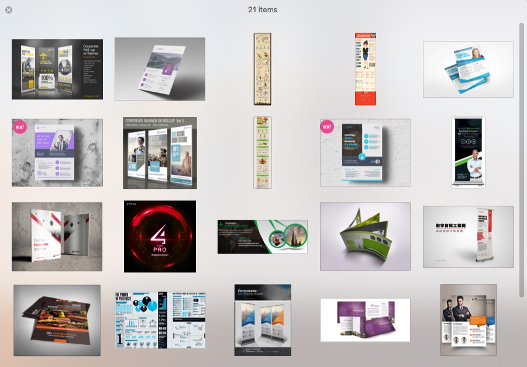
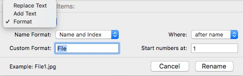

**Cut & Paste File on Mac**
* Cmd + C to cut & copy
* Cmd + v to paste a copy - cmd + v to paste the original
**Others**
* View Menu > Show path Bar. 
* View Menu > Show Status Bar. 
* Window Menu > Merge All Windows. 
* Option Drag the Separator in Column View To Resize All Columns.
* Cmd + Option + Delete to Delete Files without moving it to the Trash. 
* Shift + CMD + Option + Delete to Empty The Trash. 
* Right Click any File > Hold the Option Key you’ll Find Copy as File Name in The List. 


* Option + CMD + 1 to Clean up By Name
ممكن  أعمل Preview لعدد معين من الصور بعد لما أعمل عليهم Select اضغط على المسطرة من الكيبورد واضغط هنا:

هلاقيه عملي زي البوم مصغر كده اقدر استعرض الصور من خلاله زي كده: 


ممكن أعمل Rename لعدد كبير من الملفات مرة واحدة أو أني أغير صيغة الملفات كلها مرة واحدة عن طريق اني بضغط كليك يمين واختار Rename زي كده: 

هلاقي نافذة جديدة فتحت ممكن اختار منها كذا اختيار ومنهم الـ Format زي كده: 

لو انت جوه فولدر ومتعلم على حاجة جوه الفولدر ده وانت عايز ترجع تعلم على الفولدر نفسه بتضغط option + سهم شمال. 

