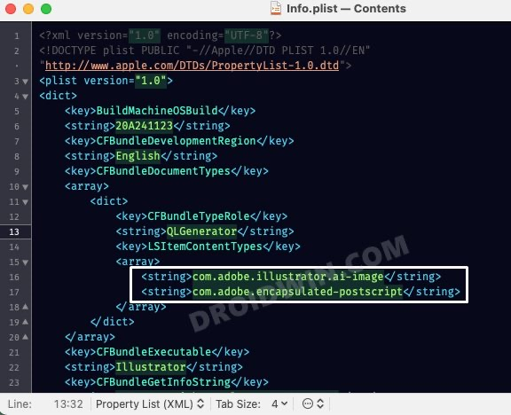

FIX 1: Edit the Info.plist File
1. To begin with, head over to the following directory
```plaintext
/System/Library/QuickLook
```
2. Then copy the "Illustrator.q|generator" file from there and paste it onto your
Desktop.
3. Now right-click on this Illustrator.qlgenerator file and select Show package
contents.
4. After that, open the "Info.plist" file present in the "Contents" folder using a text
editor.
1. Now find the following line in that file:
```plaintext
<string>com.adobe.illustrator.ai-image</string>
```
6. Now add the following line next to the above line (make sure that both these
lines have the same indentation).
```plaintext
<string>com.adobe.encapsulated-postscript</string>
```

7. Save this Info plist" file. Then copy the entire "Illustrator.qlgenerator" file and
paste it in the following directory:
```plaintext
/Library/QuickLook
```
8. That's it. Check if it fixes the missing icon preview issue for EPS files in macOS
Monterey.