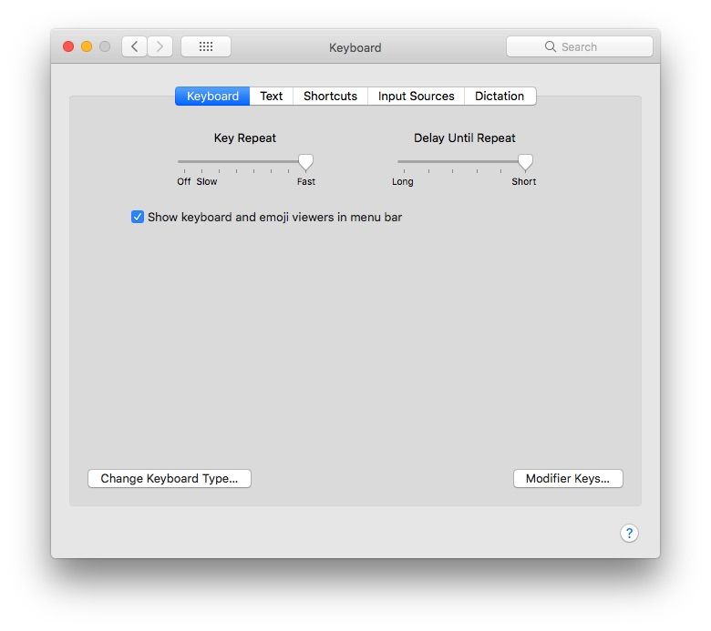

*** Open Terminal and paste this code: 
```plaintext
defaults write NSGlobalDomain ApplePressAndHoldEnabled -bool false
```
* Now Open System Preferences > Keyboard and make it like this: 

* Re-Launch The App for it to Work. 
* To Reset This to the Default type this in the Terminal: 
```plaintext
defaults write NSGlobalDomain ApplePressAndHoldEnabled -bool true
```
* To Disable Character alternates which look like this: 

Type the following command in terminal: 
```plaintext
defaults write -g ApplePressAndHoldEnabled -bool FALSE
```
To get it back to the default just replace “False” with “True”. 


