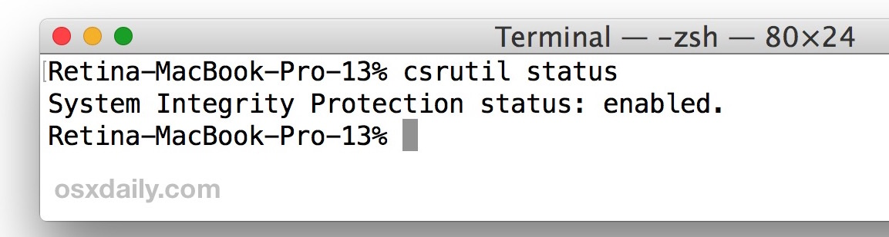

1. Launch the Terminal application in Mac OS, it’s located in the /Applications/Utilities/ directory
2. Type the following into the command line, then hit return:
```plaintext
csrutil status
```
You will see one of the following messages, indicating the status of SIP on that Mac:
* If SIP is on – “System Integrity Protection status: enabled.”
* If SIP is off – “System Integrity Protection status: disabled.”




