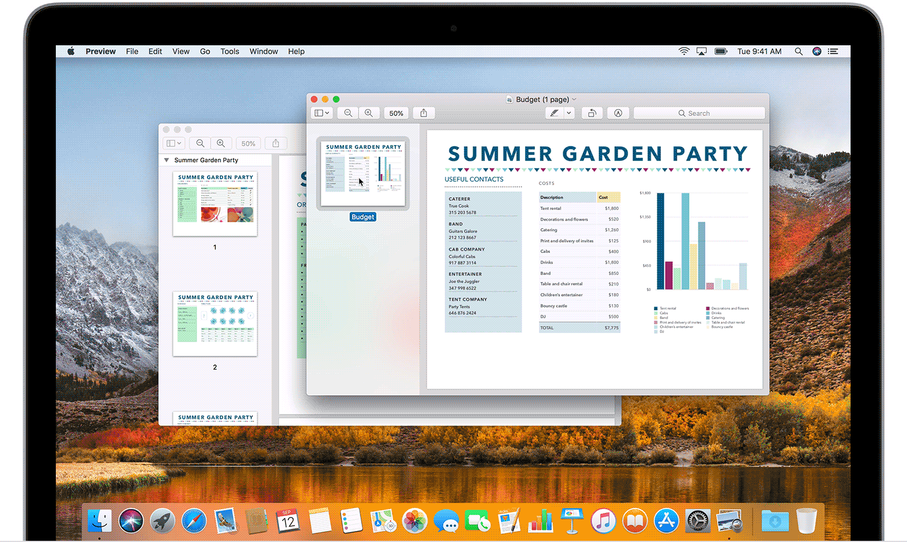

**# **Combine two PDFs
**1. Open a PDF in Preview.
2. Choose View > Thumbnails to show page thumbnails in the sidebar.
3. To indicate where to insert the other document, select a page thumbnail. 
4. Choose Edit > Insert > Page from File,* select the PDF that you want to add, then click Open. 
5. To save, choose File > Export as PDF.
# **Combine part of a PDF with another PDF
**1. Open the PDFs that you want to combine in Preview.
2. In each document, choose View > Thumbnails to show page thumbnails in the sidebar.
3. Press and hold the Command key, select the page thumbnails that you want to add to the other document, then let go of Command. 
4. Drag the selected thumbnails into the sidebar of the other PDF, then release where you want them to appear. If your Mac has macOS Sierra or earlier, drag the thumbnails directly onto a thumbnail in the other PDF.


