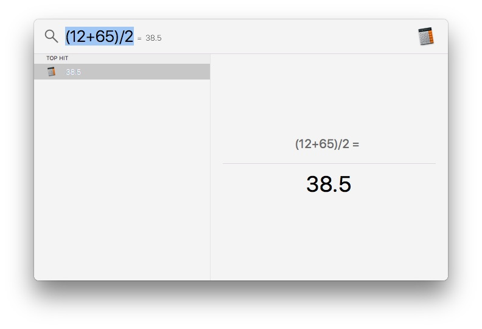

```plaintext
Kind:image “your file name”.extention
Currency conversions
Hold CMD key to get the location of the file and while holding the CMD key press R to open the File or Folder in Finder
To find a word in dictionary press cmd + l
```
**Extra Tip 1: **you can also solve math with the spotlight


**Extra Tip 2: **you can use Dictionary with spotlight, open spot light and type the word you’re looking for and press CMD + L to to Quickly Jump to the Definition of the work within spotlight, you can also press CMD D to Open the Word in the Dictionary App for more info. 


