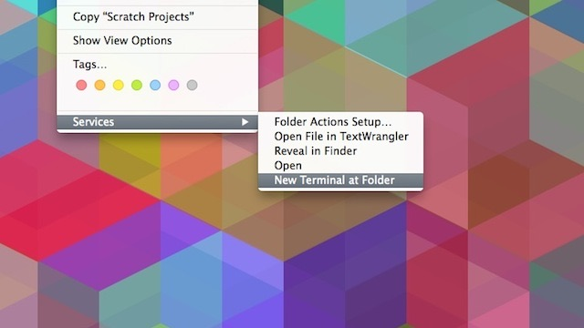

**- Open System Preferences and select Keyboard > Shortcuts > Services. Find "New Terminal at Folder" in the settings and click the box. 
- just right-click a folder and you're shown the open to open Terminal.


