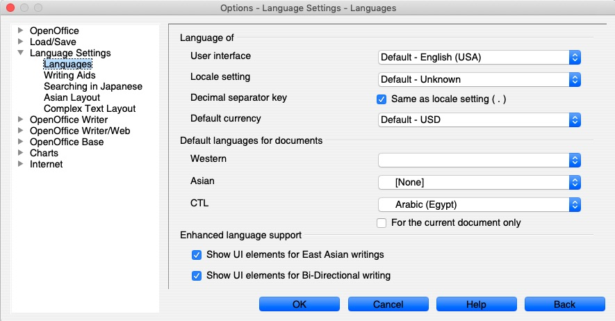
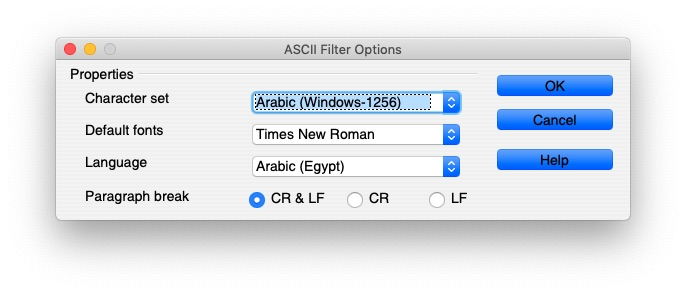

The Problem: 


How to Solve it: 
Go to This Site: 
[https://www.openoffice.org/download/](https://www.openoffice.org/download/)
And Download Full Installation: 

Open The Program and go to Preference and make the settings like this: 

Now Open The Document using This Settings: 


