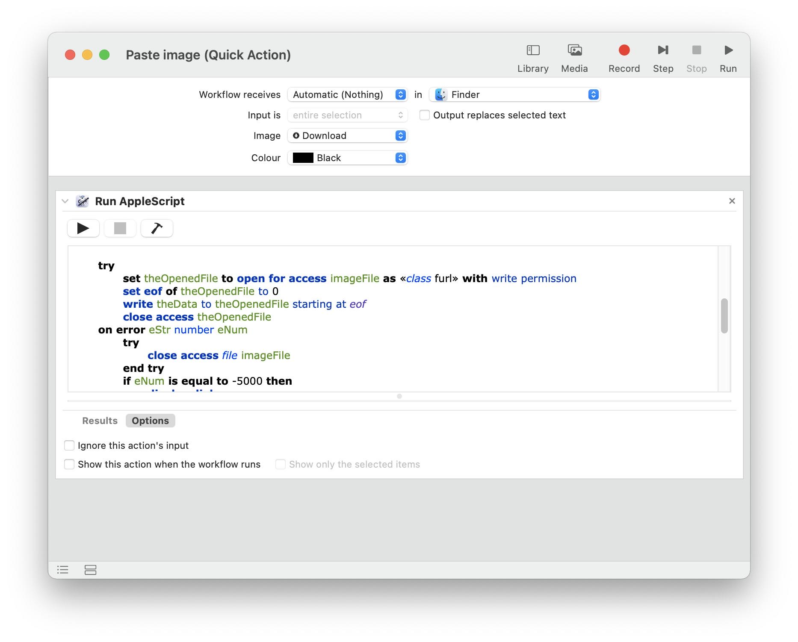

# **Step 1
**### Create a new "Quick Action" in Automator.app and add the following Run AppleScript block: Ôøº

```
set imageType to «class PNGf»

if ((clipboard info) as string) contains imageType then
    set theData to (the clipboard as imageType)
    
    -- path
    tell application "Finder" to set saveToLocation to (target of front Finder window) as text
    
    -- filename
    set fileName to do shell script ¬
        "echo $(date '+Screen Shot %Y-%m-%d% at %l.%M.%S %p.png')"
    
    set imageFile to saveToLocation & fileName
    
    
    
    try
        set theOpenedFile to open for access imageFile as «class furl» with write permission
        set eof of theOpenedFile to 0
        write theData to theOpenedFile starting at eof
        close access theOpenedFile
    on error eStr number eNum
        try
            close access file imageFile
        end try
        if eNum is equal to -5000 then
            display dialog ¬
                "You do not have write permission to this location!" buttons {"OK"} ¬
                default button 1 with title "File I/O Error..." with icon stop
            my chooseLocationAndWriteFile(imageType, fileExtension, defaultChooseFolderLocation)
        else
            display dialog eStr & " number " & eNum ¬
                buttons {"OK"} default button 1 ¬
                with title "File I/O Error..." with icon stop
        end if
        return
    end try
    
    
else
    display dialog "The clipboard does not contain graphic image data!" buttons {"OK"} ¬
        default button 1 with title "Write Clipboard Graphic Image Data to File" with icon caution
end if
```

### Save the action to the default iCloud folder.
# **Step 2
**### In System Settings > Keyboard > Shortcuts > Services, the new Quick Action should appear:
### Ôøº
### Adding a shortcut here didn't work for me 🤷‍♂️, so…
# **Step 3
**### In the "Application Shortcuts", add one with the *exact* name of your file:
### Ôøº
### That's it!