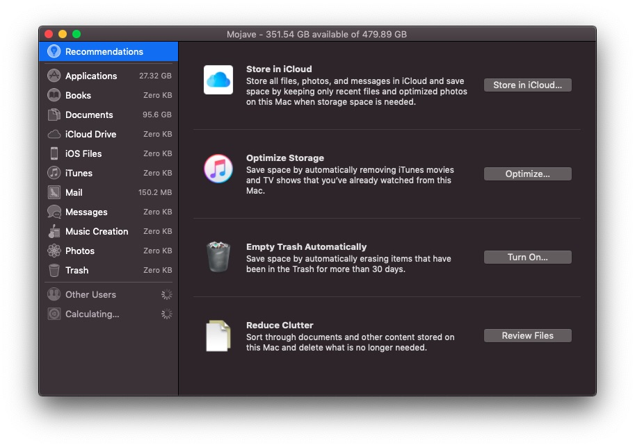

* Click on Apple Logo >> System Preference. 
* Click on Storage. 
* Click on Manage. 
You will find something like this: 

You can now click on the Document for example and Find what is taking too much from your storage. 

