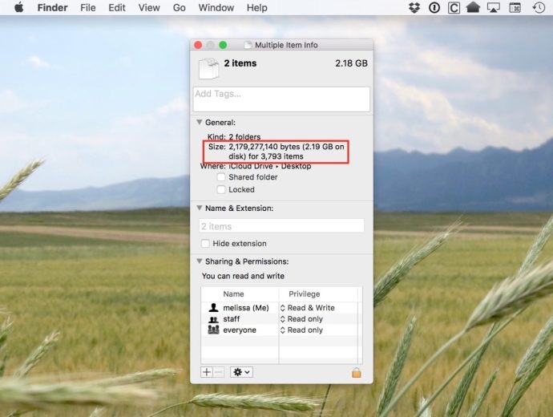
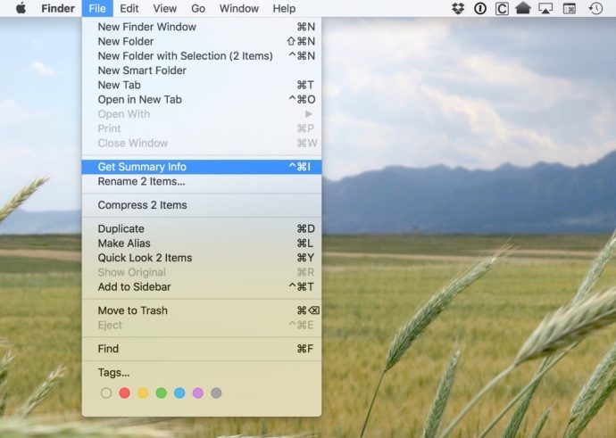

**Quick Answer**: 
Press CMD + Control+ I
**Long Answer: 
**
Note the addition of the **Control** key to our normal “Get Info” shortcut. Alternatively, you can access the same window by selecting your items, holding the **Control** key on the keyboard, and heading to **File > Get Summary Info** in the menu bar.


