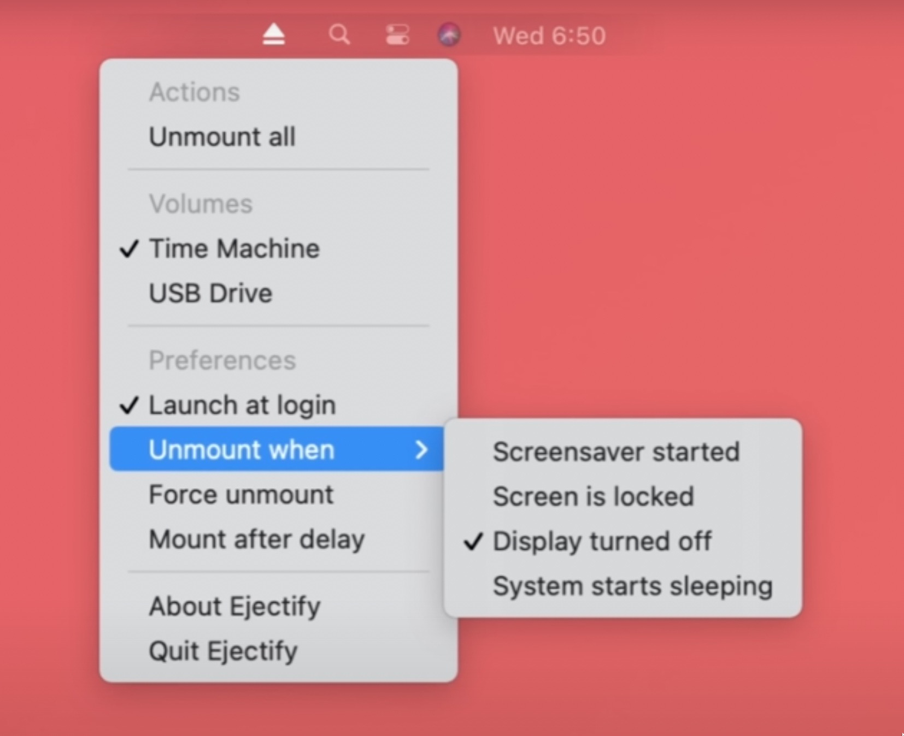

paste this command into Terminal (must restart Mac to take effect):
```plaintext
sudo defaults write /Library/Preferences/SystemConfiguration/com.apple.DiskArbitration.diskarbitrationd.plist DADisableEjectNotification -bool YES && sudo pkill diskarbitrationd
```
to re-enable the notification type: 
```plaintext
sudo defaults delete /Library/Preferences/SystemConfiguration/com.apple.DiskArbitration.diskarbitrationd.plist DADisableEjectNotification && sudo pkill diskarbitrationd
```
PS: if for some reason the code didn’t work, you can try third party apps like Ejectify. 


