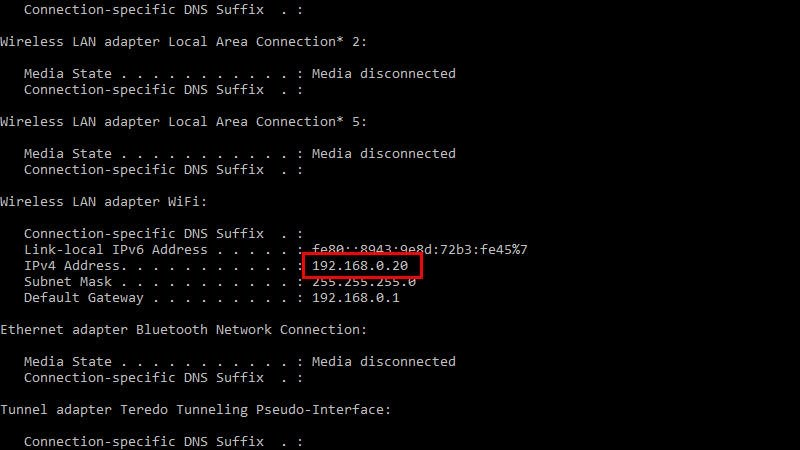


1. Make sure both your Windows 10 machine and your Mac are connected to the same network.
2. Click Win +S  in Windows 10 and enter "Command Prompt". Open the Command Prompt app. Maximize the screen so you can get a good view of everything.
3. Enter **ipconfig** and press Return.
4. Locate your IP address. It'll be marked as IPv4 Address and either under Ethernet adapter or Wireless LAN Adapter Wi-Fi (depending on your address). It'll be four sets of numbers, eg :192.168.0.20
5. Now jump over to your Mac. Press Command + K.

1. Enter smb:// and the ip address. IE, "smb://192.168.0.20" and press Return.
2. Click Registered User and enter the username and password you use to sign on to the Windows 10 PC. This might be your Microsoft Account and Password or the User ID and Password for your account (**Note**: Create a Password if you Don’t have one).
3. Click Connect. It can take a few minutes to connect over a Wi-Fi connection.
4. A window marked "Select the volumes you want to mount" will appear with one option "Users". Click OK.
5. Open a Finder window.
6. You will see the SMB share marked as the IP address in Shared in the sidebar. Click it, click Users and your username. Here are all the files on your Windows PC.

You can copy files to and from the Windows machine from here.

