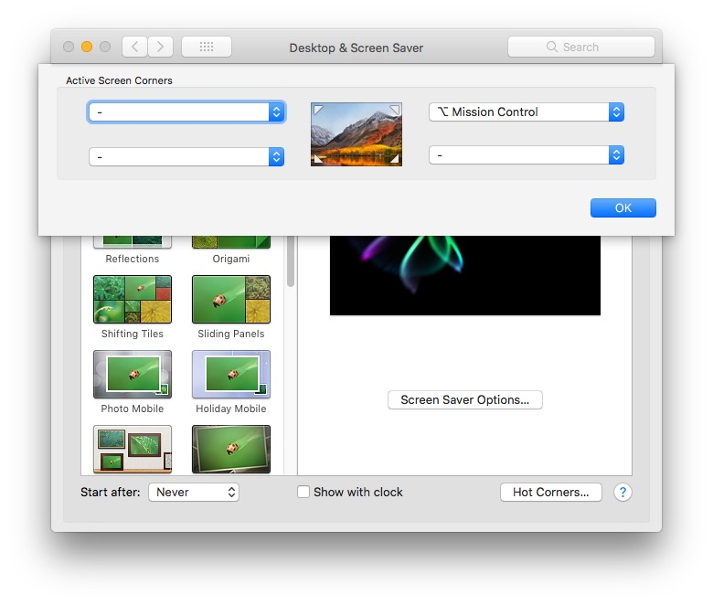

* Open System Preferences > Desktop and Screen Saver > Hot Corners.
* Click on The Top Right One and Hold Option Key, this way you won’t accidentally Trigger it. You will have to press option with it to make it triggers. 


