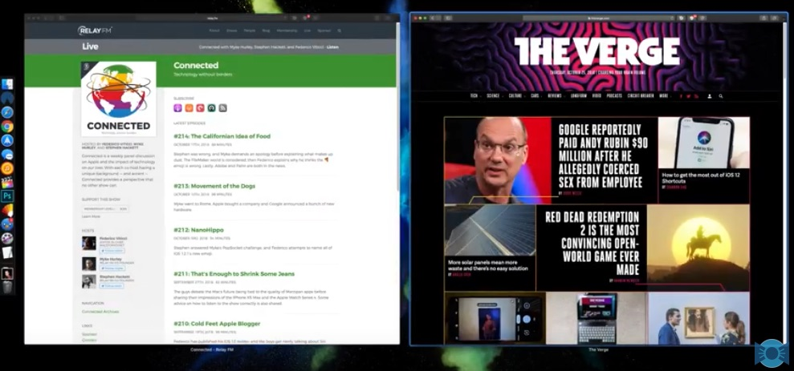

* ⌘ + H to hide a window. You can access it by using Cmd + Tab on your keyboard or clicking on the app icon on the dock. 
* Minimize to app icon in system preferences. 
* Drag the Application Folder into the dock to have full access to all apps, you can type the first letter of an app to quickly jump to it. You can also right click the folder on the dock and make select these options: (display as folder, view as list). 
* ⌘ + Q to quit and App. 
* Right Click on the Time > Open Date & Time Settings > Show Date. 
* ⌘ + ⇧ + A to Quickly Open the Application Folder
فيه برنامج اسمه Digital Color Meter  ده موجود بداخل النظام ومن خلاله بياخد درجة اللون اللي بيقف عليها الماوس ويعرض قيم الـ  RGB بتاعتها. 
* ⌘ + Tab to open The App Switcher and ⌘ + 1 to Show Opened Windows of That App so you can choose which window you want open and the recent apps in the bottom is also shown as well. 
* Cmd + Tab to open The App Switcher and ⌘ + 1 to Show Opened Windows of That App so you can choose which window you want open and the recent apps in the bottom is also shown as well. 

* If you have an app minimized to your dock, ⌘ + Tab + Release Won’t Bring The App Windows to the Front, it will be just active, To Bring The Windows Press ⌘ + Tab Then Press Option then Release ⌘ 

