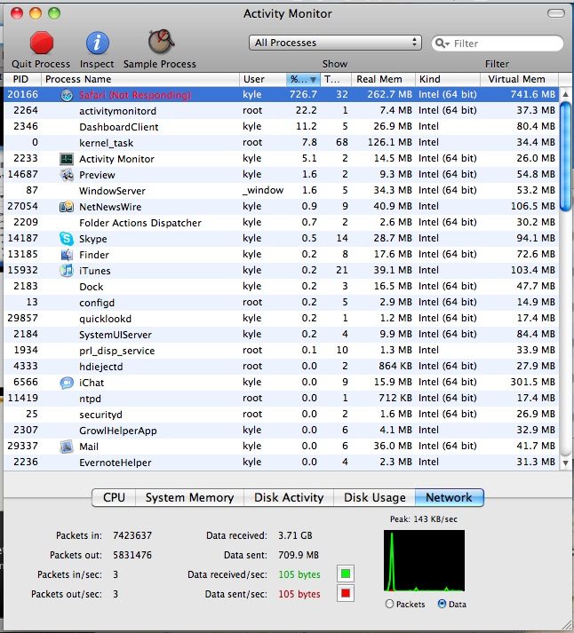
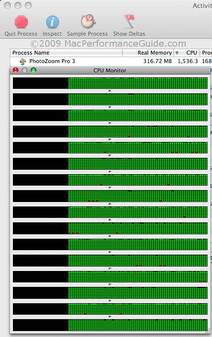

**Several responses to a question __I asked earlier__ suggested I try Opera kiosk mode, so I decided to download it and give it a try. Once the download had completed and the disk image was being verified, Safari hung for over a minute and there were periods where Safari used a very high %CPU: 



The % CPU is relative to 1 core, so 726% is using almost 8 cores. Core is loosely defined, so 1 __Hyper-Threaded__, "virtual" core looks like 2 cores to Activity Monitor. 

What type of system do you have? If it is just 2 cores (which is seems to be) then nik's answer sounds correct. 

A late model 8-core system can look like 16 cores to Activity Monitor: 


