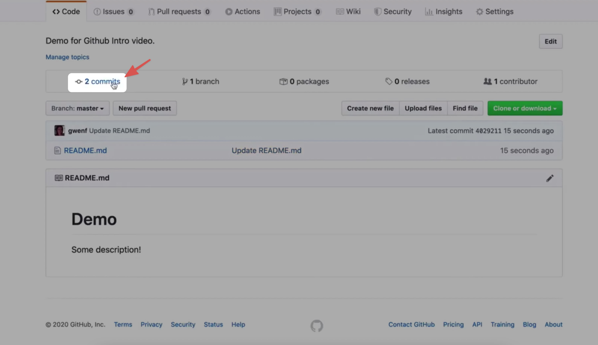
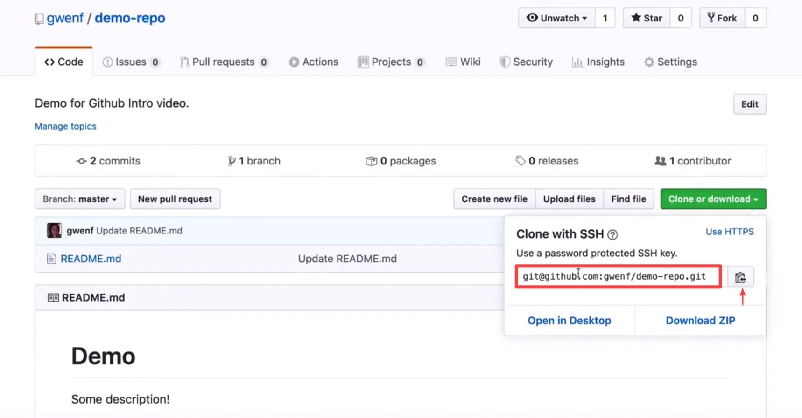
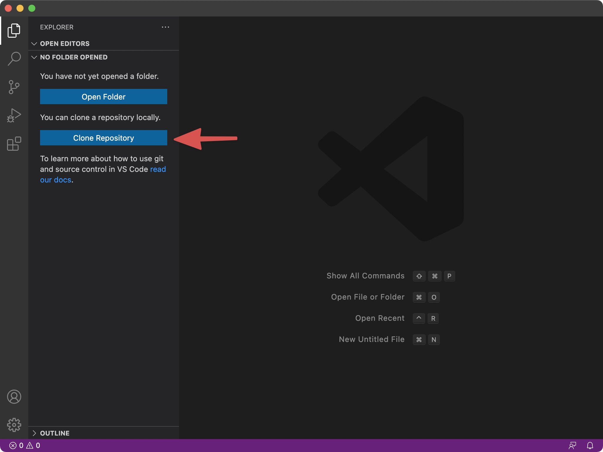
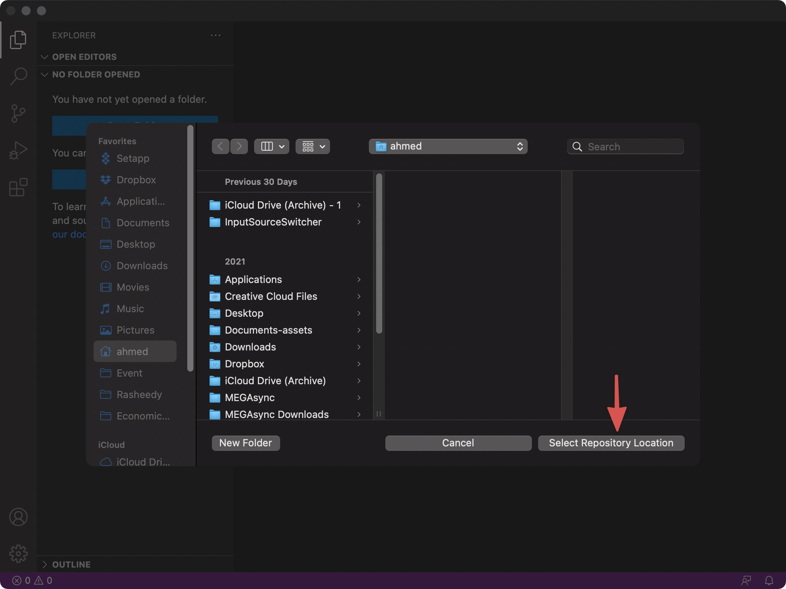
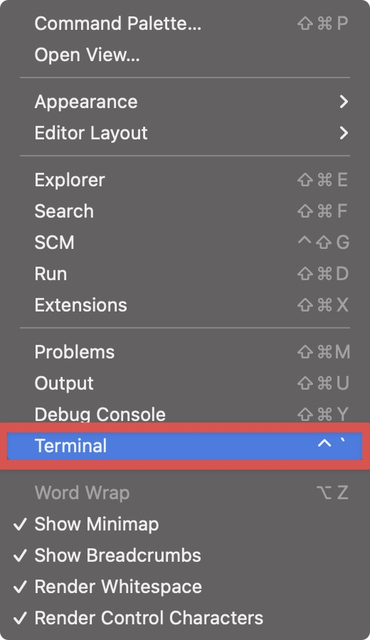
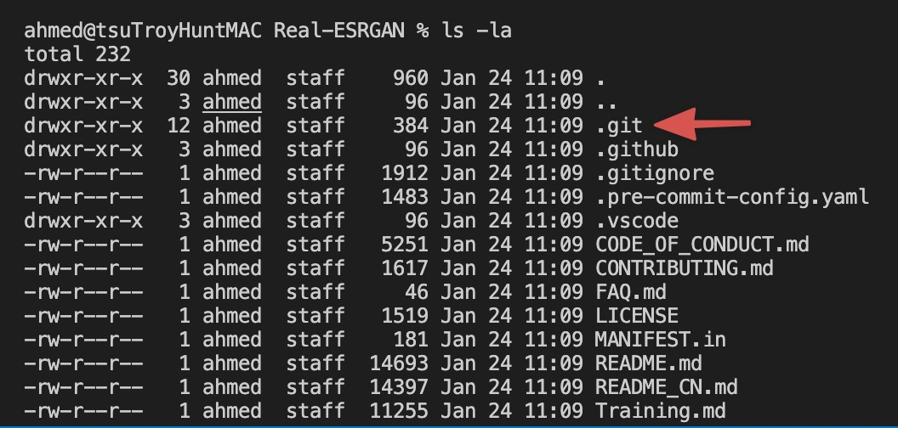
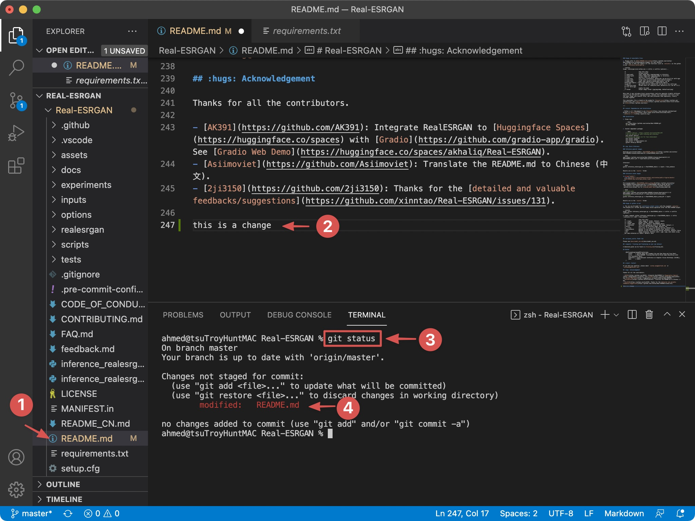
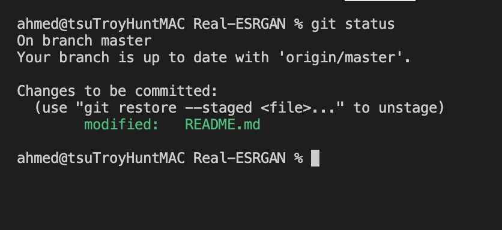
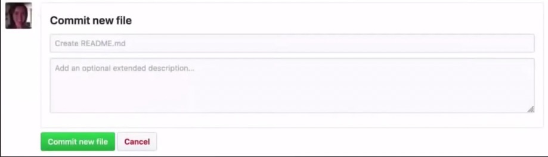
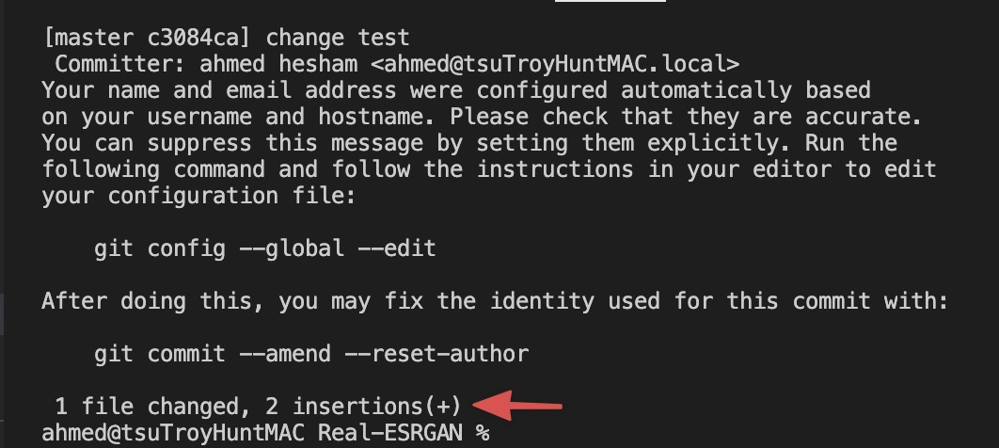

### What is Git?
A: Free and open source version control system.
### What is Version Control?
A: The management of changes to documents, computer programs, large web sites, and other collections of information.
# Terms
::**Directory**:: -> Folder
::Terminal or Command Line:: -> Interface for Text Commands
::CLI:: -> Command Line Interface
::cd:: -> Change Directory
::Code Editor:: -> Word Processor for Writing Code
::Repository:: -> Project, or the folder/place where your project is kept
::Github:: -> A website to host your repositories online
::Markdown or .md:: -> is an easy way to format your text in a sort of files. 
### Git Commands
::Clone:: -> Bring a repository that is hosted somewhere like
::Github:: into a folder on your local machine
::add:: -> Track your files and changes in Git
::commit:: -> Save your files in Git
::push:: -> Upload Git commits to a remote repo, like Github
::pull:: -> Download changes from remote repo to your local machine, the opposite of push
Note: in .md files one # Hashtag means the title and two ## means Subtitle. 
### How to install git and check if your computer has it ? 
in Linux and MacOS it's installed by default to check open terminal and type: 
```plaintext
git --version
```
Note: when installing Git for windows, it's recommended to install the Git Bash Option. 
here's a tut by Atlassian: 
[https://www.atlassian.com/git/tutorials/install-git](https://www.atlassian.com/git/tutorials/install-git)
to see the history of changes you made , go to the commits sections like this: 


For code editing:Visual Studio Code is good and free software. 

### How to copy a repo to your local machine ? 
we will use a command called ::git clone:: 
in a Github page copy the clone with SSH command like this: 

open visual code studio and choose clone Repository: 

after pasting the clone command select the folder which you will be cloning the repo to: 


### Another way to clone a repo to your local machine 
create a folder on your local machine and open visual code studio , this time choose open folder or press ⌘+O and choose the folder you created. 
from the view menu choose terminal or press from the keyboard 
```plaintext
⌘+`
```

now paste the ::git clone:: command in the terminal like that: 
```plaintext
git clone https://github.com/xinntao/Real-ESRGAN.git
```
after that use the cd (change directory) command to move into the repo folder. 
```plaintext
cd Real-ESRGAN
```
now to view the files in that directory we will use this command: 
```plaintext
ls -la
```
::ls -la:: means list everything in the directory including hidden files and folders. 
when you use this command you will find a ::.git::  folder 

this hidden git folder store all the files that save your commits. 
for example if you open the Readme.md file and added a change you can find about the changed files through ::git status:: command like that: 

the modified color is red which means it's not committed yet 
to commit the changes we will use the ::git add:: command, which we can use in two ways: 
### The First way: 
is by selecting which file to commit the changes to like this: 
```plaintext
git add README.md
```
### The Second Way: 
is by adding a period after the ::git add:: command to be like this: 
```plaintext
git add .
```
after adding your changes and typing the git status command in terminal you should get a green line like this; 

the green line means that your changes is tracked successfully and ready to be committed. 
to commit your changes we will use the ::git commit:: command like this: 
```plaintext
git commit -m "added index.html" -m "some Description" 
```
the ::-m:: stands for a message which is in the website looks like this: 

after you commit your files you should get a screen looks like this: 

but your commits is only saved locally not on Github, to save it online we will use the ::git push:: command like this: 
```plaintext
git push
```
which means i want to push these commits to remote repo where my project is hosted. 


