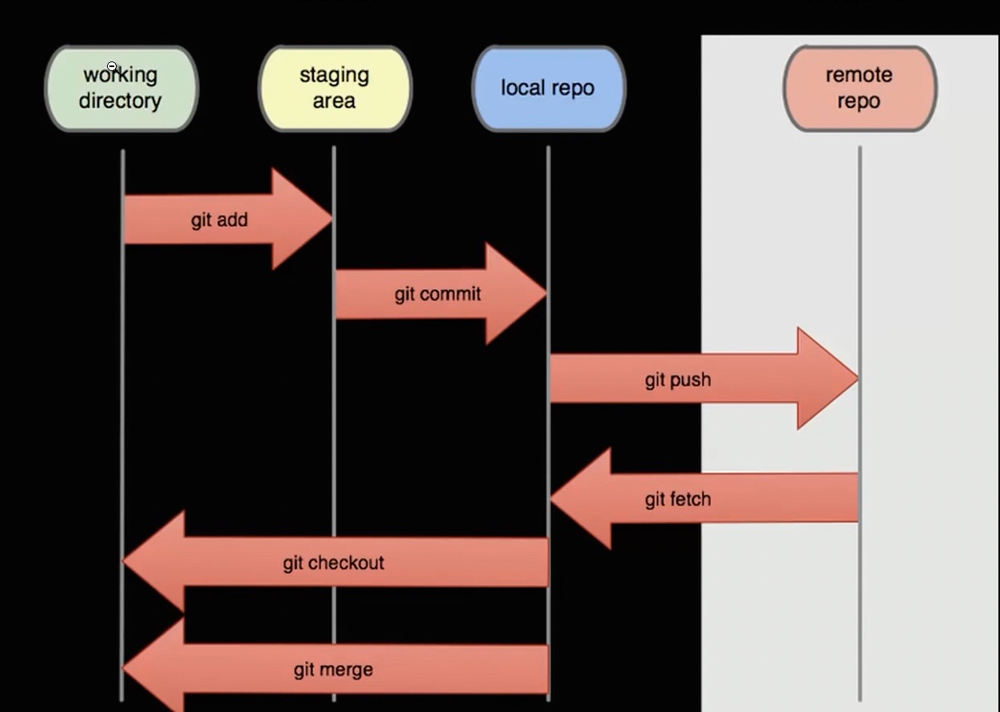

GIT is Distributed Version Control System
you can install git via `homebrew` or it comes pre-installed via oh-my-zsh

```sh
brew install git
```

After the installation is complete, verify that Git is installed by running the following command:

```sh
git --version
```

after creating an account on Github creating your first repo, you'll clone the repo to your local machine. 

```sh
git clone https://github.com/Elzero-Courses/Git_Course.git
```

after cloning the project change directory to the cloned project

```sh
git status
```

you will get something like this: 

```sh
Your branch is up to date with 'origin/main'
```

::origin::: is the remote copy of your project which is on the Github server. 
::main::: is the local copy of the project.
you can verify the name of the remote by typing: 

```sh
git remote -v
```

the -v stand for `verboose` mode; you should get something like this: 

```sh
origin	https://github.com/ahmedheshammec/myscripts.git (fetch)
origin	https://github.com/ahmedheshammec/myscripts.git (push)
```

::fetch:: is getting the commits from the online server to your local project. 
::push:: is the opposite (pushing the edits from your local project to the Github server)



::Note::: when you commit or push or pull a change you might git error message in the terminal regarding the authentication `'Support for password authentication was removed.` when git asks for authentication and ask for username and password 
to fix that: **
**1. Go to this link: https://github.com/settings/tokens (Profile -> settings -> developers setting -> personal access tokens). (don't go to repository setting; it's your profile setting)
2. Generate a new token and copy-paste it somewhere safely.
3. Now search for an app in your Mac, named Keychain Access.
4. Search for github.com (if there are multiple GitHub logins then choose Kind: Internet password), double-click it.
5. Click on show password, then enter your Mac's password and hit Enter.
6. Password should be visible by now. Now, just paste the token you generated in step 2 and click Save changes.
::Note::: i pasted the token in the terminal when it asked for auth and it worked 
::Note::: save this token in a save place cuz you can't see it again in the website. 

The `git add` command is used to add new or modified files in your working directory to the Git staging area. This command updates the index, also known as the staging area, with the current content found in the working tree, preparing the changes to be committed in the next commit.
To add everything in your current working directory and its subdirectories to the Git staging area, you can use the following command:

```sh
git add .
```

The period (.) represents the current directory and recursively adds all files and directories within it. This command will stage all new and modified files, but it will not include files that have been deleted. To stage deleted files as well, you can use the command:

```sh
git add --all
```

Alternatively, you can use the shorthand command:

```sh
git add -A
```

Both `git add --` all and `git add -A`  will stage all changes, including new, modified, and deleted files, in   the entire working directory tree.
you can add individual files or folders as well

```sh
git add your_file_or_folder
```

to remove file or folder from the staging area use the command `git reset head`

```sh
git reset head Osama.rtf
```

to commit use the command 

```sh
git commit -m "your commit message"
```

if you try to commit your changes and got and error like this: 
```sh
Author identity unknown
*** Please tell me who you are.
Run
git config --global user.email "you@example.com"
git config --global user.name "Your Name"
to set your account's default identity.
Omit --global to set the identity only in this repository.
fatal: unable to auto-detect email address (got 'Ahmed@TroyHuntMacbook.(none)')
```
run the following two commands 

```sh
git config --global user.email "you@example.com"
```


```sh
git config --global user.name "Your Name"
```

and try to commit again
### :: **The Difference Between Branch, Origin, And Main Or Master ?** ::

The `git branch` command is used to list, create, or delete branches in Git. When used without any arguments, it displays a list of existing branches in your repository and highlights the current branch.
In terms of the differences between branch, origin, and main (or master), here's a breakdown:
	1.	Branch: In Git, a branch is a lightweight movable pointer to a commit. It allows you to diverge from the main line of development and work on separate features, bug fixes, or experiments. Branches are independent and can be created, switched between, and merged.
	2.	Origin: origin is a default remote repository name often used in Git. It represents the main repository from which your local repository was cloned or fetched. You can push your local changes to the origin repository or fetch and merge the changes made by others.
	3.	Main or Master: Traditionally, Git used master as the default branch name. However, many organizations and projects have transitioned to more inclusive terminology. Instead of master, main has become an alternative default branch name. The choice between main or master as the branch name is a matter of preference and convention within a project or community.
To summarize, branch refers to a separate line of development in Git, origin represents the default remote repository, and main or master is the name commonly used for the main branch, although main has gained popularity as an alternative to master.

```sh
git branch
```

to push the commits you made: 

```sh
git push origin master # Older Versions of Git
```

or

```sh
git push origin main # Newer Versions of Git
```

to initialize directory as git repo type: 

```sh
git init
```

to show and view your commits type: 

```sh
git log
```

to list all local branches type: 

```sh
git branch
```

to create new branch type: 

```sh
git branch <branch-name>
```

to switch from current to branch name type: 

```sh
git checkout <branch-name>
```

to rename current branch

```sh
git branch -m <brnach-name>
```

to delete specified branch

```sh
git branch -d <branch-name>
```

### Main vs Master Branch Names Historically

1. `origin` is the default name for your remote repository (like on GitHub). It's just a nickname/alias that points to the URL of your remote repository. You can see what "origin" points to by running:

```bash
git remote -v
```

2. `main` (or `master`) is the name of your branch. You can see what branch you're currently on with:

```bash
git branch
```

About the `master` vs `main` change:
- Historically, the default branch was called `master`
- In 2020, GitHub changed the default branch name to `main` for new repositories for more inclusive language
- Existing repositories weren't automatically changed, which is why you might still see `master` in older repos

To check which name your repository uses:
1. If you're already in a repo, use `git branch` to see your branches
2. When creating a new repo:
   - GitHub now uses `main` by default
   - You can configure your Git default branch name globally using:
   
   ```bash
   git config --global init.defaultBranch main
   ```

So when you do `git push origin main`, you're saying "push my commits to the remote repository nicknamed 'origin', to the branch called 'main'".
### :: **Make a Repo From Local and Push to Remote** ::

To Make a Repo from Local First Create it on Github without the Readme or License File and Just Git the Link; now from the command line: 
```sh
echo "# Title" >> README.md
git init
git add README.md
git commit -m "first commit"
git branch -M main
git remote add origin https://github.com/user_name/your_repo_link
git push -u origin main
```

### :: __`How to Remove a Git From Your Directory?`__ ::
use this command: 

```sh
rm -rf .git
```


### HTTPS VS SSH 

You can check whether you're using HTTPS or SSH by looking at the remote URL using:

```bash
git remote -v
```

The URL format will tell you which method you're using:

- HTTPS URLs look like: `https://github.com/username/repository.git`
- SSH URLs look like: `git@github.com:username/repository.git`

For example:

```bash
# If you see this, you're using HTTPS:
origin  https://github.com/username/repo.git (fetch)
origin  https://github.com/username/repo.git (push)

# If you see this, you're using SSH:
origin  git@github.com:username/repo.git (fetch)
origin  git@github.com:username/repo.git (push)
```

If you want to switch between HTTPS and SSH, you can change the remote URL using:

```bash
git remote set-url origin new_url
```


### :: **Some Notes** ::
* you cannot push a single file using git without cloning the entire repo first to your local machine. 
* you cannot list all your repos from git command line. 

:: `Advanced Stuff to Check Later` ::
* https://formulae.brew.sh/formula/mr
* https://formulae.brew.sh/formula/mu-repo