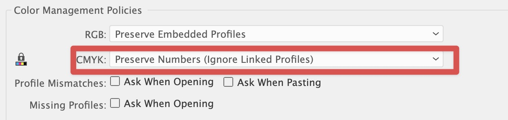

# Your Current Color Settings Discard / Honor CMYK Profiles in linked content error message Fix 
from the edit menu choose color settings or ⇧⌘ K and under color management policies > CMYK option > toggle between "preserve numbers (ignore linked profiles)" and "convert to working space" 


