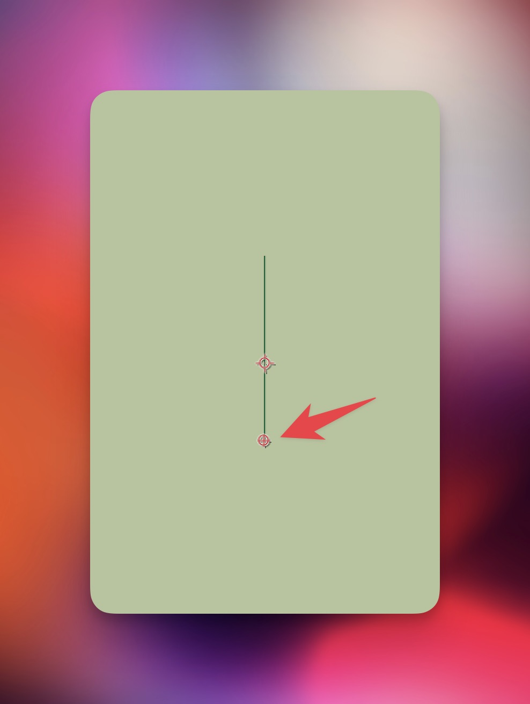

Let's Say We Have the Following Line Rotating 360 Degrees

❖ And We Want to Reveal a Background Behind the Line and the Reveal Will Happen with the Rotation of the Line.
❖ First We Will Use the Effect Radial Wipe Cuz It Gives the Same Effect as the Rotation
❖ But How We Gonna Align the Rotation Value (in Degrees) with the Transition Completion of the Radial Wipe (in Percentage)? The Answer Is the Linear Interpolation And We Won't Even Need Keyframes
❖ Apply the Radial Wipe Effect to the Current Background and Set the Wipe Center to the Start of the Line as Follows:

❖ And Next We Will Add the Linear Interpolation as Follows:

❖ So We're Interpolating the Value Between 0 and 360 of the Rotation to the Value Between 0 and 100 of the Transition Completion
❖ Final Result:


