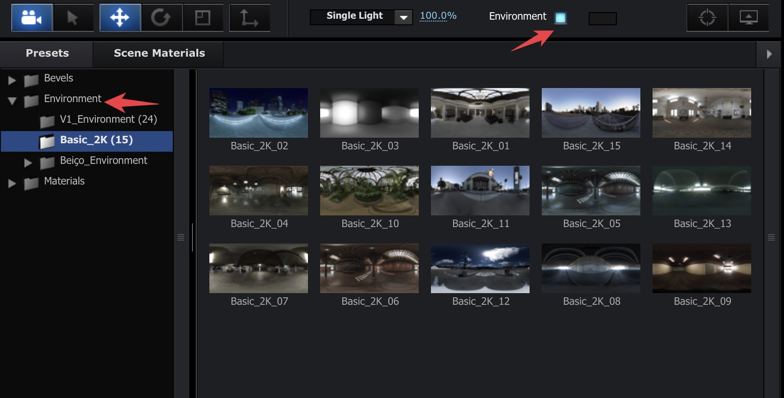
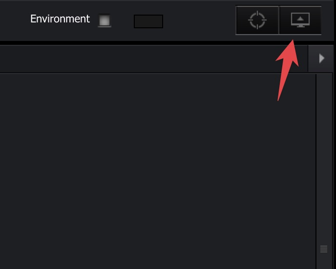
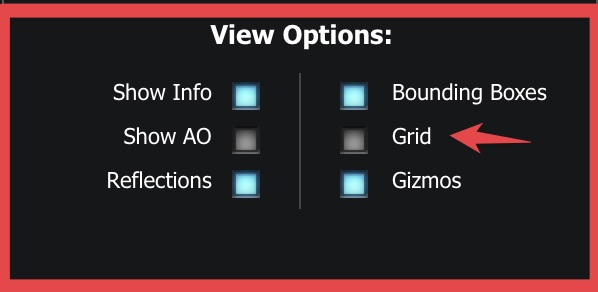
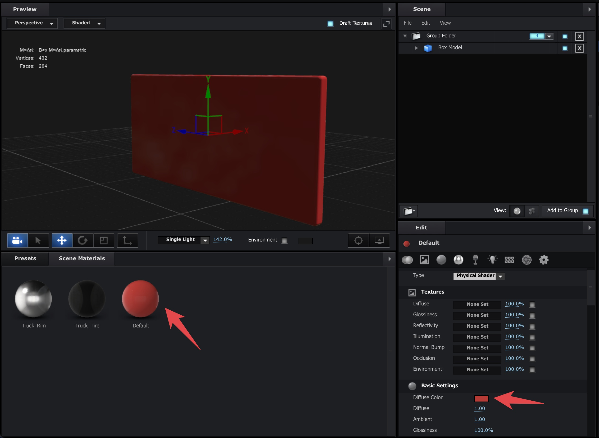
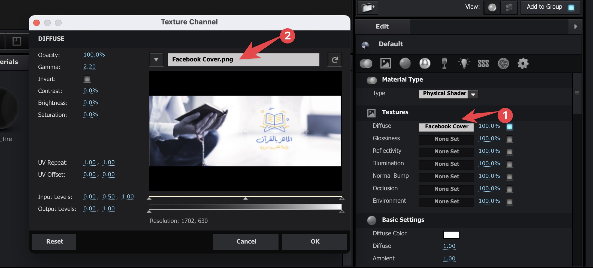
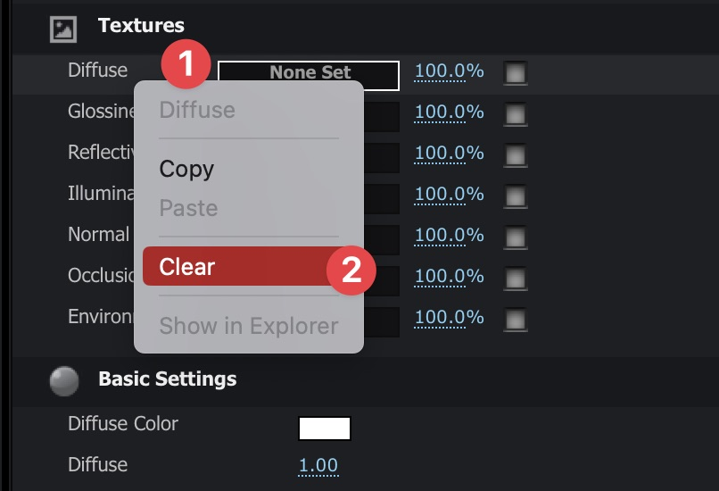

### Camera Movements Inside the Plugin
❖ Left Click and Drag ← → >> Rotate Around the Canvas
❖ Click with Mouse Wheel and Drag ← → >> Pan on the X and Y Axis
❖ Mouse Wheel ↑↓ >> Zoom in the Z Axix
### Changing the Environment

❖ You Can Also Change the Lighting Next the the Environment.
### Disabling The Grid
You Can Disable the Grid that Shows in the Viewport by Going Here:

And Turning Off the Grid

### Adding Color to Default Material
We Can Do so by Selecting the Material and Change the Diffuse Color

### Adding Photo / Logo to Material
Click on the Material and From the Edit Menu Under Texture Select the Diffuse as Follows:

And to Clear the Texture Just Right Click and Select Clear as Follows: 


