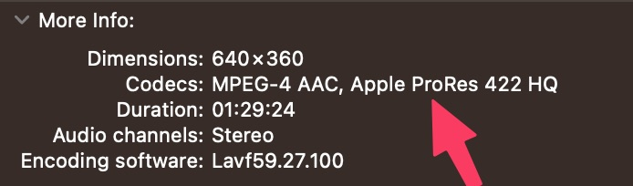
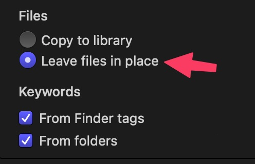
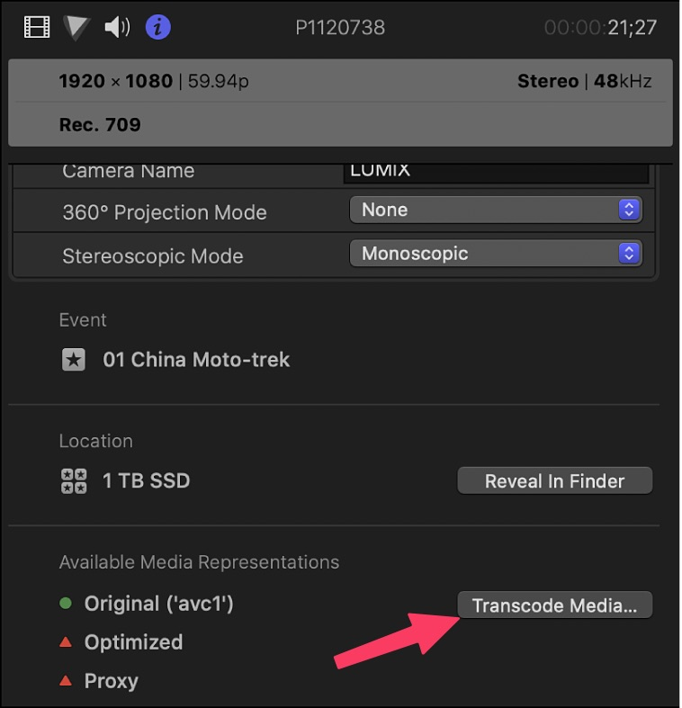
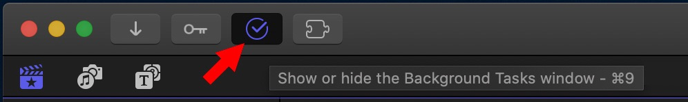

**Is Transcoding Footage to ProRes help speed up editing on editing software like final cut, premiere, and DaVinci Resolve?
**>>>>

#### How to Check the codec used in the footage**?
**click (⌘ + i) on your keyboard you'll find it under More info

or using the MediaInfo app on the app store: 



#### **How to Transcode to Apple ProRes 422? 
**#### ****use the following code: 
```plaintext
ffmpeg -i inputVideo.mp4 \ -c:v prores_ks \ -profile:v 3 \ -vendor apl0 \ -bits_per_mb 8000 \ -pix_fmt yuv422p10le \ proRes422_output.mov
```

## **Final Cut Pro 
**The First Thing To Do Is Right-Click On The Library Untitled (The Default Library Created In The ~/Movies Folder) And Close It
::**Libraries**::: Consider them Containers (where all your current work resides). 
::**Events**::: think of it as Workspaces (files and folders) that holds your media files (could be A-roll - B-roll, different days of filming, ..etc). 
::**Projects**::: think of them as Timelines (which can reference any event in the library).

::Now Let's Make A New Shortcut For Creating A New Library: ::
From Final Cut Pro Menu >> Commands >> Customize ( Or ⌥ ⌘ K) 
Now From The Command List Expand The Main Menu Commands And From File Menu Choose New Library And Add New Shortcut (⇧ ⌘ L), This Will Give You a Popup To Make a New Shortcut List, Let's Call It Ahmed. 
use 
::**Now Let's Create Our New Event**:: By Pressing (⌥ + N) And Delete The Default Library. 
::The best way to add media to events ::
just drag & drop to the event like this: 

You Can Also Press (⌘ + I) To Import The Media You Want, You Can Drag And Drop From Finder To The Bottom Area Of The Import Dialogue And FinalCut Will Locate It Automatically.
Also, Make Sure Leave Files In Place Is Checked. 

When The Media Is Added Final Cut  By Default Adds The Date As A Grouping System To The Media, To Fix That Do The Following: 

When You Delete Media From The Project FCP Move The Item Into A Trash Folder Inside The Fcpbundle File, Which Takes Disk Space; To Fix That And Permanently Delete The File ::Empty The System Trash.::
Now Let's Create The Timeline From One Of The Media We Imported
After Importing The Media FCP By Default Starts To Transcode The Media To ApplePro-res (Optimized Codec) For Final Cut Pro. You Can Check That By Clicking On The Media Info In The Inspector. 

And Checking The Background Tasks Icon: 

::Note::: 
In Final Cut Pro, if the "Create optimized media" option is dimmed, it means that the original camera format can be edited with good performance and there is no need to transcode video to the Apple ProRes 422 format. If you are experiencing this issue and you want to create optimized media, you can try changing your project settings to a different resolution or frame rate.


