To start working with FCP you need to create a ‘library’ with the top Hierarchy in FCP. 
**Libraries >> Events >> Projects**
::**Libraries**::: Consider them Containers (where all your current work resides). 
::**Events**::: think of it as Workspaces (files and folders) that holds your media files (could be A-roll - B-roll, different days of filming, ..etc). 
::**Projects**::: think of them as Timelines (which can reference any event in the library). 
after creating your library, create your event and delete the default event.
Start importing your media files
::Keyword Collections::: If You Dragged and Dropped a Folder to an Event FCP Will Automatically Create a Keywork Collection (Mini Folder) for that Folder. You Can Also Create Them From the File >> New Menu and Store Special Types of Footage in Them.
::Note::: Please Organize Your Files in One Folder that Contains Everything You’re Working On. 
::Tip::: in the “Media Import” Panel; you can drag any file from finder to this area and final cut will go to this directory automatically. 
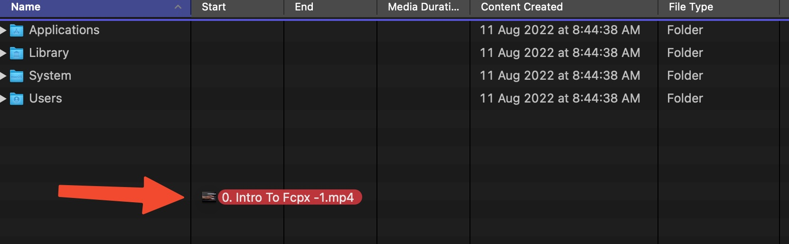
also make sure to select “leave files in place” since all files are in the same folder
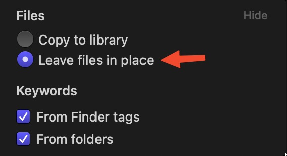
If You Choosed the Other Option `Copy to Library` it Will Significantly Increase The `fcpbundle` fIle Size Cuz It Will Be Taking a Copy of All the Footage Inside of It.
So It's Better to Make This Permanent by Going to:: Final Cut Pro >> Settings (⌘+,) >> Import Tab >> Leave Files in Place::
you can also specify which event to put these media at or create a new one for it.  
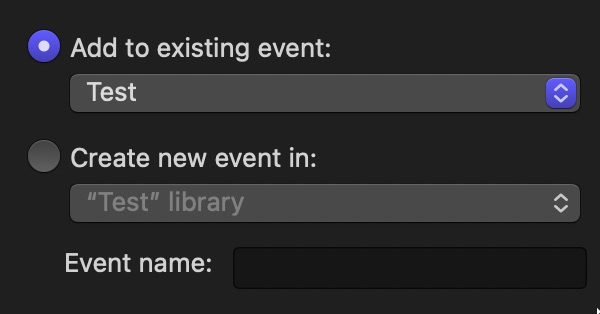
Now create your project (Sequence in Premiere pro) and adjust it to the settings you want. 
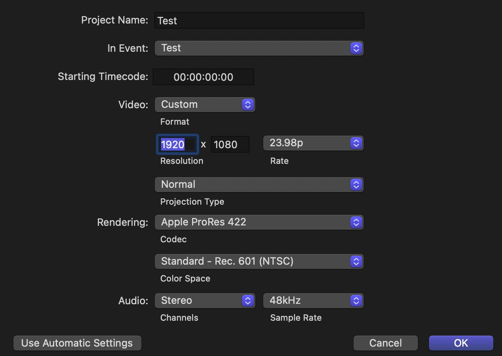
After creating your project, it’s better to view things in list view: 
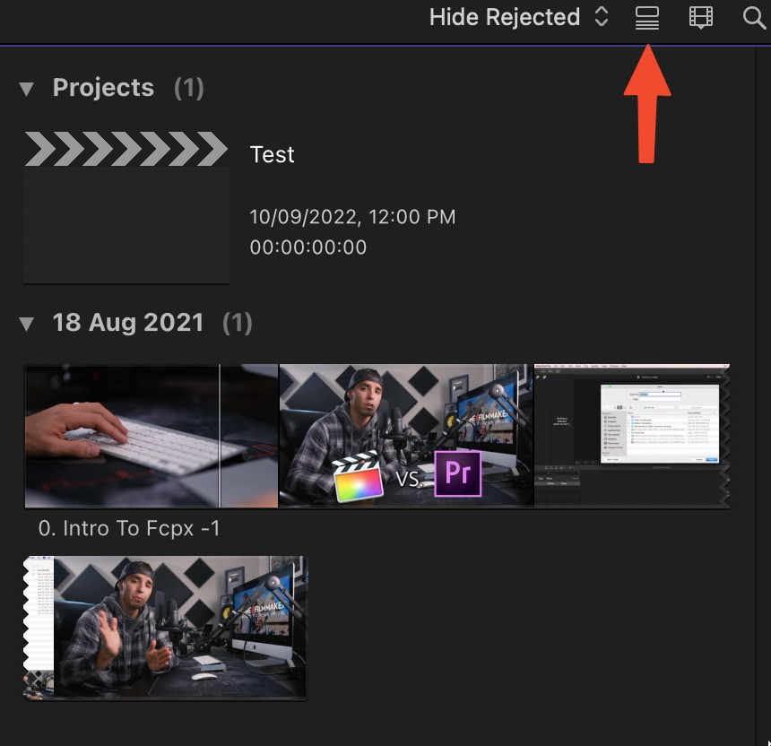
so now it will look like this: 
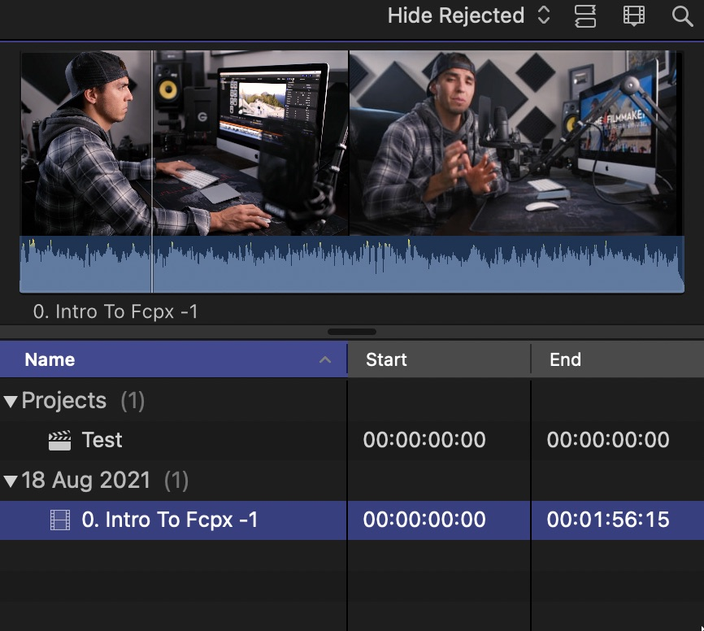
so it’s easier to to see and work with. 
you can set in and out point (range) right from the library by clicking and dragging the mouse over the footage; and drag it to your timeline like this: 
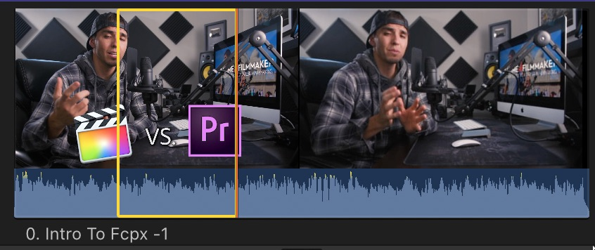
and option click the range to remove it. 
### How to Remove Footage Grouping in the Event Browser?
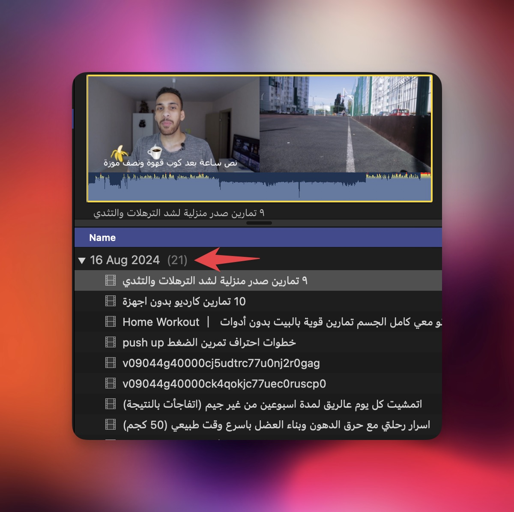
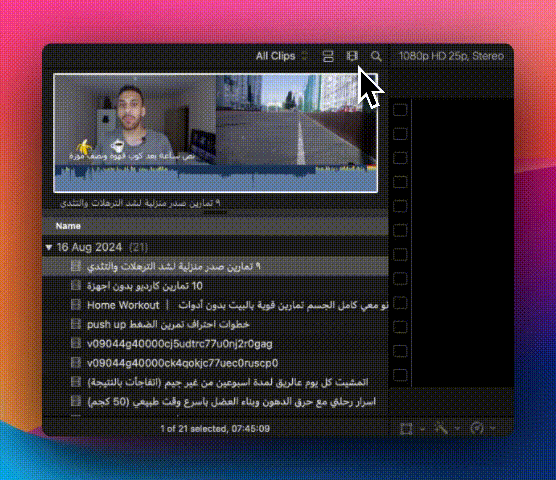

but if you created a project you'll see this grouping again
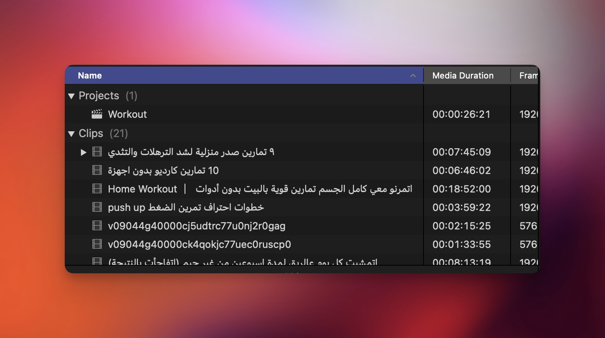
And to Get Rid of It We Can Create a New Event for only Projects and Add the Project to It
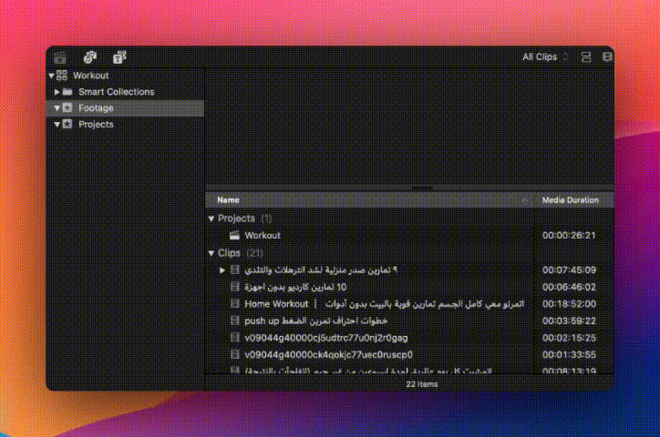

