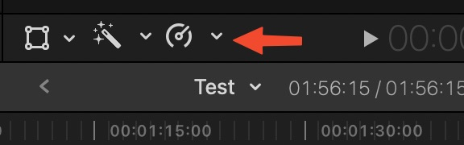
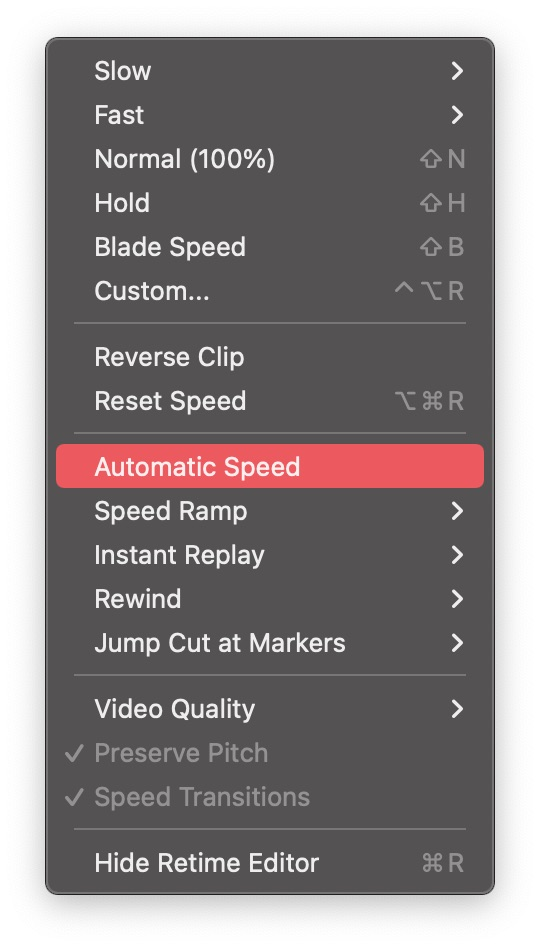

::Frame Rate::
Select all footage from the timeline that you want to fit to project frame rate and from this icon choose automatic speed. 


this will set all your selected footage to be like the project frame rate. 

::Footage Size::
FCP already scale your footage to the project frame size unlike premiere. 

