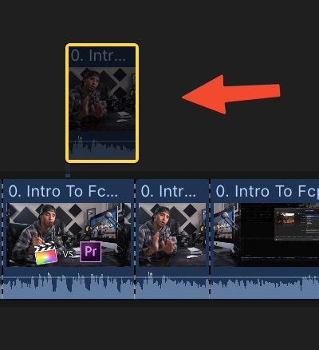

**Note: your keyboard layout must be in English in order for these shortcuts to work

**Spacebar** `-->` play and pause the video.

**⌘+ (+/-)** `-->` Zoom in and out your timeline.

**Shift + Z** `-->` Fit all your clips in your timeline to 100% view.

**B** `-->` (Blade Tool) used to cut your footage.

**⌘+B** `-->` cut your footage at the playhead, if you add shift i will cut the above layers as well

**A** `-->` (Select Tool)

**V** `-->` Disable the clip Temporarily, and Press it again to Enable.



**S** `-->` (Enable or Disable Skimming Or Scrubbing) through the timeline.

**Shift + S** `-->` (Enable/Disable Audio Skimming)

**N** `-->` (Enable or Disable Snapping) through the timeline.

**⇧ + ⌘ + V** `-->` (Paste Attributes) like color correction , scale, rotation, etc. Must do ⌘ + C to copy first.

**⌥ + ⌘ + V** `-->` (Paste Effects).

**⌘ + T** `-->` add cross dissolve effect.

**⌥ + G** `-->` new compound clip (nested clip) from the selected clips.

**⌃ + ⌥ + R** `-->` Set Clip Custom Speed.

**⌃ + ⇧ + S** `-->` Detach Audio

**⌥ + K** `-->` add keyframe

**⌃ + R** `-->` Render Selection

**⌃ + ⇧ + R** `-->` Render All

**i & O** `-->` sets the in and out point that will be exported.

**⌥ + X** `-->` Clear the in and out point.

**⌘+R** `-->` show clip speed editor

**⌘+E** `-->` Export your Project

**,** `-->` nudge the clip backward 1 frame

**.** `-->` nudge the clip forward 1 frame

**M** `-->` adda a marker

**⇧+3** `-->` Audio only (Drag only Audio From the Event Browser to the Timeline)

