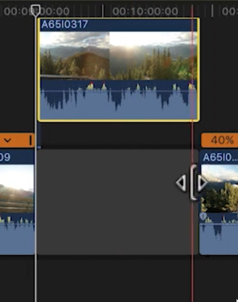

FCP uses what is called “the magnetic timeline’ which means when you delete a clip between two clips, it will ripple delete the space between them. 
but there will be times when you want that space between the two clips, you can do that with the position tool (Shortcut P) from your keyboard. 

Note: be careful with that position tool as it overwrites the clips already in the timeline if you put that above clip back to the timeline, and to fix that; press A for the selection tool to squeeze that part back into the magnetic timeline without overwriting the clips already in the timeline. 