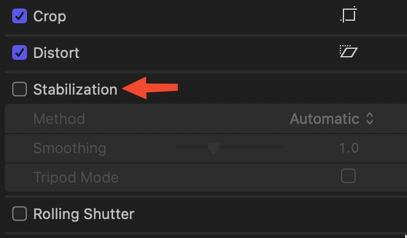
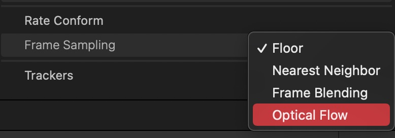

::Stabilization::
you can find stabilization in the inspector panel in the top right corner. 


when you check mark the stabilization you will notice that it’s running in the background tasks in the top left corner

::Optical Flow::
it’s kinda like slow motion but to use it the clip must have a different frame rate than the timeline. and from the inspector under rate conforms choose optical flow. 

::please note:: that to use optical flow try to pick some frames with less movement for better results. 

