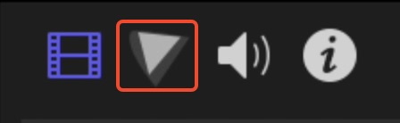
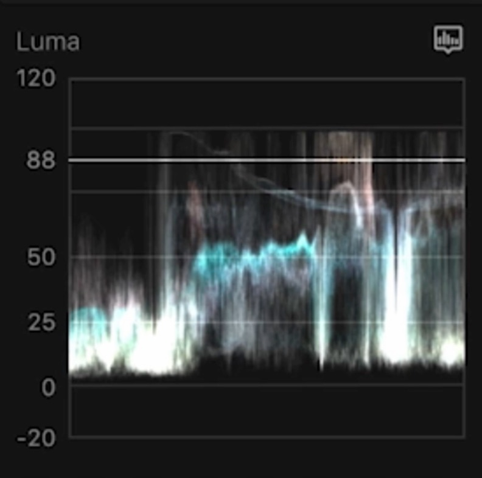
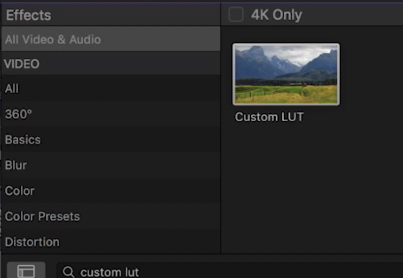
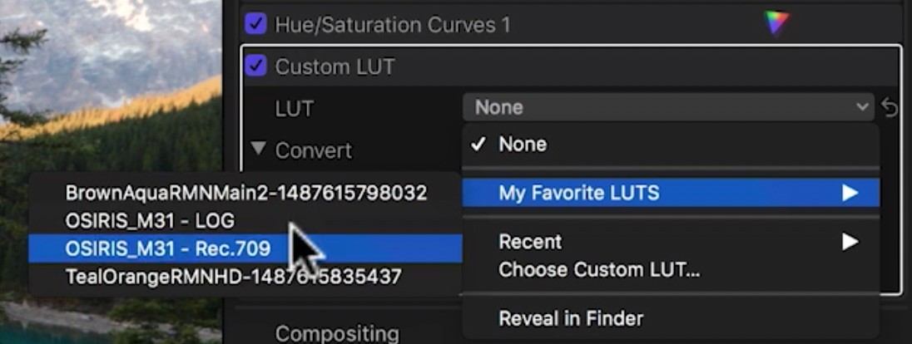

::Color Correction:: here we are trying to make all clips match the lightning, shadows, exposure, saturation, .. etc. 
and we can edit those from this color panel here in the top right corner. 
and here we can use what is called scopes which help you better color correct your footage. 

so here for example in luma, you should be between 0 and 100. 
::Color Grading:: here we can apply LUTs (look up table). and you can apply LUTs by going to the effects panel and typing custom LUT and dragging it to your footage. 

and after that from the inspector under custom LUT; choose the folder where your LUTs at and you can choose from different LUTs to apply. 


