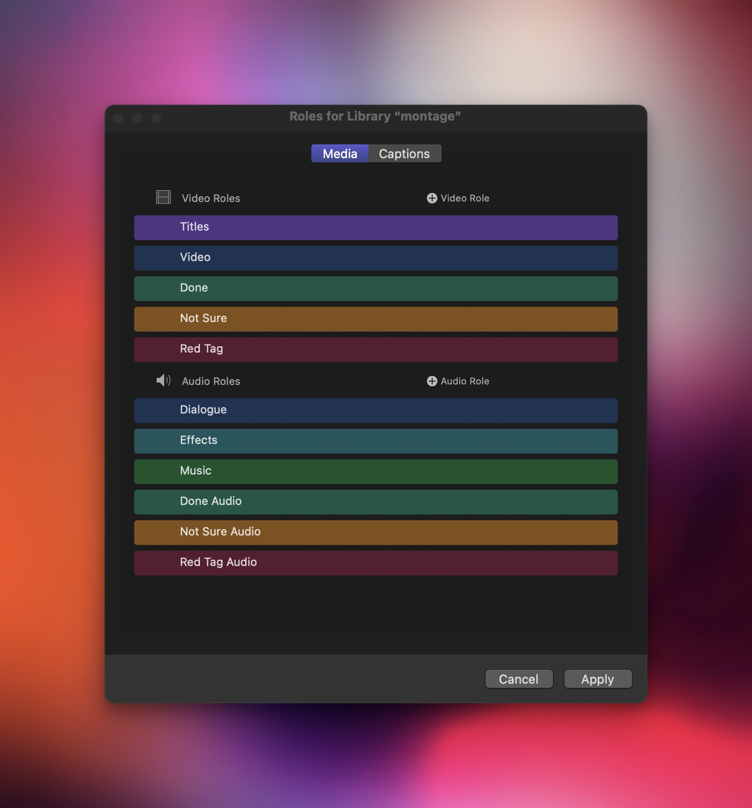
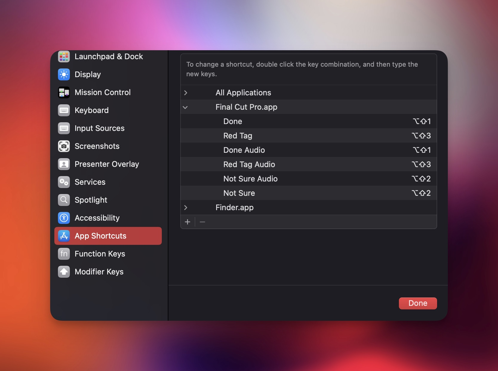

❖ You Can Assign Roles by Selecting Clips and From the Modify Menu Choose Edit Roles. 

❖ To Effectively Change the Color of a Clip It Has to Have the Same Keyboard Shortcut for the Video and Audio Role and to Assign a Keyboard Shortcut for the New Video and Audio Roles You Created You Can't Do It in Final Cut Instead We Will Use ::The System Settings App:: Shortcuts Section::

::❖ Under App Shortcuts Use Final Cut Pro and Make Two Entries Using the Same Shortcut ::⇧+⌥+1 :: (The Two Entries Are for the Video and Audio Rules)

❖ But if You Created a New Library the Roles Will Be Gone so It's Better to Use the Template Workflow (Use the Default ::`untitled.fcpbundle`:: and Add the Rules to It and Then Using Zsh to Copy the Template to Your Desired Location with a New Name) 

❖ Here's the Workflow I'm Using:

↪ Open The ::`untitled.fcpbundle` ::And Click on the Library Name and From the Modify Menu Choose Edit Roles and Add the Rules as Follows: 



↪ Next Go to System Settings >> Keyboard >> Keyboard Shortcuts >> Final Cut Pro >> and Add the Following Shortcuts as Follows:


### Notes: 
❖ Be Careful when You Name the Rules Cuz if the Rule Name Is as Same as Something in Final Cut the Shortcut Won't Work. 

### How to Select All Clips with the Same Role?

❖ Click on the Index Word in the Timeline. 

❖ Under the Clips You Will See Some Columns Like Name, .. Right Click and Make Sure Audio Roles Are Checked. You Can Remove Other Columns and Check the Option Resize All Columns for convenience.

❖ Now Type in the Search the Name of the Role You Want to Select It Will Filter All Clips for You, Then You Can ⌘+A to Select Them All and Do Whatever You Want with Them.

