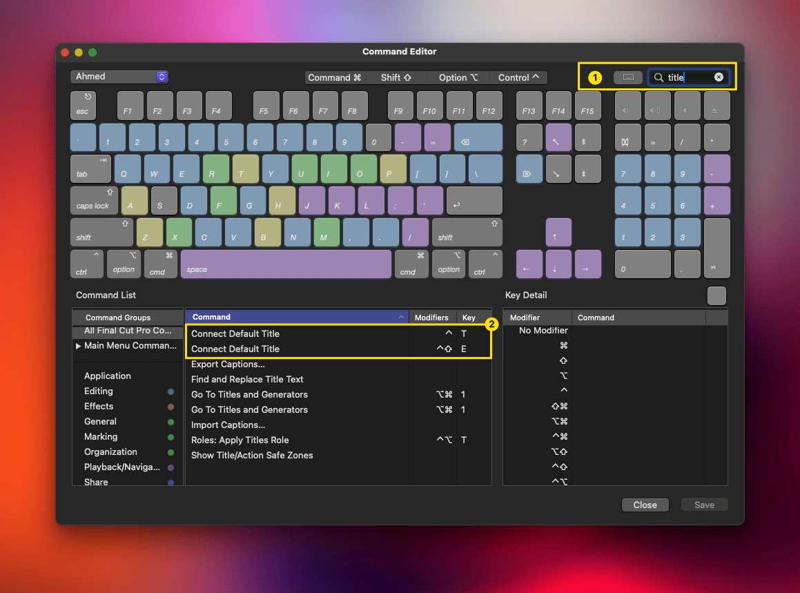
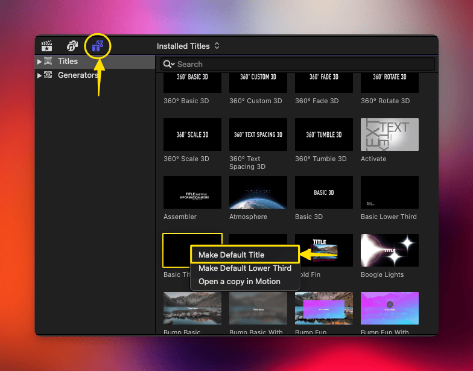
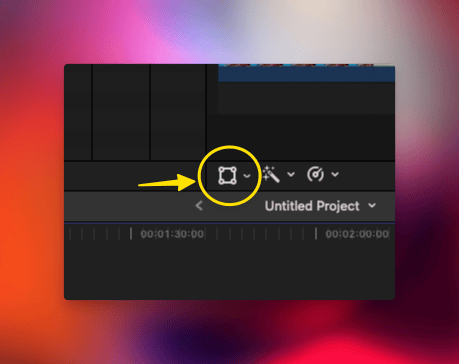

### How to Add a Basic Title?

→ Press `⌥ + ⌘ + K` or From the Final Cut Menu >> Command Sets >> Customize 
→ Search for the word `Title` and add another keyboard shortcut for it (i made it with `⌃ + ⇧ + E`) because the default shortcut is used by Raycast to open the terminal.  

### Choosing a Default Title

→ You Can Right Click on Any Title in the Title Browser Window and Choose the Title You Want as the Default Title

**Important Tip**
→ Try adding the title to your timeline but make sure the transform icon is not active otherwise the small title will take the whole screen to move

**Why This is Important?**

→ See the difference when you move a title with this icon active / inactive: 

### Professional Titles

→ Professional Titles can be found on websites like Envato Elements or apptorrents.ru
