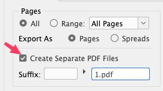
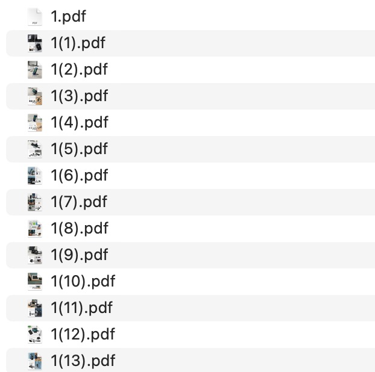
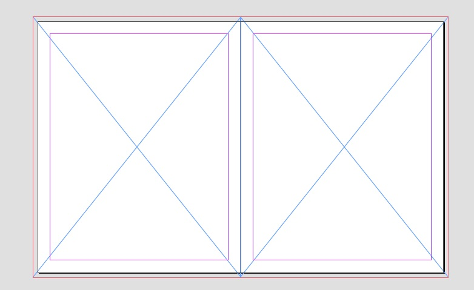

- export the section as pdf (pages not spreads) with no crop or bleed marks. 
- in the export options check the option to create separate pdf files

- the outcome should be something like this:

- in your compiled file when you add the technology, create a spread with two frames like this:

- duplicate the spread, and add the pages we exported from the pdf to the frames in the left and right pages.

