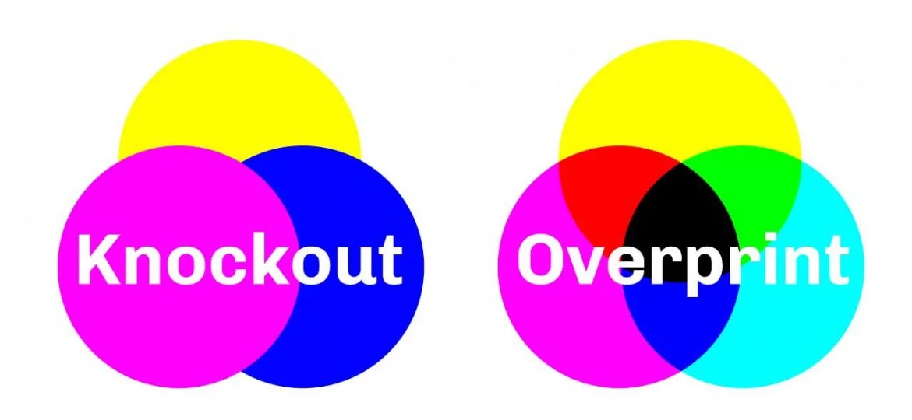

**overprint** is a printing technique where one color is printed directly on top of another without knocking out the underlying color.

**Key Points:**

1. **Purpose**: It’s used to create effects like overlapping colors, adding depth, or ensuring critical elements (like black text) remain sharp.

2. **Common Use**: Black text or graphics are often set to overprint to avoid registration issues, ensuring no white gaps appear around them.

3. **Designer’s Role**: You must carefully control overprint settings because unexpected overlaps can result in undesired color changes or printing errors.

4. **Previews**: Overprint effects might not be visible on-screen unless you use specialized tools or overprint preview modes in design software like Adobe Illustrator or InDesign.

Sure! Let me break it down:

**Normal Printing (Knockout):**

• In traditional printing, when two colors overlap, the underlying color is **knocked out** or removed in the overlapping area to avoid mixing colors.

• For example, if you place blue text on a yellow background, the printer “knocks out” (removes) the yellow ink where the blue text will be printed. This ensures the text appears clean and true to its intended blue color.

  
**Overprinting:**
• When you **overprint**, the underlying color is **not knocked out**. Instead, the top color is printed directly over the existing one.

• Using the same example: if the blue text is set to overprint on a yellow background, the blue ink will mix with the yellow ink in the overlapping area. This might result in a greenish appearance depending on the inks.

**Why Use Overprint?**

1. **Black Elements**:

• Black is often overprinted because it’s strong enough to dominate underlying colors, ensuring clean and sharp text or graphics without risking misalignment (known as registration issues).

• Example: Black text on a colored background will remain black and crisp.

2. **Special Effects**:

• Overprinting can create unique color-mixing effects where two inks blend.

3. **Avoiding Gaps**:

• If there’s a misalignment during printing, overprint prevents unwanted white gaps or outlines where the underlying color should be.

**Visual Example:**

Imagine printing **red text** on a **blue background**:

1. **Knockout**: The printer removes the blue ink behind the red text, so the red appears clean and vibrant.

2. **Overprint**: The red ink prints over the blue ink, resulting in a purple-ish color in the overlapping area.

  

**Important Consideration:**

Overprint should be used carefully because it can lead to **unexpected color results** or readability issues if you’re not mindful of how inks interact. Always preview overprint settings in your design software and consult with your printer!

**Question: and give me a short answer then go in details? as a graphic designer should i put my black text to overprint or not if the file will go to offset printing? or maybe i shouldn't unless the print house said so?**

**Short Answer:**

Yes, you should generally set black text to overprint for offset printing to avoid misalignment issues, but it’s best to confirm with the print house to align with their workflow.
  
**Detailed Explanation:**

1. **Why Overprint Black Text?**

• Black ink is opaque and won’t be affected much by underlying colors. Overprinting ensures no tiny white gaps appear around the text due to misregistration during printing.

• Overprinting black is a standard practice for small, body, or thin text because it keeps the design clean and avoids unnecessary complications.

2. **When NOT to Overprint Black Text**

• If your black text is large or placed over complex, colorful backgrounds, overprinting might cause visible color blending, making the black look muddy. In such cases, knocking out might be better.

3. **Consult the Print House**

• Print shops may have specific preferences or automated settings to handle overprint. Always share a proof with overprint preview enabled and ask for their guidance.

4. **Prepress Tip**

• Use your design software’s overprint preview to check how your text will appear. This ensures no surprises when the file goes to print.
  

**Bottom Line:**
  
Overprinting black text is usually safe and recommended for offset printing, especially for small or thin text. However, double-check with your print house to ensure it matches their workflow.