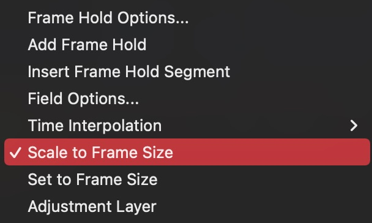

when your sequence frame size is lower than your footage, you can right click on your footage at the timeline and choose [Scale to Frame Size]. 

and that will make your footage fit to your sequence frame size. 