الـ HTML5 هي النسخة المحدثة من الـ HTML القديمة واللي بقا فيها تفاعل كبير من المستخدم مع الويبسايت مش بس عرض المعلومات سواء كلام أو صور. 
أول حاجة اتغيرت في الـ HTML5 انك مش لازم تكتب علامات التنصيص "" ومش لازم تكتب الـ text type هنا: 
```plaintext
<link rel="stylesheet" type="text/css" href="style.css">
```
فبقت ممكن اكتبها كده بس وعادي برده لو حطيت علامات التنصيص مش هايعمل مشكلة: 
```plaintext
<link rel=stylesheet href=style.css>
```
وعندي meta جديدة في الـ HTML5  زي كده: 
```plaintext
<meta name="viewport" content="width=device-width, initial-scale=1.0" >
```
الـ viewport هنا المقصود بيه انك بتخاطب السيرفر انه يشوف ايه الجهاز اللي بيتم من عليه عرض الصفحة وبقوله حطلي عرض الـcontent أو المحتوى ١٠٠٪ من حجم الشاشة اللي معروض عليها. 
وفيه برضه meta بتاعة الويندوز لو الجهاز يعني ويندوز اللي بيعرض صفحة الـ HTML5 فبنحط الـ meta دي: 
```plaintext
<meta charset="utf-8" >
```
حاجة برضو جديدة اننا في الـ HTML5 الـ id نفسه بقا div 
يعني بدل ما نكتب: 
```plaintext
<div id="header">
```
نكتب كده: 
```plaintext
<header></header>
```
وده بيفيد جدًا في الـ SEO أو الـ Search Engine Optimizer
** ملحوظة**: علشان اخلي كل محتوى الـbody في نصف الصفحة بروح على الـ css وبكتب كده: 
```plaintext
body {
	margin: 0auto;
	width: 70%;
	clear: both;
}
```
وبعد كده اي حاجة جوه الـ body لما بديها 100% فده معناه انها بتاخد 100% من الـ 70% اللي انا مديها للـ body
لو عايز ارفع الحاجة لفوق بحط قيمة بالسالب: 
```plaintext
margin-top: -20px;
```
ملحوظة: لما باجي اعمل الـ navigation menu بتاعتي زي كده: 
```plaintext
    <ul>
      <li> <a href="#Home">Home</a> </li>
      <li> <a href="#portfolio">Portfolio</a> </li>
      <li> <a href="#about">About</a> </li>
      <li> <a href="#contact">Contact</a> </li>
    </ul>
```
بلاحظ انه بيحط padding من على الشمال كده منه لنفسه علشان يعني دي list وكده .. بس ده هايخلي لما اجي اعمل align للمنتصف انها تكون مش في المنتصف بالظبط طب احل الموضوع ده ازاي: 
بروح على الـ css وبكتب كده: 
```plaintext
* {
	padding: 0;
}
```
ملحوظة: ممكن في ملف الـ css اعمل اختيارات معينة داخلة ضمن اختيارات تانية زي كده: 
```plaintext
.header img {
  width: 100%;
}
```
هنا انا حدد class الـ header ودخلت جواه على الصورة
مثال تاني: 
```plaintext
.navbar a:link, .navbar a:visited {
  color: white;
  padding: 10px 40px; 
}

.navbar a:hover, .navbar a:active {
  background-color: rgb(29, 83, 111);
  color: white;
}
```
هنا انا بحدد اختيارات معينة للينك اللي جوه الـ navbar 
ودي النتيجة النهائية: 
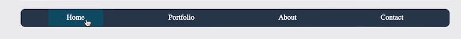
شرح الفروقات بين a.link و a.visited وa.hover و a.active باستخدام Chat GPT
a: link is the state of an unvisited link.
a:visited' is the state of a link that has been visited by the user.
a:hover" is the state of a link when the mouse is hovering over it.
a:active is the state of a link when it is being clicked or activated.
In simple terms, these pseudo-classes are used to define the different styles of a link based on its state (unvisited, visited, being hovered over, or being clicked).
طب سؤال ؟ ليه هنا استخدمنا الـ padding في الـ state بتاعة الـ link والـ visited ومستخدمتهاش في الـ hover والـ active ؟ 
الإجابة من ChatGPT 
**When you apply the padding in the link and visited state, it ensures that the hover and active state will appear exactly how you want it to, without any unexpected behavior. The padding is applied to the link and visited states because it allows for a consistent look and feel for the element regardless of the state it is in. The padding in the hover and active state is not necessary because the hover and active states are already being styled with a different background color.
****When you apply the padding to the link and visited state, it provides a consistent look and feel for the element regardless of the state it is in. By applying the padding to the link and visited state, the hover and active state will appear exactly as you want it to, without any unexpected behavior. The padding is applied to the link and visited states because it provides a consistent look and feel for the element regardless of the state it is in. This is important because it ensures that the element will appear exactly as you want it to, regardless of the state it is in.
****The background color changes in the hover state because the hover state is being styled with a different background color. When you apply the padding in the hover state, it can cause unexpected behavior because the padding will be applied to the hover state even when the element is not being hovered over. To avoid this, it is best to apply the padding to the link and visited states, which ensures that the element will appear exactly as you want it to, regardless of the state it is in.**
طب معناه ايه السطر ده
```plaintext
padding: 10px 40px; 
```
padding: 10px 40px; sets the padding of an element. Padding is the space within an element, between the element's content and its border.
The values '10px' and '40px' define the top and bottom padding ('10px') and the left and right padding ('40px*) respectively. The units "px* stand for pixels, which is a unit of length in CSS.
So, this particular CSS code sets the top and bottom padding of an element to 10 pixels, and the left and right padding to 40 pixels. The padding adds space within the element, increasing its overall size and creating space between the content and the border.
إجابات عن بعض الأسئلة [Chat GPT]: 
**ايه الفرق بين margin 0 وبين margin 0 auto ؟ **
'margin: 0 auto; sets the top and bottom margins to 0, and the left and right margins to 'auto'. This is commonly used to horizontally center an element within its container. The "auto' value on the left and right margins allows the browser to automatically calculate and distribute the remaining space evenly, effectively centering the element horizontally.
'margin: 0;" sets all four margins (top, right, bottom, and left) to 0.
This eliminates any space around the element and sets the element flush against its container.
In summary, "margin: 0 auto; ' centers an element horizontally within its container, while margin: 0;" removes all margins from the element.
**يعني ايه احط الـ padding أول الـ margin بقيمة 3% ؟ **
When you set the 'padding or margin to '3%" in CSS, it means that the I space around an element (padding) or outside of an element (margin) will be set to 3% of the parent container's width.
For example, if the parent container has a width of '1000px' then the
'padding' or 'margin' of '3%* would be equal to '30px' ('1000px *
0.03 = 30px').
Percentage values for 'padding and 'margin' are relative to the parent container's width. This allows for more flexible and responsive design, as the space around or within an element will scale proportionally with changes to the parent container's size.
**ايه الفرق بين display: inline-block وبين display: inline بس ؟ **
1. 'display: inline-block; sets an element to display as an inline-level block container. An inline-block element is placed inline with the text and behaves like a block-level element (it can have a width and height set), but it can be affected by the surrounding text and cannot have margins or paddings set on its top and bottom.
2. display: inline;' sets an element to display as an inline- level element. An inline element only takes up as much width as necessary, and is affected by the surrounding text. An inline element cannot have a width, height, margins, or paddings set.
In summary, display: inline-block; allows for an element to be treated like a block-level element, but still be affected by the surrounding text, while display: inline; sets an element to be fully affected by the surrounding text and only take up as much space as necessary.
مثال لتوضيح الفرق بينهم: 
```plaintext
<div style="background-color: lightgray; width: 500px;">
  <div style="background-color: yellow; display: inline-block; width: 150px; height: 150px;">
    <p>I am a block-level element with display: inline-block;</p>
  </div>
  <div style="background-color: green; display: inline;">
    <p>I am an inline element with display: inline;</p>
  </div>
</div>
```
النتيجة: 
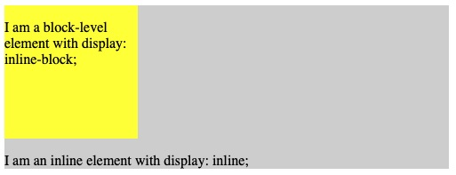
In this example, the first div (yellow) has 'display: inline-block;', so it acts like a block-level element and can have a width and height set, but it is affected by the surrounding text. The second div (green) has display: inline;, so it takes up only as much space as necessary, and is affected by the surrounding text.
Note: In the example, the width and height of the first div are set to '150px" and 150px* respectively, while the width and height of the second div are not set and will only be determined by the content inside.
فيه أمر جديد في الـ HTML5 اسمه Figure وبيتكتب كده: 
```plaintext
<figure></figure>
```
والأمر ده بستخدمه لما احب احط صورة واحط تحتها Caption زي كده: 
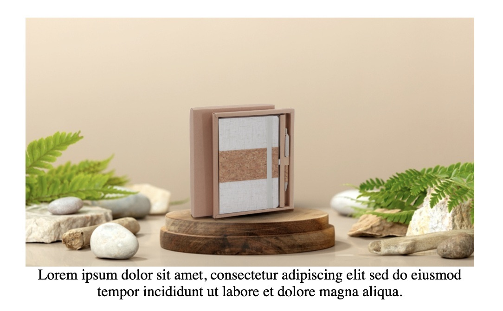

وبكتب الكود بتاعها كده: 
```plaintext
<figure>
    
    <figcaption>
        Lorem ipsum dolor sit amet, consectetur adipiscing elit,
    </figcaption>
</figure>
```
### اضافة صوت
فيه برضوا أمر جديد في الـ HTML5 اسمه audio وبيتكتب كده: 
```plaintext
<audio src="audio/myfile.mp3" controls ></audio>
```
وده بيخليني اقدر احمل ملف صوت ويشتغل على الويبسايت. 
وممكن اضيف كلام يظهر لو المتصفح مش بيدعم تشغل ملفات الصوت زي كده: 
```plaintext
<audio src="audio/myfile.mp3" controls > 
    <p> your browser doesn't support audio files </p>
</audio>
```
### اضافة فيديو
وزي الصوت ممكن اضيف فيديو طبعًا زي كده: 
```plaintext
<video src="/videos/video.mp4" controls></video>
```
وممكن اضيف خاصية الـ autoplay بحيث يشتغل على طول زي كده: 
```plaintext
<video src="/videos/video" controls autoplay ></video>
```
### الكتابة باللغة العربية
وفيه برده حاجة مهمة للكتابة العربي لو انا مثلا عايز اكتب عربي في النص ده: 
```plaintext
<p>Lorem ipsum dolor sit amet, consectetur adipiscing elit.</p>
```
بكتبه كده: 
```plaintext
<p>Lorem ipsum dolor sit amet,  <bdi> بسم الله الرحمن الرحيم </bdi> consectetur adipiscing elit.</p>
```
### اضافة Mark or Highlight 
زي كده: 
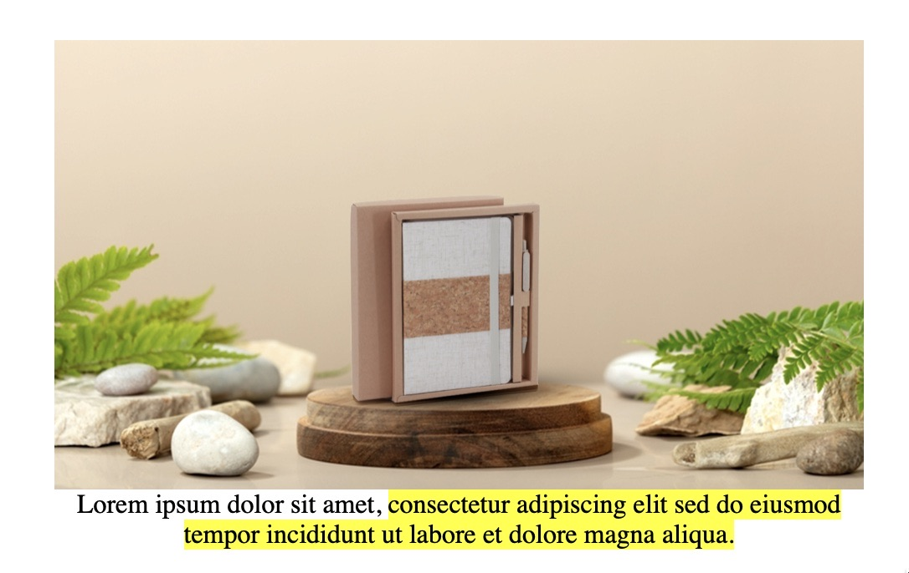

بكتبه كده: 
```plaintext
<mark> the text you want to highlight </mark>
```
ممكن برده اضيف حاجة زي كده: 
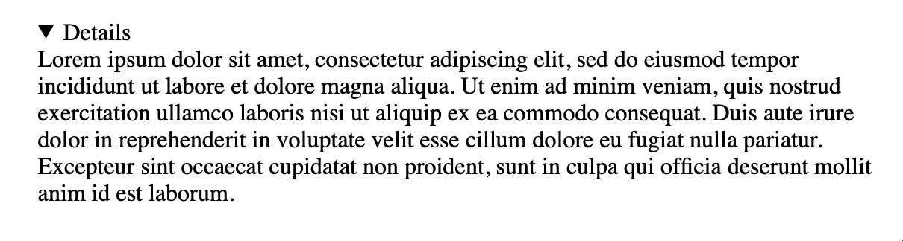
عن طريق امر Details بحيث لما اضغط على السهم اللي جمب الكلمة يفتحلي معلومات زيادة 
الامر  بيتكتب كده: 
```plaintext
<details> lorem ipsum dolor sit amet </details>
```
طيب لو عايز اخير كلمة details دي تبقا كلمة read more ؟ بعمل كده عن طريق أمر summary زي كده: 
```plaintext
<details> 
    <summary> Read More </summary>    
    lorem ipsum dolor sit amet 
</details>
```
زي كده: 
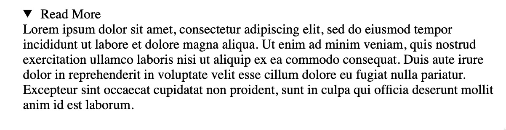
لو عايز اضيف كذا سطر زيادة في الـ paragraph بتاعي بكتبه كده: 
```plaintext
<br>
<br>
<br>
```
فيه اثنين tag شبه بعض اسمهم progress  و meter بيتكتبوا كده: 
```plaintext
<meter value="50" min="0" max="100" ></meter>
```
ودي هي النتيجة: 
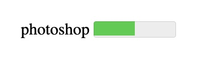
ونفس الكلام بالنسبة لـ tag الـ progress برده زي كده: 
```plaintext
<progress value="80" min="0" max="100" ></progress>
```
زي كده: 
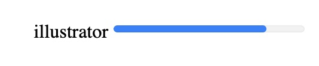
طب لو عايز اضيف فيديو من على اليوتيوب مثلا ؟ بيكون embedded link بروح على كلمة share واختار embed علشان اسحب الكود زي كده: 
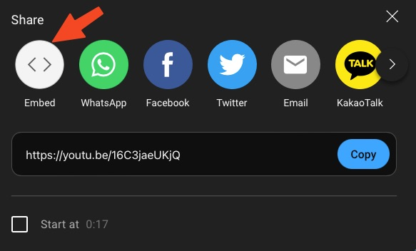
بروح احط الكود بيبقا حاجة زي كده: 
```plaintext
<iframe width="260" src="https://www.youtube.com/embed/16C3jaeUKjQ" title="YouTube video player" frameborder="0" allow="accelerometer; autoplay; clipboard-write; encrypted-media; gyroscope; picture-in-picture; web-share" allowfullscreen></iframe>
```
وطبعًا ممكن اتحكم في قيمة الـ width وقيمة الـ height زي ما انا عايز علشان تناسب الصفحة بتاعتي. 
ممكن اثبت مثلا الارتفاع 200px واخلي العرض يبقا 100% علشان يبقا responsive 
### Responsive Website
وعلشان اعمل الـ website يكون responsive لازم اعمل نسخة من الويبسايت تكون شغالة على الموبايل بمعنى ان طريقة العرض تناسب الموبايل وهنا بحتاج جوجل كروم بروح من قائمة كروم على More Tools وبختار Developer Tools زي كده: 
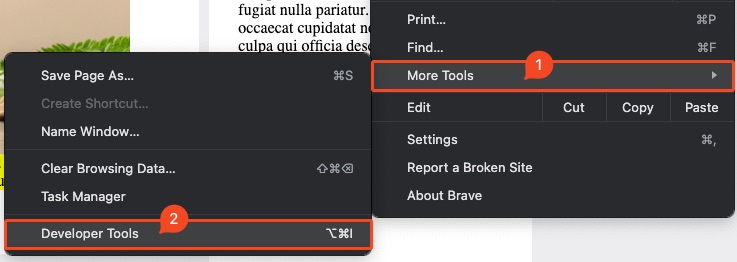
هايفتح معايا نافذة المطورين هاضغط منها على الزرار ده: 
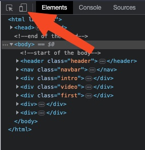
هالاحظ ان طريقة العرض اتغيرت وجابلي طول وعرض زي كده: 
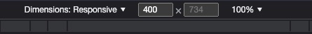
ولو ضغطت على السهم اللي جمب كلمة responsive  هايطلعلي اجهزة كتيرة زي الايفون والسامسونج وغيرها وممكن اضيف انا كمان اجهزة تانية. 
ودلوقتي لازم احدد حاجة اسمها الـ break point اني بقوله مثلا لما العرض يبقا مثلا 500 غيرلي شكل الويبسايت خليه بالشكل الفلاني طب هاعمل ده ازاي؟ 
هاروح على الـ css وانزل تحت خالص واحط كومنت كده علشان انظط الدنيا اكتب : 
```plaintext
/* ---------- CSS3 for Mobile -------------- */ 
```
يعني اللي جاي ده هايكون الـ css الخاص بنسخة الموبايل
واكتب الـ Break Point بتاعتي زي كده: 
```plaintext
@media screen and (max-width:500px) {
  
}
```
كده معناها اني بقوله لما عرض الويبسايت يصغر لـ 500px او أقل غيرلي شكل الويبسايت مثل ما انا هاقولك ما بين القوسين دول { } واللي هاحطه جوه القوسين دول هو الحاجات بس اللي انا عايزها تتغير والباقي بسيبه زي ما هو. 
فمثلا الـ body هاخلي عرضه 90% بدل من 70% زي كده: 
```plaintext
@media screen and (max-width:500px) {
  body {
    width: 90%;
  }
}
```
واعمل ريفرش من كروم علشان اشوف التغييرات وممكن برده اغير الفونت في الـ body كله يبقا اصغر ١٠٪ 
```plaintext
@media screen and (max-width:500px) {
  body {
    width: 90%;
    font-size: 90%;
  }
}
```
وده مثال للتغييرات اللي عملناها على نسخة الموبايل في ملف الـ CSS: 
```plaintext
/* ---------- CSS3 for Mobile -------------- */ 

@media screen and (max-width:500px) {
  body {
    width: 90%;
    font-size: 90%;
  }
  .navbar {
    height: 240px;
  }

  ul {
    height: 230px;
  }

  li {
    display: inline;
  }

  .navbar a:link, .navbar a:visited {
    display: block;
  }
  .intro {
    width: 56%;
  }
  .video {
    width: 30%;
  }
  .first {
    margin-top: 360px;
  }
  iframe {
    width: 100%;
  }
}
```
وده الشكل النهائي للموبايل: 
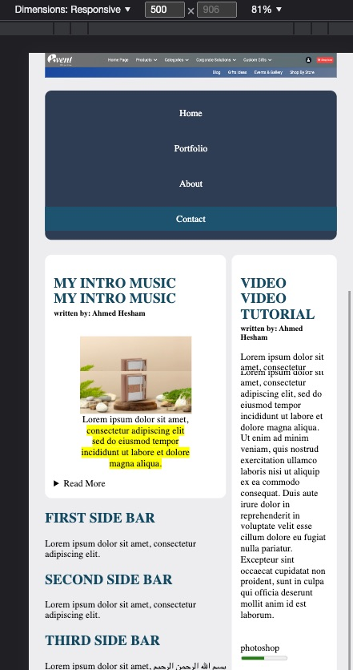
وممكن بدل ما احط كله في ملف css واحد ممكن اخلي جزء الموبايل في ملف css  منفصل وارجع اربطه بالـ html كالاتي: 
بكرر السطر بتاع ربط الـ html بملف الـ css وبزود فيه كود زي كده: 
```plaintext
<link rel="stylesheet" href="stylemobile.css" media="screen and (max-width:500px)"> 
```
معنى كده اني بقول للـ html انه طبقي الـ css بتاع الموبايل لما عرض المتصفح يكون 500px أو أقل. 
وممكن طبعا اعمل فايل ثالث لقياس الايباد مثلا .. وهكذا


