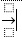

* to make radical جذر تربيعي type \sqrt
* to make and empty text box inside radicals الجذور التربيعية type ( ) and press space after it
* to quickly insert equation hold alt and press =
* to put something in superscript put before it ^ 
* to put something in subscript put before it _
* to put something above type \above
* to put something below type \below
* to put something above and below type \rightarrow and space to show the arrow after that type \above then double space the first one show the inverted t and the second one to put it above the arrow. 
put the cursor at the end of the arrow again and type \below and double space, should be something like this: 

* to put above and below before box like this: 

* type: 
```plaintext
(_^)
```
you'll find more useful shortcuts by going to word options < proofing < auto-correct  < math auto-correct
* \box
* \alpha
* \overbar
* \overbar(a+b)
* \vec for vector arrow above text


[https://www.youtube.com/watch?v=bLsKThYh_pI](https://www.youtube.com/watch?v=bLsKThYh_pI)


