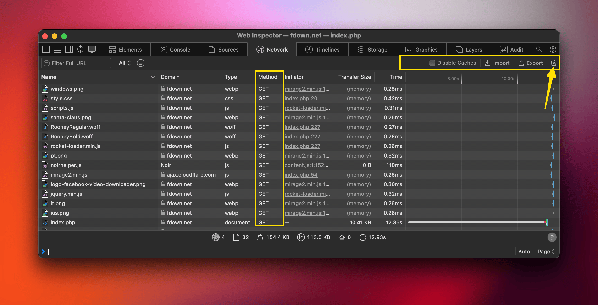
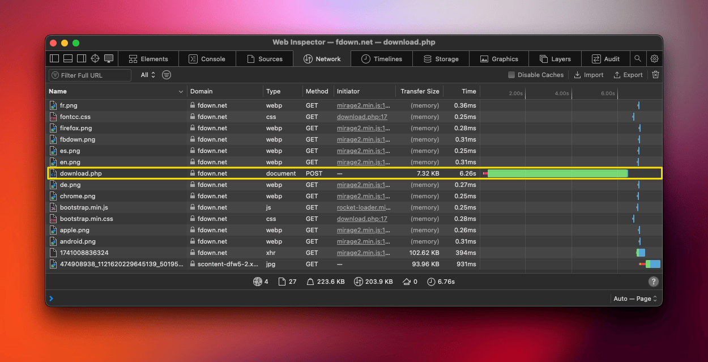
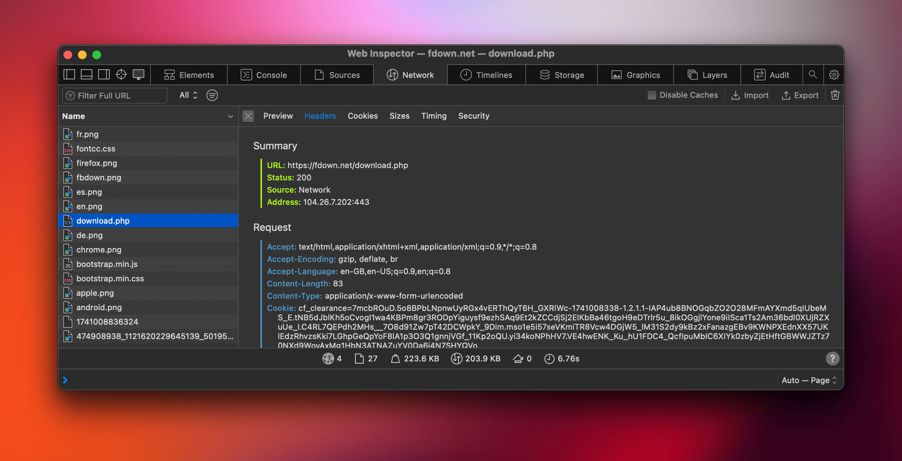
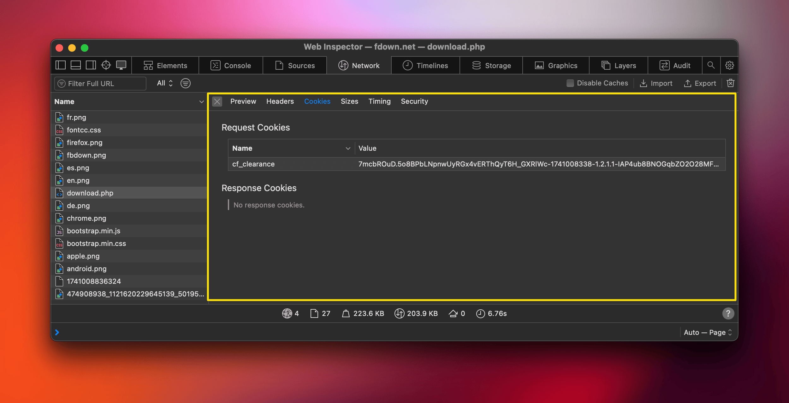
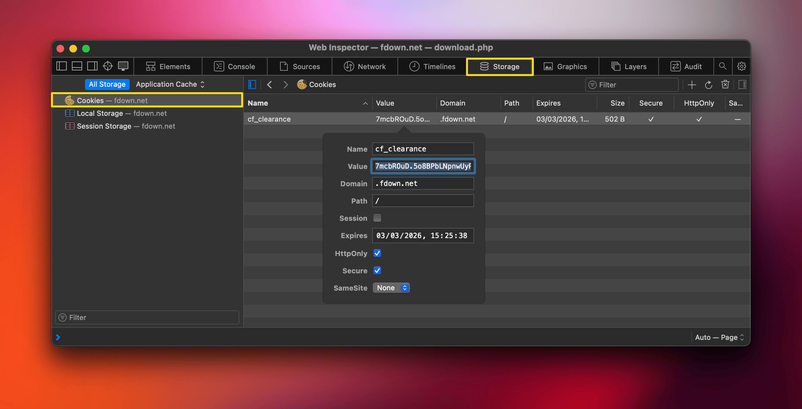
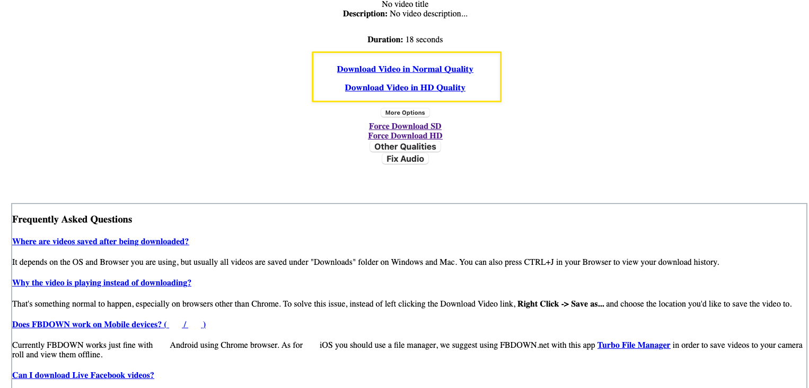
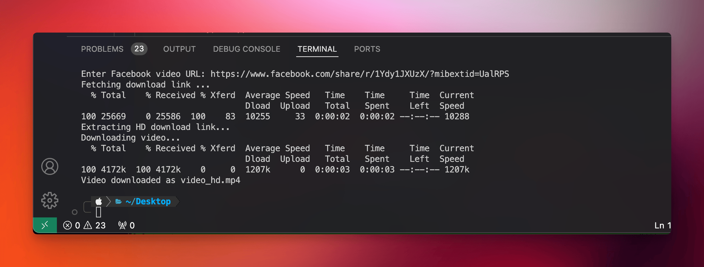

Curl is a command-line tool and library for transferring data with URLs. It supports a wide range of protocols including HTTP, HTTPS, FTP, and more, making it a versatile tool for connecting and interacting with servers on the internet. cURL is often used for automating file transfers, testing APIs, and downloading web content.

→ The best thing about this approach is that we can use it with any website, we just need to send the right parameters to the server to get the proper response.

→ The endgame of this experiment is to simulate what we do in the browser but we're doing it in the terminal

→ We will use the website https://fdown.net/ to send a POST request to https://fdown.net/download.php with the right parameters (Facebook Video URL, Cookies, ..etc) and get and HTML response which will contain actual download links. 

→ The POST request is not an API request cuz there's no endpoints here it's a web submission request. 

→ We will automate the process so that after we get the HTML response we will extract the actual download URL and download it with CURL

### What is Cookies and CF_CLEARANCE?
Cookies are small pieces of data stored on a user's device by websites to remember information about the user, such as login status or preferences, to enhance the browsing experience. The `CF_CLEARANCE` cookie is specifically set by `Cloudflare`, a web security and performance company, to verify that a user has passed a security check (like a CAPTCHA) and is allowed to access the website, typically used to protect against bots and DDoS attacks.

→ First Things First: we need to open the website https://fdown.net/ and open the developers tools (⌥ + ⌘ + I) and open the network tab and empty the current data


→Also make sure the method column is visible by right clicking on any top item in the table and choose `Method` to be visible. 

→ Now paste the facebook url in the browser and click download (We're sending a POST request now from the browser). and watch the network tab. 

→ You will notice several requests in the network tab, we're interested in the POST request

→ Once we click on this one we will get crucial informations from the Headers and Cookies

→ From the headers URL in the Summary we can see that the POST request is sent to https://fdown.net/download.php and we will do the same when we use CURL. 

→ it's best to send this headers and cookies to `chatGPT` to reverse engineer how the post request is made and based on that construct the curl command. 

→ if we moved to the cookies tab we will see the `cf_clearance` value

→ We need this value to send it with curl and we can get it two ways: 
1- **Method 1** (Not Recommended) : click on export and it will download a `fdown.net.har` file which can be opened in vs code and then search for `cf_clearance` and copy the value. 
2- **Method 2** (Recommended): go to the storage tab and double click on the cookie then copy it's value. 

→ Now we're ready to send the curl POST request, we want to save the output of the curl POST request (HTML Response) to and html file, Here's the basic code: 

```sh
curl -X POST "https://fdown.net/download.php" \
     -H "Content-Type: application/x-www-form-urlencoded" \
     -H "Cookie: cf_clearance=<YOUR_CF_CLEARANCE_TOKEN>" \
     -H "User-Agent: Mozilla/5.0 (Macintosh; Intel Mac OS X 10_15_7) AppleWebKit/605.1.15 (KHTML, like Gecko) Version/18.3 Safari/605.1.15" \
     -H "Referer: https://fdown.net/index.php" \
     --data-urlencode "URLz=<FACEBOOK_VIDEO_URL>"
```
and here's the code with the facebook link and cookie and we will redirect the output to a `response.html` file: 

```sh
curl -X POST "https://fdown.net/download.php" \
     -H "Content-Type: application/x-www-form-urlencoded" \
     -H "Cookie: cf_clearance=7mcbROuD.5o8BPbLNpnwUyRGx4vERThQyT6H_GXRlWc-1741008338-1.2.1.1-IAP4ub8BNOGqbZO2O28MFmAYXmd5qIUbeMS_E.tNB5dJblKh5oCvogI1wa4KBPm8gr3RODpYiguysf9ezhSAq9Et2kZCCdjSj2EIKbBa46tgoH9eDTrlr5u_8ikOGgjlYone9iISca1Ts2Am36bdl0XUjRZXuUe_I.C4RL7QEPdh2MHs__7O8d91Zw7pT42DCWpkY_9Dim.mso1e5i57seVKmiTR8Vcw4DGjW5_lM31S2dy9kBz2xFanazgEBv9KWNPXEdnXX57UKlEdzRhvzsKki7LGhpGeQpYoF8lA1p3O3Q1gnnjVGf_11Kp2oQU.yi34koNPhHV7.VE4hwENK_Ku_hU1FDC4_QcfIpuMbIC6XIYk0zbyZjEtHftGBWWJZTz70NXd9WovAxMg1HbN3ATNAZuYV0Da6j4N7SHYQVo" \
     -H "User-Agent: Mozilla/5.0 (Macintosh; Intel Mac OS X 10_15_7) AppleWebKit/605.1.15 (KHTML, like Gecko) Version/18.3 Safari/605.1.15" \
     -H "Referer: https://fdown.net/index.php" \
     --data-urlencode "URLz=https://www.facebook.com/share/r/1Ydy1JXUzX/?mibextid=UalRPS" \
     -o response.html
```

→ This will download a `response.html` file which we can open it in safari, and we can also download the video from there: 


→ Now the last step is to capture the HD quality link from the HTML and use curl to download the video and automate this whole thing in a bash script: 

```bash
#!/bin/bash

# Variables
CF_CLEARANCE="7mcbROuD.5o8BPbLNpnwUyRGx4vERThQyT6H_GXRlWc-1741008338-1.2.1.1-IAP4ub8BNOGqbZO2O28MFmAYXmd5qIUbeMS_E.tNB5dJblKh5oCvogI1wa4KBPm8gr3RODpYiguysf9ezhSAq9Et2kZCCdjSj2EIKbBa46tgoH9eDTrlr5u_8ikOGgjlYone9iISca1Ts2Am36bdl0XUjRZXuUe_I.C4RL7QEPdh2MHs__7O8d91Zw7pT42DCWpkY_9Dim.mso1e5i57seVKmiTR8Vcw4DGjW5_lM31S2dy9kBz2xFanazgEBv9KWNPXEdnXX57UKlEdzRhvzsKki7LGhpGeQpYoF8lA1p3O3Q1gnnjVGf_11Kp2oQU.yi34koNPhHV7.VE4hwENK_Ku_hU1FDC4_QcfIpuMbIC6XIYk0zbyZjEtHftGBWWJZTz70NXd9WovAxMg1HbN3ATNAZuYV0Da6j4N7SHYQVo"
read -p "Enter Facebook video URL: " FACEBOOK_URL

# Check if the input is not empty
if [ -z "$FACEBOOK_URL" ]; then
    echo "Error: No URL provided. Exiting."
    exit 1
fi

# Optional: Check if the URL contains "facebook.com"
if [[ "$FACEBOOK_URL" != *"facebook.com"* ]]; then
    echo "Error: The provided URL does not appear to be a Facebook video link. Exiting."
    exit 1
fi


# Step 1: Send POST request and save response
echo "Fetching download link ..."
curl -X POST "https://fdown.net/download.php" \
     -H "Content-Type: application/x-www-form-urlencoded" \
     -H "Cookie: cf_clearance=$CF_CLEARANCE" \
     -H "User-Agent: Mozilla/5.0 (iPhone; CPU iPhone OS 18_3_1 like Mac OS X) AppleWebKit/605.1.15 (KHTML, like Gecko) Version/18.3.1 Mobile/15E148 Safari/604.1" \
     -H "Referer: https://fdown.net/index.php" \
     -H "Accept: text/html,application/xhtml+xml,application/xml;q=0.9,*/*;q=0.8" \
     -H "Accept-Language: en-US,en;q=0.9" \
     -H "Sec-Fetch-Dest: document" \
     -H "Sec-Fetch-Mode: navigate" \
     -H "Sec-Fetch-Site: none" \
     -H "Sec-Fetch-User: ?1" \
     --data-urlencode "URLz=$FACEBOOK_URL" \
     -o response.html

# Step 2: Extract download link
echo "Extracting HD download link..."
DOWNLOAD_LINK=$(sed -n 's/.*<a[^>]*id="hdlink"[^>]*href="\([^"]*\)".*/\1/p' response.html | sed 's/&amp;/\&/g')


# Handle Missing Download Links Gracefully
if [ -z "$DOWNLOAD_LINK" ]; then
    echo "Error: No download link found in the response. Please check your input and try again."
    exit 1
fi

# Step 3: Download the video
if [ -n "$DOWNLOAD_LINK" ]; then
    echo "Downloading video..."
    curl -L \
         -H "Referer: https://fdown.net/download.php" \
         -H "User-Agent: Mozilla/5.0 (Macintosh; Intel Mac OS X 10_15_7) AppleWebKit/605.1.15 (KHTML, like Gecko) Version/18.3 Safari/605.1.15" \
         -H "Cookie: cf_clearance=$CF_CLEARANCE" \
         -H "Accept: */*" \
         -H "Accept-Language: en-US,en;q=0.9" \
         -o video_hd.mp4 "$DOWNLOAD_LINK"
    echo "Video downloaded as video_hd.mp4"
else
    echo "No download link found in the response."
fi
```

→ This bash script prompt the user for a facebook url, make a post request and extract the url from the `response.html` file and use curl to download the video as `video_hd.mp4`



Mission Accomplished 🥳 🚀