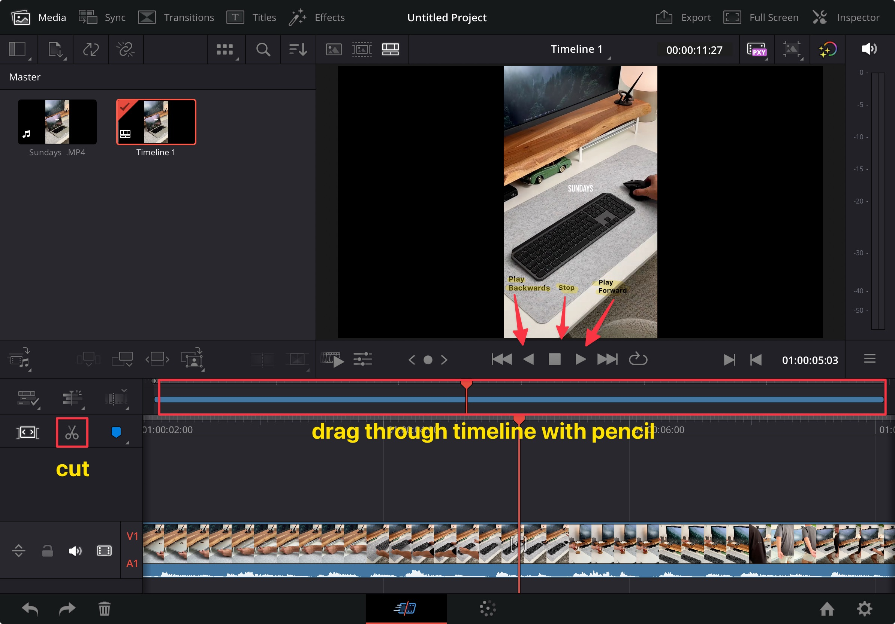
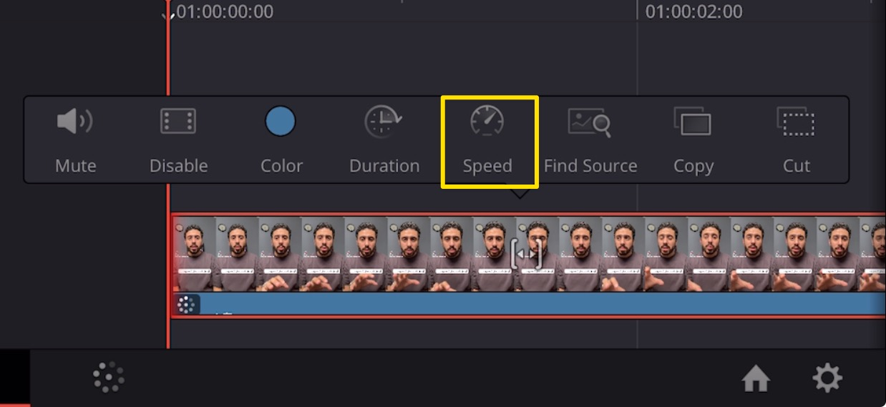

❖ When You First Open the the Program You Will See the Following UI: 

### How to Right Click? 

❖ Just Click and Hold for Two Seconds (You Can Do It with the Pencil as Well) in the Import Media Space and the Menu Will Show Up. 

❖ When You Right Click in the Import Media Space There's an Option For `New Bin` Where You Can Organize Files in Bins Like Premiere Pro

### Undo, Redo, and Delete

You Can Find Them in the Lower Left Corner of the Previous Screenshot.

### Transitions

You Can Find It in the Top Left Side of the Previous Screenshot Along with the Titles, Effects, Etc.

### Inspector (Like the One In FCP)

You Can Find It in the Top Right Corner of the Previous Screenshot. 

### How to Import Media and Apply Your First Transition? 

❖ First Let's Import the Media: 

❖ Note that if the Video Has a Long Name DaVinci May Not Be Able to Correctly Import the Media.

❖ Now Right Click on the Media and Choose the Following Option to Create the Timeline:

❖ Now Drag the Media to the Timeline Area to Create the Timeline, You'll Notice in the Media Area that a New Timeline Has Been Created, You Can Right Click on It and Choose Timeline Settings

❖ If You Wish to Change the Project Settings, You Have to First Uncheck the Box `Use Project Settings` 

❖ **Very Important**: You Always Have to Uncheck the Box `Use Project Settings` Cuz DaVinci Will Not Pick up the Right Settings Automatically. You Have to Manually Check You Clip Settings and Apply It to the New Timeline

❖ and It's Also Best Practice to Change the Dimensions From the Gear Icon Cuz It Has a Nice UI

### Creating and Deleting Projects

❖ You Can Create, Delete Projects From the Home Icon in the Lower Right Corner of the Previous Screenshot (Next to the Gear Icon). You Can Also Close the Projects From the Same Place but You Have to Save the Project Before You Close It Otherwise the Close Option Won't Appear.

❖ Now Let's Take a Look at some Controls: 

❖ When You Create a Timeline You'll Notice in the Ui There's Two Timelines the Big One Marked with Red in the Previous Screenshot Is for Overall View of the Timeline Where the Smaller One Beneath It Is the One for Precise Movement.

### Switching Between Timeline Scoops

❖ You Can Move Between the Two Timelines by Dragging an Edge of the Clip From the Small Timeline up to the Big Timeline and Move in the Big Timeline to Reach the Point You Want

❖ Now Cut and Drag a Transition Between the Two Clips; You Can Also Control the Duration of the Transition with Handles. 

### Insert Video or Audio Only

### Source Monitor

❖ Double Click on the Clip to Open It in the Source Monitor and Set the in and Out Points

❖ You Can Also Drag with the Pencil the in and Out Points in the Timeline and You'll See the Audio Waveform for Precise Editing

### Disabling Video or Audio

### Changing Clip Speed

❖ Click and Hold on the Clip in the Timeline and You Will See a Popup Window with the Speed Option.

❖ When You Click on It It Will Take You to the Speed Control Section in the Layer Controls Where You Can Adjust or Reset the Speed. 

### Turn Snapping on or Off

### Split and Join Clips

### Trim to Playhead

### LUTs

❖ You Can Find LUTs in The Top Left Corner when You Switch to the Color Tab 

❖ You Can Load Custom LUTs From the Internet (`.cube` Files) And Paste Them in the Files App → DaVinci Resolve Folder

❖ And Then You Need to Update the List of LUTs From DaVinci (By Clicking on the Gear Icon) For Changes to Take Effect. 

### Blending Modes in Nodes

❖ DaVinci Resolve Uses Node-Based Color Grading (Like Layers in Photoshop with Blending Modes); You Can Add Nodes From Here 👇

❖ Right Click on the Node and From the Composite Mode Choose the Blending Mode for that Node

❖ You Can Review the Color Grading You Did by Clicking on the Following Button (It Will Turn Off and On the Color Grading) 👇

❖ If You Did some Intensive Color Grading and You Start Noticing some Stutter You Can Turn Off the Color Grading and Turn It Back on when You Render.

### Applying One Grading to Many Clips Using Stills

❖ First of All You Need to Make Sure Clips and Gallery in the Top Left Corner Are Active

❖ Next Click and Hold on the Preview Panel (The Video Itself in the Middle) and Select Grab Still

❖ Note: In the Effects Tab in the Top Left Corner There's `Adjustment Clip` Which You Can Drag Across Multiple Clips and Apply some Color Grading to It and It Will Affect the Underlying Clips (Like Premiere Pro)

### Export

❖ When You Export Choose `ProRes` If You Have `ffmpeg` Nearby on the Mac or Something, and Choose `youtube` If You Don't Have `ffmpeg` Around and You Want An `mpeg-4` File With `mp4` Extension.

❖ Until Now I Don't Know a Way to Export with Alpha Channel From DaVinci but There's a Workaround for That: You Can Create a Still Image with the Green Screen Hex Code and Export the Video with It, Then You Can Use the Key Effect Later in Something Like After Effects to Get the Alpha Channel.

### Useful Things to Know

❖ You Can Use a Keyboard with the iPad and Get Shortcuts Working Like the Desktop Version (eg. ⌘+F For Action Window) And Just for Convenience You Can Use Mouse, Plug in a Monitor with the Type C Cable for Extra Space, There's Also a Device Called the Speed Editor Which Can Be Connected to the iPad via Bluetooth.

❖ There's Also `Black Magic Cloud` Where You Can Save Your Projects in the Cloud and Continue Working on Them From the Desktop Version. You Can Also Import & Export Projects From the Home Icon.

❖ When You're Doing B-Roll Editing You Keep the the Original Sound From The A-Roll Footage And Use Just the Video From the B-Roll

