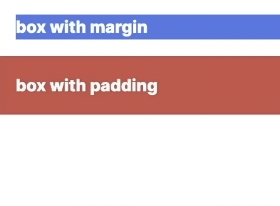
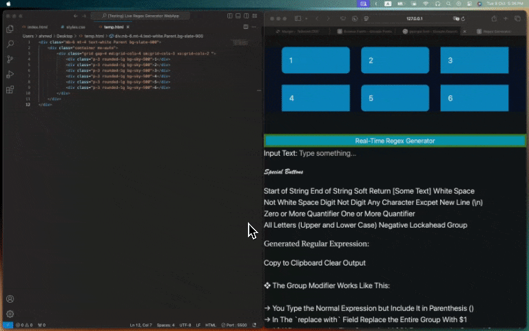
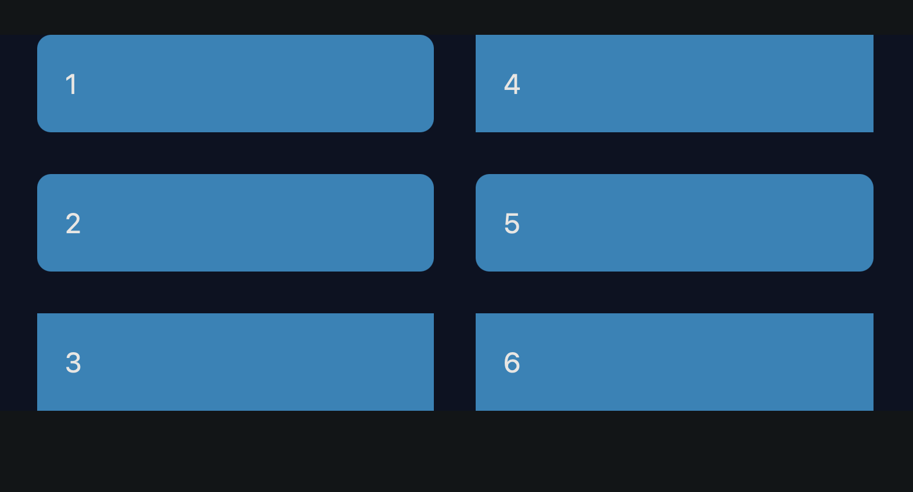
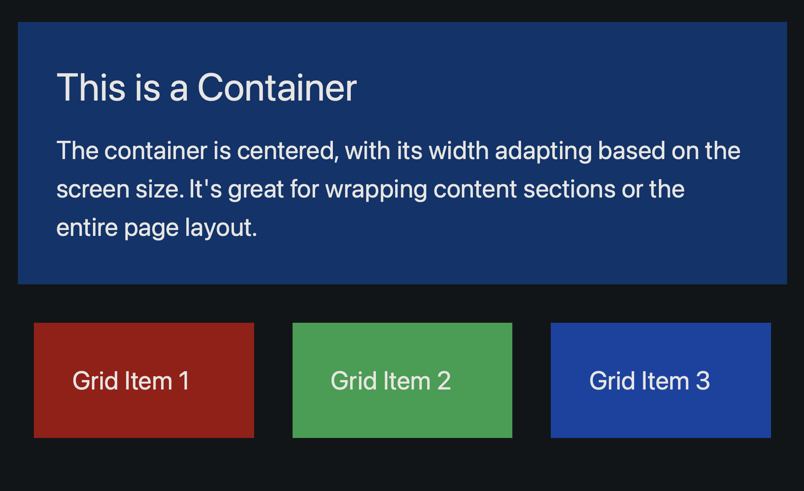
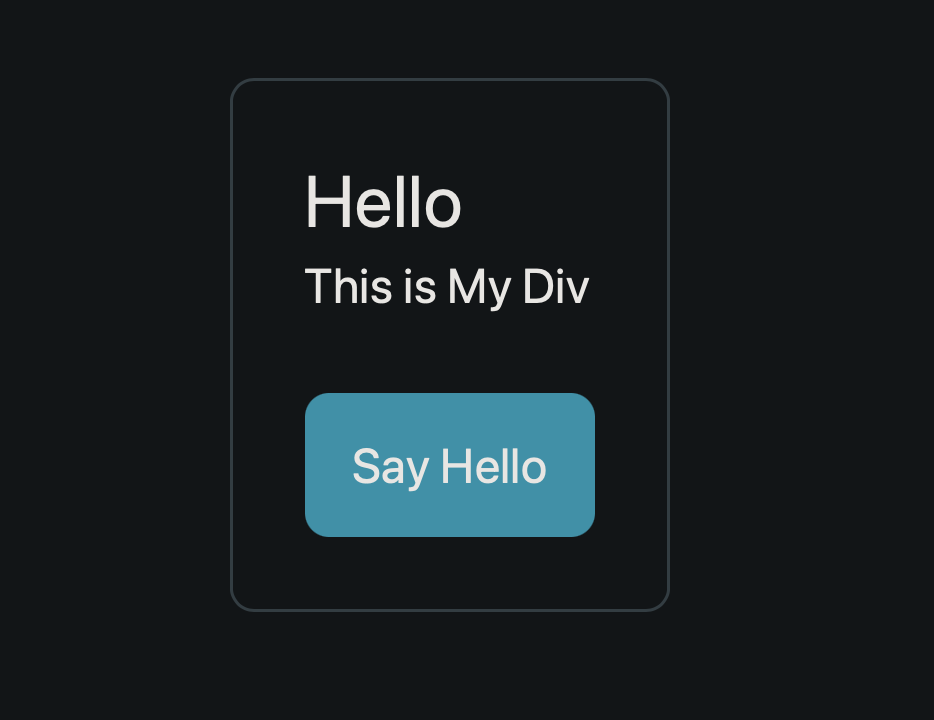
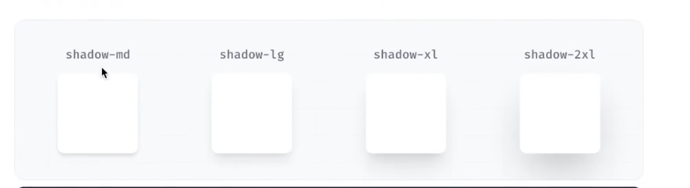

### Concepts about Tailwind CSS

#### Question and Answer from ChatGPT

**Question:**

i have a question about tailwind css. i just learned a crash course from freeCodeCamp and i understand the classes and the way how we write the code for different styles. and i use a build tool like vite to get the full tailwind experience with vanilla javascript (cuz i was testing with a simple single web app) and before i learned that crash course i was told that you should learn a css framework like bootstrap or tailwind. my question is: by saying framework or in general is tailwind just some classes i add for fast styling web apps or there's more to the concept of framework that i don't know yet?

**Answer**
Great question! When people refer to Tailwind CSS as a “framework,” they are typically referring to more than just the utility classes it provides. Tailwind is considered a CSS framework because:

  

1. **Utility-First Approach**: Unlike traditional frameworks like Bootstrap, which provide pre-designed components (buttons, forms, etc.), Tailwind focuses on utilities—small, single-purpose classes like bg-blue-500 or p-4 that directly style elements. This utility-first approach offers a lot of flexibility and control without writing custom CSS.

2. **Customization**: Tailwind allows for deep customization of your design system via its configuration file (tailwind.config.js). You can define your own color palettes, spacing, typography, and more. This means you can easily adapt Tailwind to suit the specific needs of your project, unlike CSS libraries like Bootstrap, where you’re more confined to their pre-set styles.

3. **Responsive Design**: Tailwind is built with responsive design in mind. It allows you to apply different styles based on screen size using responsive variants (md:, lg:, etc.), giving you control over how your app looks on different devices, all within the same class-based system.

4. **Component-Based Styling**: While Tailwind doesn’t provide pre-built UI components like Bootstrap, you can build reusable styled components using its classes. Some developers combine Tailwind with JavaScript frameworks (like React, Vue, etc.) to build custom, reusable components with Tailwind’s utility classes.

5. **Performance**: Tailwind includes tools like PurgeCSS that automatically remove unused CSS, making your final CSS file smaller and more performant.

  

So, while on the surface it might look like Tailwind is just a collection of utility classes for fast styling, it’s actually a complete framework that helps you streamline your workflow, build custom designs without leaving your HTML, and scale your web app’s design system. There’s more to Tailwind than just adding classes; it offers a powerful, flexible approach to CSS that integrates well with modern development workflows.

### How to Install?

❖ For the Best Guide We Can Go to Their Website: 

https://tailwindcss.com/docs/installation

```zsh
sudo npm install -D tailwindcss
```

❖ Tailwind CSS is Providing Already Written CSS, You Just Have to Add the Classes to Your HTML

❖ Next There's a Lot of Ways to Setup Tailwind CSS but in Our Case We Will Use the CDN Way Cuz We're only Playing with a Simple HTML Document: 

❖ Add the Play CDN script tag to the `<head>` of your HTML file, and start using Tailwind’s utility classes to style your content.

```html
<!doctype html>
<html>
<head>
  <meta charset="UTF-8">
  <meta name="viewport" content="width=device-width, initial-scale=1.0">
  <script src="https://cdn.tailwindcss.com"></script>
</head>
<body>
  <h1 class="text-3xl font-bold underline">
    Hello world!
  </h1>
</body>
</html>
```

❖ We Can Also Download the Script Itself as a Local Copy Using `curl` 

```zsh
curl -L -o tailwind.js https://cdn.tailwindcss.com
```

❖ `-L`: This option tells curl to follow any redirects (since https://cdn.tailwindcss.com redirects to the actual script).

❖ `-o` `tailwind.js`: This will save the output to a file named `tailwind.js`.

❖ now let's add it to the html inside the `<head>` tag: 

```html
<script src="tailwind.js"></script>
```

❖ To Make Sure It's Loaded Open the HTML File and See if It's Loaded in the Sources Tab, Also by Commenting Out the Line that Loads Tailwind You Will See a Visual Difference.

❖ We Can Config the `tailwind.css` From There to Add More Stuff Like Adding Custom Colors, Fonts, Etc.

```html
<head>
  <script src="tailwind.js"></script> 
  <script>
    tailwind.config = {
      theme: {
        extend: {
          colors: {
            customColor: '#ff0000',
          },
        },
      },
    };
  </script>
</head>
```


❖ in `Vs-Code Extensions` type `Tailwind CSS IntelliSense` and install it.

❖ As We Said Before, tailwind.css is A utility-first CSS framework packed with classes like `flex`, `pt-4`, `text-center` and`rotate-90` that can be composed to build any design, directly in your markup.

❖ So We Can Go to This Color Page for Example: 

https://tailwindcss.com/docs/customizing-colors

And Apply some Classes in Any Text We Have in Our HTML: 

```html
<h1 class="text-cyan-500">Real-Time Regex Generator</h1>
```

❖ Under the Hood, Tailwind Is only Getting that Cyan Color From It's File, Not Anything Else, Which Means Faster Responses and Loading Time.

❖ Now Let's Create a Background for the Text

```html
<h1 class="bg-cyan-500 text-white">Real-Time Regex Generator</h1>
```

❖ We Can Also Add a Border Like This: 

```html
<h1 class="bg-cyan-500 border-4 border-yellow-600">Real-Time Regex Generator</h1>
```

`border-4` → Sets the Border Size

`border-yellow-600` → Sets the Border Color; You Can Refer to the Following Page for More Colors: 

https://tailwindcss.com/docs/customizing-colors

### Customizing Colors

❖ If We Want to Add a Color (Just a Hex Code) Outside of the Tailwind Library, We Can Do so Using the Following Code: 

```html
<head>
    <meta charset="UTF-8">
    <meta name="viewport" content="width=device-width, initial-scale=1.0">
    <title>Regex Generator</title>
    <script src="tailwind.js"></script>
    <script>
        tailwind.config = {
            theme: {
                extend: {
                    colors: {
                        mainColor: '#a2d984',
                    },
                },
            },
        };
    </script>
</head>
```

❖ and let's use that `mainColor` we created in the border: 

```html
<h1 class="bg-cyan-500 border-4 border-mainColor">Real-Time Regex Generator</h1>
```

❖ We Can Also Make This `mainColor` a Color Palette Like This:

```html
<head>
    <meta charset="UTF-8">
    <meta name="viewport" content="width=device-width, initial-scale=1.0">
    <title>Regex Generator</title>
    <script src="tailwind.js"></script>
    <script>
        tailwind.config = {
            theme: {
                extend: {
                    colors: {
                        mainColor:{
                            100: "#a2da84",
                            932: "#749adf"
                        },
                    },
                },
            },
        };
    </script>
</head>
```

❖ And Apply It to the Border Like This Way: 

```html
<h1 class="bg-cyan-500 border-4 border-mainColor-100">Real-Time Regex Generator</h1>
```

❖ We Can Also Use `flex` To Center the Text Like This: 

```html
<h1 class="bg-cyan-500 border-4 border-mainColor-100 flex justify-center">Real-Time Regex Generator</h1>
```

### Text Sizes in Tailwind CSS

❖ You Can Type the Following Classes Directly in Your HTML: 

```html
class="text-xs"
class="text-sm"
class="text-md"
class="text-lg"
class="text-xl"
```

`xs` → extra small

`sm` → small

`md` → medium

`lg` → large

`xl` → x-large

❖ You Can Multiply The `xl` By a Number for Example `3xl` Means Three Times `xl`

### Responsive Text Size

There's Something Called `screens` In the Responsive Design; Which Means when the Screen Size Hits a Specific Value the Text Size Will Change Based on the Screen Size, We Can Put It in Our HTML Like This: 

```html
<script>
    tailwind.config = {
        theme: {
            screens: {
                sm: '480px',
                md: '768px',
                lg: '976px',
                xl: '1440px',
            },
            extend: {
                colors: {
                    mainColor: {
                        100: "#a2da84",
                        932: "#749adf"
                    },
                },
            },
        },
    };
</script>
```

❖ Then We Tell the Text Layer eg.(h1) that We Want You to Be Small in a Specific Screen Size and We Want You Large in Another Size, Here's an Example: 

```html
<h1 class="bg-cyan-500 border-4 border-mainColor-100 flex justify-center text-sm lg:text-xl">Real-Time Regex Generator</h1>
```

❖ In This Snippet the Text Size Is Small but when It Hits the Large Screen Size (976px) It Will Be Large

❖ These Sizes Technical Name is `Break Points`


### Spacing and Margins

❖ Tailwind Has Kinda a Preset for Spacing (You Can Customize or Overwrite): 

```html
<script>
    tailwind.config = {
        theme: {
            screens: {
                sm: '480px',
                md: '768px',
                lg: '976px',
                xl: '1440px',
            },
            spacing: {
                '1': '8px',
                '2': '12px',
                '3': '16px',
                '4': '24px',
                '5': '32px',
                '6': '48px',
            },
            extend: {
                colors: {
                    mainColor: {
                        100: "#a2da84",
                        932: "#749adf"
                    },
                },
            },
        },
    };
</script>
```

❖ And We Can Put It in Our Code Like This: 

```html
<h3 class="mb-3">Special Buttons</h3>
```

`mb` → Margin Bottom
`mt` → Margin Top
`ml` → Margin Left
`mr` → Margin Right
`mx` → Margin Left & Right (X-Axis)
`m` → Margin Top & Bottom (Y-Axis)

❖ We Can Change `mb-3` to `m-3` This Will Apply the Margin From All Sides. 

### Fonts

Tailwind Comes with some Fonts that You Can Apply Right Away as a Class (on the Fly) or by Setting a Theme

### Theme Method

```html
<script>
    tailwind.config = {
        theme: {
            fontFamily: {
                'sans': ['ui-sans-serif', 'system-ui',],
                'serif': ['ui-serif', 'Georgia',],
                'mono': ['ui-monospace', 'SFMono-Regular',],
                'display': ['Oswald',],
                'body': ['"Open Sans"'],
            },
            screens: {
                sm: '480px',
                md: '768px',
                lg: '976px',
                xl: '1440px',
            },
            spacing: {
                '1': '8px',
                '2': '12px',
                '3': '16px',
                '4': '24px',
                '5': '32px',
                '6': '48px',
            },
            extend: {
                fontFamily: {
                    'custom': ['Brush'],
                },
                colors: {
                    mainColor: {
                        100: "#a2da84",
                        932: "#749adf"
                    },
                },
            },
        },
    };
</script>
```

❖ Then Apply the Font in Your HTML As Follows:

```html
<h2 class="mt-3 mb-3 font-serif">Generated Regular Expression:</h2>
```

❖ You Can Check if the Font Is Applied or Not Using the Inspect Element in the Browser and the Style Tab


#### On the Fly Method

```html
<h3 class="mb-3 mt-3 font-['Open_Sans']">Special Buttons</h3>
```

or

```html
<h3 class="mb-3 mt-3 font-['Times_New_Roman']">Special Buttons</h3>
```

or

```html
<h3 class="mb-3 mt-3 font-['Gorgia']">Special Buttons</h3>
```

### Special Fonts

Let's Say We Have a Custom Font in Our System Called `Brush Script.ttf` And We Put It in the Same Place as The `html,js` Files, **How Can We Tell Tailwind to Use This Font?**

❖ First Paste the Following Code Into a `styles.css` File: 

```css
@font-face {
  font-family: 'Brush';
  src: url('Brush\ Script.ttf') format('truetype');
}
```

→ This Will Define the Custom Font We Want to Use in Our Project. 
→ If You Created a Folder for Fonts the Code Will Be Like This: 

```css
@font-face {
  font-family: 'CustomFont';
  src: url('/fonts/your-custom-font.ttf') format('truetype');
}
```

→ Customize the Code with Your Project. 
→ You Can Also Paste a Google Font Url in the Parenthesis to Fetch a Font Directly From Google Fonts. 

❖ Link the CSS File in Your HTML: 

```html
<link href="styles.css" rel="stylesheet">
```

→ This Line Will Be Inside the Head Tag `<head>` 

❖ Extend Tailwind’s Font Family: 

```html
<script>
    tailwind.config = {
        theme: {
            screens: {
                sm: '480px',
                md: '768px',
                lg: '976px',
                xl: '1440px',
            },
            spacing: {
                '1': '8px',
                '2': '12px',
                '3': '16px',
                '4': '24px',
                '5': '32px',
                '6': '48px',
            },
            extend: {
                fontFamily: {
                    'custom': ['Brush'],
                },
                colors: {
                    mainColor: {
                        100: "#a2da84",
                        932: "#749adf"
                    },
                },
            },
        },
    };
</script>
```

❖ Use the Font in Your HTML: 

```html
<h3 class="mb-3 mt-3 font-['Brush']">Special Buttons</h3>
```

### Importing Fonts from Google Fonts

You can use **Google Fonts** to import Poppins for Example. Add this in the `<head>` of your HTML file:

```html
<link href="https://fonts.googleapis.com/css2?family=Poppins:wght@400;600&display=swap" rel="stylesheet">
```

**Extend Tailwind’s Configuration**:
After adding the font to your project, you need to update your tailwind.config.js to include **Poppins** in the fontFamily section.

```js
// tailwind.config.js
module.exports = {
  theme: {
    extend: {
      fontFamily: {
        poppins: ['Poppins', 'sans-serif'],
      },
    },
  },
}
```

**Use the Font in Your HTML**
Now that **Poppins** is registered in Tailwind, you can apply it using the `font-poppins` class in your HTML:

```html
<div class="font-poppins text-lg">
  This text is using the Poppins font!
</div>
```

### Padding

### What Is the Difference Between Margin and Padding?

`Margin` → The Space Outside of the Element. 

`Padding` → The Space Inside the Element. 

Some Examples: 

|Class|Properties|
|---|---|
|p-0|padding: 0px;|
|px-0|padding-left: 0px; padding-right: 0px;|
|py-0|padding-top: 0px; padding-bottom: 0px;|
|ps-0|padding-inline-start: 0px;|
|pe-0|padding-inline-end: 0px;|
|pt-0|padding-top: 0px;|
|pr-0|padding-right: 0px;|
|pb-0|padding-bottom: 0px;|
|pl-0|padding-left: 0px;|
|p-px|padding: 1px;|
|px-px|padding-left: 1px; padding-right: 1px;|
|py-px|padding-top: 1px; padding-bottom: 1px;|
|ps-px|padding-inline-start: 1px;|
|pe-px|padding-inline-end: 1px;|
|pt-px|padding-top: 1px;|
|pr-px|padding-right: 1px;|
|pb-px|padding-bottom: 1px;|
|pl-px|padding-left: 1px;|
|p-0.5|padding: 0.125rem; /* 2px */|
|px-0.5|padding-left: 0.125rem; /* 2px */ padding-right: 0.125rem; /* 2px */|
|py-0.5|padding-top: 0.125rem; /* 2px */ padding-bottom: 0.125rem; /* 2px */|
|ps-0.5|padding-inline-start: 0.125rem; /* 2px */|
|pe-0.5|padding-inline-end: 0.125rem; /* 2px */|
|pt-0.5|padding-top: 0.125rem; /* 2px */|
|pr-0.5|padding-right: 0.125rem; /* 2px */|
|pb-0.5|padding-bottom: 0.125rem; /* 2px */|
|pl-0.5|padding-left: 0.125rem; /* 2px */|
|p-1|padding: 0.25rem; /* 4px */|
|px-1|padding-left: 0.25rem; /* 4px */ padding-right: 0.25rem; /* 4px */|
for more classes refer to the documentation at this link: 

https://tailwindcss.com/docs/padding



### Space Between

if you have a div that contains two or three elements inside that div you can add a class to the div to set the space between those two or three elements, for example: 

| Class       | Properties                       |
| ----------- | -------------------------------- |
| space-x-0   | margin-left: 0px;                |
| space-y-0   | margin-top: 0px;                 |
| space-x-0.5 | margin-left: 0.125rem; /* 2px */ |
| space-y-0.5 | margin-top: 0.125rem; /* 2px */  |
| space-x-1   | margin-left: 0.25rem; /* 4px */  |
| space-y-1   | margin-top: 0.25rem; /* 4px */   |
for more classes, refer to the following documentation
https://tailwindcss.com/docs/space

### Grids in Tailwind

See the Following Div Snippet and How Responsive Tailwind Is Making It: 

```html
<div class="mb-6 mt-4 text-white Parent bg-slate-900">
    <div class="container mx-auto">
        <div class="grid gap-4 md:grid-cols-4 sm:grid-cols-3 xs:grid-cols-2 ">
            <div class="p-3 rounded-lg bg-sky-500">1</div>
            <div class="p-3 rounded-lg bg-sky-500">2</div>
            <div class="p-3 rounded-1g bg-sky-500">3</div>
            <div class="p-3 rounded-1g bg-sky-500">4</div>
            <div class="p-3 rounded-lg bg-sky-500">5</div>
            <div class="p-3 rounded-1g bg-sky-500">6</div>
        </div>
    </div>
</div>
```



→ Now if We Changed the Columns to Rows Like This: 

```html
<div class="mb-6 mt-4 text-white Parent bg-slate-900">

<div class="container mx-auto">

<div class="grid gap-4 grid-flow-col md:grid-rows-4 sm:grid-rows-3 xs:grid-rows-2 ">

<div class="p-3 rounded-lg bg-sky-500">1</div>

<div class="p-3 rounded-lg bg-sky-500">2</div>

<div class="p-3 rounded-1g bg-sky-500">3</div>

<div class="p-3 rounded-1g bg-sky-500">4</div>

<div class="p-3 rounded-lg bg-sky-500">5</div>

<div class="p-3 rounded-1g bg-sky-500">6</div>

</div>

</div>

</div>
```

→ The Counting Order Will Change: 



→ You Can Play with the Numbers Until You Get What You're Looking For

### What Is the Difference Between Grid and Container in Tailwind?

**Key Differences**

| **Feature** | **Grid**                                     | **Container**                                    |
| ----------- | -------------------------------------------- | ------------------------------------------------ |
| Purpose     | Controls grid-based layout (rows/columns)    | Defines a responsive, centered container         |
| Layout      | Two-dimensional grid (rows & columns)        | No layout control (only width & centering)       |
| Flexibility | Allows detailed control over positioning     | Automatically adjusts width based on screen size |
| Example Use | Complex layouts like dashboards or galleries | Wrapping entire pages or sections of content     |
**Example to show the difference**: 

```html
<div class="my-3">
    <!-- Container Example -->
    <div class="container mx-auto bg-blue-300 p-4">
        <h1 class="text-2xl">This is a Container</h1>
        <p class="mt-2">The container is centered, with its width adapting based on the screen size. It's great for
            wrapping content sections or the entire page layout.</p>
    </div>

    <!-- Grid Example -->
    <div class="grid grid-cols-3 gap-4 mt-8 p-4">
        <div class="bg-red-500 p-4 text-white">Grid Item 1</div>
        <div class="bg-green-500 p-4 text-white">Grid Item 2</div>
        <div class="bg-blue-500 p-4 text-white">Grid Item 3</div>
    </div>
</div>
```



### Adding Shadows

→ Let's Say We Have a Dive Like This: 

```html
<div class="my-3 p-4 parent flex justify-center">
    <div class="inline-block p-4 text-black bg-white border rounded-lg">
        <h1 class="text-2xl">Hello</h1>
        <p class="mb-4">This is My Div</p>
        <button class="px-3 py-2 rounded-lg cursor-pointer bg-cyan-500">Say Hello</button>
    </div>

</div>
```



→ We Can Add the Shadow Classes Like This: 



Refer to This Documentation Link for More Options: 
https://tailwindcss.com/docs/box-shadow

### Animation in Tailwind

See the Following Animated Bottom when You Hover over It: 

```html
<div class="container my-3 flex justify-center">
    <button
        class="scale-50 p-1 transition ease-in-out delay-100 bg-blue-500 hover:-translate-y-1 hover:scale-75 hover:bg-indigo-500 duration-300">
        Save Changes
    </button>
</div>
```

→ We Used `scale-50` To Make the Button 50% Smaller and when We Hover over It It Scales From 50% To 75% 

For More Scale Classes Refer to This Documentation: 
https://tailwindcss.com/docs/scale

#### Processing Button Using Tailwind

```html
<div class="flex items-center justify-center">
  <button type="button" class="inline-flex items-center px-4 py-2 font-semibold leading-6 text-sm shadow rounded-md text-white bg-indigo-500 hover:bg-indigo-400 transition ease-in-out duration-150 cursor-not-allowed" disabled="">
    <svg class="animate-spin -ml-1 mr-3 h-5 w-5 text-white" xmlns="http://www.w3.org/2000/svg" fill="none" viewBox="0 0 24 24">
      <circle class="opacity-25" cx="12" cy="12" r="10" stroke="currentColor" stroke-width="4"></circle>
      <path class="opacity-75" fill="currentColor" d="M4 12a8 8 0 018-8V0C5.373 0 0 5.373 0 12h4zm2 5.291A7.962 7.962 0 014 12H0c0 3.042 1.135 5.824 3 7.938l3-2.647z"></path>
    </svg>
    Processing...
  </button>
</div>
```

→ more examples can be found in this documentation: 
https://tailwindcss.com/docs/animation

→ you can `inspect element` in the page and copy the div that contains the animation if you want to test it in your own html document. 

### Design System in Tailwind

❖ Unfortunately with Tailwind CDN You Can't Use Something Like the `@Apply` Directive to Define a Class with Tailwind Code and Then Re-Use It to Apply the Code You Wrote for that Components


### Useful Links

Free Website for Icons
https://icones.js.org
