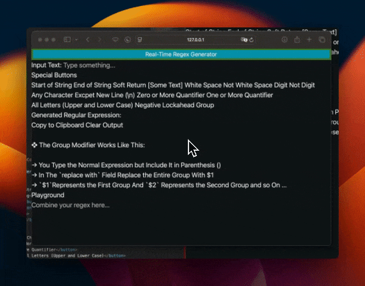

❖ For the Best Guide We Can Go to Their Website: 

https://tailwindcss.com/docs/installation
### How to Install?

```zsh
sudo npm install -D tailwindcss
```

❖ Tailwind CSS is Providing Already Written CSS, You Just Have to Add the Classes to Your HTML

❖ Next There's a Lot of Ways to Setup Tailwind CSS but in Our Case We Will Use the CDN Way Cuz We're only Playing with a Simple HTML Document: 

❖ Add the Play CDN script tag to the `<head>` of your HTML file, and start using Tailwind’s utility classes to style your content.

```html
<!doctype html>
<html>
<head>
  <meta charset="UTF-8">
  <meta name="viewport" content="width=device-width, initial-scale=1.0">
  <script src="https://cdn.tailwindcss.com"></script>
</head>
<body>
  <h1 class="text-3xl font-bold underline">
    Hello world!
  </h1>
</body>
</html>
```

❖ We Can Also Download the Script Itself as a Local Copy Using `curl` 

```zsh
curl -L -o tailwind.js https://cdn.tailwindcss.com
```

❖ `-L`: This option tells curl to follow any redirects (since https://cdn.tailwindcss.com redirects to the actual script).

❖ `-o` `tailwind.js`: This will save the output to a file named `tailwind.js`.

❖ now let's add it to the html inside the `<head>` tag: 

```html
<script src="tailwind.js"></script>
```

❖ To Make Sure It's Loaded Open the Html File and See if It's Loaded in the Sources Tab, Also by Commenting Out the Line that Loads Tailwind You Will See a Visual Difference.

❖ We Can Config the tailwind.css From There to Add More Stuff Like Adding Custom Colors, Fonts, Etc.

```html
<head>
  <script src="tailwind.js"></script> 
  <script>
    tailwind.config = {
      theme: {
        extend: {
          colors: {
            customColor: '#ff0000',
          },
        },
      },
    };
  </script>
</head>
```


❖ in `Vs-Code Extensions` type `Tailwind CSS IntelliSense` and install it.

❖ As We Said Before, tailwind.css is A utility-first CSS framework packed with classes like `flex`, `pt-4`, `text-center` and`rotate-90` that can be composed to build any design, directly in your markup.

❖ So We Can Go to This Color Page for Example: 

https://tailwindcss.com/docs/customizing-colors

And Apply some Classes in Any Text We Have in Our HTML: 

```html
<h1 class="text-cyan-500">Real-Time Regex Generator</h1>
```

❖ Under the Hood, Tailwind Is only Getting that Cyan Color From It's File, Not Anything Else, Which Means Faster Responses and Loading Time.

❖ Now Let's Create a Background for the Text

```html
<h1 class="bg-cyan-500 text-white">Real-Time Regex Generator</h1>
```

❖ We Can Also Add a Border Like This: 

```html
<h1 class="bg-cyan-500 border-4 border-yellow-600">Real-Time Regex Generator</h1>
```

`border-4` → Sets the Border Size

`border-yellow-600` → Sets the Border Color; You Can Refer to the Following Page for More Colors: 

https://tailwindcss.com/docs/customizing-colors

### Customizing Colors

❖ If We Want to Add a Color (Just a Hex Code) Outside of the Tailwind Library, We Can Do so Using the Following Code: 

```html
<head>
    <meta charset="UTF-8">
    <meta name="viewport" content="width=device-width, initial-scale=1.0">
    <title>Regex Generator</title>
    <script src="tailwind.js"></script>
    <script>
        tailwind.config = {
            theme: {
                extend: {
                    colors: {
                        mainColor: '#a2d984',
                    },
                },
            },
        };
    </script>
</head>
```

❖ and let's use that `mainColor` we created in the border: 

```html
<h1 class="bg-cyan-500 border-4 border-mainColor">Real-Time Regex Generator</h1>
```

❖ We Can Also Make This `mainColor` a Color Palette Like This:

```html
<head>
    <meta charset="UTF-8">
    <meta name="viewport" content="width=device-width, initial-scale=1.0">
    <title>Regex Generator</title>
    <script src="tailwind.js"></script>
    <script>
        tailwind.config = {
            theme: {
                extend: {
                    colors: {
                        mainColor:{
                            100: "#a2da84",
                            932: "#749adf"
                        },
                    },
                },
            },
        };
    </script>
</head>
```

❖ And Apply It to the Border Like This Way: 

```html
<h1 class="bg-cyan-500 border-4 border-mainColor-100">Real-Time Regex Generator</h1>
```

❖ We Can Also Use `flex` To Center the Text Like This: 

```html
<h1 class="bg-cyan-500 border-4 border-mainColor-100 flex justify-center">Real-Time Regex Generator</h1>
```

### Text Sizes in Tailwind CSS

❖ You Can Type the Following Classes Directly in Your HTML: 

```html
class="text-xs"
class="text-sm"
class="text-md"
class="text-lg"
class="text-xl"
```

`xs` → extra small

`sm` → small

`md` → medium

`lg` → large

`xl` → x-large

❖ You Can Multiply The `xl` By a Number for Example `3xl` Means Three Times `xl`

### Responsive Text Size

There's Something Called `screens` In the Responsive Design; Which Means when the Screen Size Hits a Specific Value the Text Size Will Change Based on the Screen Size, We Can Put It in Our HTML Like This: 

```html
<script>
    tailwind.config = {
        theme: {
            screens: {
                sm: '480px',
                md: '768px',
                lg: '976px',
                xl: '1440px',
            },
            extend: {
                colors: {
                    mainColor: {
                        100: "#a2da84",
                        932: "#749adf"
                    },
                },
            },
        },
    };
</script>
```

❖ Then We Tell the Text Layer eg.(h1) that We Want You to Be Small in a Specific Screen Size and We Want You Large in Another Size, Here's an Example: 

```html
<h1 class="bg-cyan-500 border-4 border-mainColor-100 flex justify-center text-sm lg:text-xl">Real-Time Regex Generator</h1>
```

❖ In This Snippet the Text Size Is Small but when It Hits the Large Screen Size (976px) It Will Be Large

❖ These Sizes Technical Name is `Break Points`




### Spacing and Margins

❖ Tailwind Has Kinda a Preset for Spacing (You Can Customize or Overwrite): 

```html
<script>
    tailwind.config = {
        theme: {
            screens: {
                sm: '480px',
                md: '768px',
                lg: '976px',
                xl: '1440px',
            },
            spacing: {
                '1': '8px',
                '2': '12px',
                '3': '16px',
                '4': '24px',
                '5': '32px',
                '6': '48px',
            },
            extend: {
                colors: {
                    mainColor: {
                        100: "#a2da84",
                        932: "#749adf"
                    },
                },
            },
        },
    };
</script>
```

❖ And We Can Put It in Our Code Like This: 

```html
<h3 class="mb-3">Special Buttons</h3>
```

`mb` → Margin Bottom
`mt` → Margin Top
`ml` → Margin Left
`mr` → Margin Right

❖ We Can Change `mb-3` to `m-3` This Will Apply the Margin From All Sides. 

### Fonts

Tailwind Comes with some Fonts that You Can Apply Right Away as a Class (on the Fly) or by Setting a Theme

### Theme Method

```html
<script>
    tailwind.config = {
        theme: {
            fontFamily: {
                'sans': ['ui-sans-serif', 'system-ui',],
                'serif': ['ui-serif', 'Georgia',],
                'mono': ['ui-monospace', 'SFMono-Regular',],
                'display': ['Oswald',],
                'body': ['"Open Sans"'],
            },
            screens: {
                sm: '480px',
                md: '768px',
                lg: '976px',
                xl: '1440px',
            },
            spacing: {
                '1': '8px',
                '2': '12px',
                '3': '16px',
                '4': '24px',
                '5': '32px',
                '6': '48px',
            },
            extend: {
                fontFamily: {
                    'custom': ['Brush'],
                },
                colors: {
                    mainColor: {
                        100: "#a2da84",
                        932: "#749adf"
                    },
                },
            },
        },
    };
</script>
```

❖ Then Apply the Font in Your HTML As Follows:

```html
<h2 class="mt-3 mb-3 font-serif">Generated Regular Expression:</h2>
```

❖ You Can Check if the Font Is Applied or Not Using the Inspect Element in the Browser and the Style Tab


#### On the Fly Method

```html
<h3 class="mb-3 mt-3 font-['Open_Sans']">Special Buttons</h3>
```

or

```html
<h3 class="mb-3 mt-3 font-['Times_New_Roman']">Special Buttons</h3>
```

or

```html
<h3 class="mb-3 mt-3 font-['Gorgia']">Special Buttons</h3>
```

### Special Fonts

Let's Say We Have a Custom Font in Our System Called `Brush Script.ttf` And We Put It in the Same Place as The `html,js` Files, **How Can We Tell Tailwind to Use This Font?**

❖ First Paste the Following Code Into a `styles.css` File: 

```css
@font-face {
  font-family: 'Brush';
  src: url('Brush\ Script.ttf') format('truetype');
}
```

→ This Will Define the Custom Font We Want to Use in Our Project. 
→ If You Created a Folder for Fonts the Code Will Be Like This: 

```css
@font-face {
  font-family: 'CustomFont';
  src: url('/fonts/your-custom-font.ttf') format('truetype');
}
```

→ Customize the Code with Your Project. 
→ You Can Also Paste a Google Font Url in the Parenthesis to Fetch a Font Directly From Google Fonts. 

❖ Link the CSS File in Your HTML: 

```html
<link href="styles.css" rel="stylesheet">
```

→ This Line Will Be Inside the Head Tag `<head>` 

❖ Extend Tailwind’s Font Family: 

```html
<script>
    tailwind.config = {
        theme: {
            screens: {
                sm: '480px',
                md: '768px',
                lg: '976px',
                xl: '1440px',
            },
            spacing: {
                '1': '8px',
                '2': '12px',
                '3': '16px',
                '4': '24px',
                '5': '32px',
                '6': '48px',
            },
            extend: {
                fontFamily: {
                    'custom': ['Brush'],
                },
                colors: {
                    mainColor: {
                        100: "#a2da84",
                        932: "#749adf"
                    },
                },
            },
        },
    };
</script>
```

❖ Use the Font in Your HTML: 

```html
<h3 class="mb-3 mt-3 font-['Brush']">Special Buttons</h3>
```


