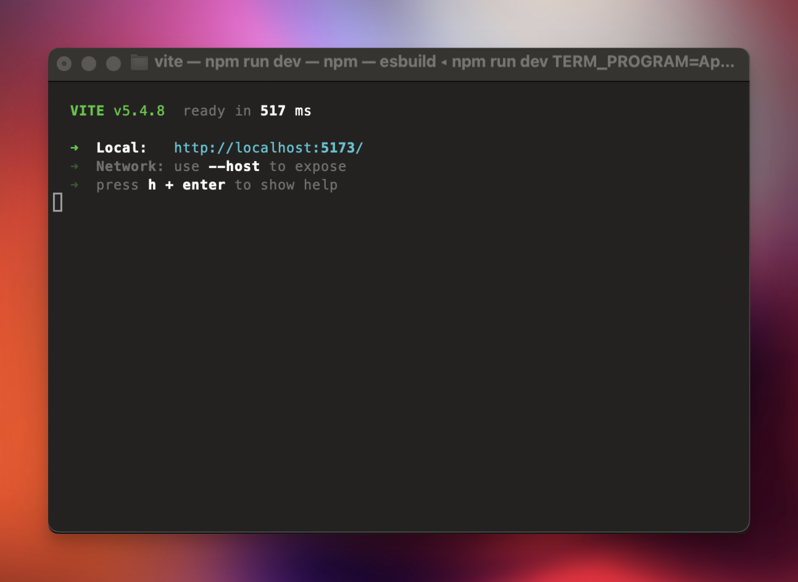
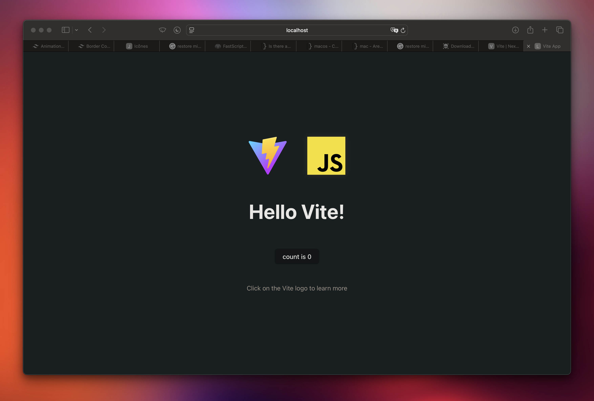

❖ To use Tailwind's advanced features like the @apply directive, you need to use a build tool like `Webpack` or `Vite`, which can compile your CSS and allow you to write custom CSS using PostCSS.

❖ To Install `vite` : 

```zsh
npm init vite
cd vite-project
npm install tailwindcss
```

❖ When You Install `vite` You'll Get a Prompt to Use a Framework and Since We're Using a Simple Web Application We Will Choose the Option `Vanilla` 

❖ after installing `vite` it will create a new `Vite` project in a directory called `vite-project` 

❖ Change into the project directory

```zsh
cd vite-project
npm install
npm run dev
```

→ next use the command `npm install tailwindcss` in the `vite-project` directory This will install Tailwind and its dependencies, and you'll be ready to start using it in your project.

→ after you finish installing you'll get a terminal output with the local host we'll use: 



→ we will use the localhost `5173` it will look something like this: 



❖ now open the `index.html` file and delete everything and type `!` and press tab to create the basic html structure. 

→ in the `index.html` file add the following line in the head tag: 

```html
<link rel="stylesheet" href="style.css">
```

❖ After installing Tailwind, you'll need to create a `tailwind.config.js` file to configure Tailwind. You can do this by running the command

```zsh
npx tailwindcss init
```

This will create a basic `tailwind.config.js` file that you can customize to suit your needs

→ run the following command: 

```zsh
npm install tailwindcss postcss autoprefixer
```

❖ By default, `Vite` creates a `style.css` file in the `src` folder. You need to add the following lines to the top of that file:

```css
@tailwind base;
@tailwind components;
@tailwind utilities;
```

❖ These lines tell Tailwind to include its base styles, components, and utilities in your project.


→ in the `tailwind.config.js` add the `html,js` files

```js
/** @type {import('tailwindcss').Config} */
export default {
  content: ["./**/*.{html,js}"],
  theme: {
    extend: {},
  },
  plugins: [],
}
```

→ create a new file in the root of your project `vite.config.js` and add the following code into it: 

```js
import { defineConfig } from 'vite';
import tailwindcss from 'tailwindcss';
import autoprefixer from 'autoprefixer';

export default defineConfig({
  css: {
    postcss: {
      plugins: [tailwindcss(), autoprefixer()],
    },
  },
});
```


❖ Once you've added these lines, you can start using Tailwind classes in your HTML files. 

```html
<div class="bg-orange-500 text-white p-4">Hello World!</div>
```

→ you might need to `restart` the `vite` session through the terminal for things to take effect. 

→ now when you see the `Hello World` with the background you will notice it's centered in the page and that's because by default the `style.css` file contains the following `body` code: 

```css
body {
  margin: 0;
  display: flex;
  place-items: center;
  min-width: 320px;
  min-height: 100vh;
}
```

→ we need to remove the line `place-itmes: center;` and the  line `display: flex;` and refresh the page and our div will be at it's normal position at the top. 

→ it's better to remove all css that was pre-defined in the `style.css` file since we're gonna use Tailwind CSS

❖ notice that now when you type `bg-orange-` the `Tailwind intelliSense`   extension will display the colors available


### Design System in Tailwind

❖ since we used the build tool `vite` we can now use the design system and the `@apply` directive

❖ first let's create a basic `HTML` structure like this: 

```html
<!DOCTYPE html>
<html lang="en">
<head>
  <meta charset="UTF-8">
  <meta name="viewport" content="width=device-width, initial-scale=1.0">
  <title>Document</title>
  <link rel="stylesheet" href="style.css">
</head>
<body>
  <div>
    <h1>This is a Title</h1>
    <h2>This is a subtitle</h2>
    <p>This is a paragraph</p>
    <a href="https://www.google.com">This is an anchor</a>
    <div><button>This is a button</button></div>
    <div><input type="text"></div>
    <div>
      <input type="checkbox" id="checkbox">
      <label for="checkbox">Checkbox</label></div>
  </div>
  <div>
    <select name="" id="">
      <option value="">Option 1</option>
      <option value="">Option2</option>
    </select>
  </div>

</body>
</html>
```

→ now let's add our design system for `<h1>` and `<h2>` tags, let's open the `style.css` file add add the following: 

```css
@tailwind base;
@tailwind components;
@tailwind utilities;

@layer base {
  h1 {
    @apply mb-2 text-3xl font-bold
  }
  h2 {
    @apply mb-1 text-xl font-semibold
  }
}
```

→ now refresh the page for changes to take effects and you will see the margin and font styling is added and if you added another h1 or h2 element they will inherit from the base layer we created in the main `style.css`

❖ let's add the links: 

```css
@tailwind base;
@tailwind components;
@tailwind utilities;

@layer base {
  h1 {
    @apply mb-2 text-3xl font-bold
  }
  h2 {
    @apply mb-1 text-xl font-semibold
  }

  a {
    @apply underline text-blue-600 hover:text-purple-500 transition;
  }
}
```

❖ now let's adjust the buttons: 

```html
<div class="my-4" ><button class="btn btn-primary">This is a button</button></div>

<div class="my-4" ><button class="btn btn-secondary">This is a secandary button</button></div>
```

→ now let's define the classes in our main `style.css` file: 

```css
@tailwind base;
@tailwind components;
@tailwind utilities;

@layer base {
  h1 {
    @apply mb-2 text-3xl font-bold
  }
  h2 {
    @apply mb-1 text-xl font-semibold
  }

  a {
    @apply underline text-blue-600 hover:text-purple-500 transition;
  }

  .btn {
    @apply px-4 py-2 rounded-lg text-white;
  }

  .btn-primary {
    @apply bg-blue-600; 
  }
  
  .btn-secondary {
    @apply bg-slate-800; 
  }
}
```

→ notice that text is white in both buttons cuz we applied that class to the common class `btn` which is applied to both buttons. 

❖ now let's add a slight color transition on hover: 

```css
@tailwind base;
@tailwind components;
@tailwind utilities;

@layer base {
  h1 {
    @apply mb-2 text-3xl font-bold
  }
  h2 {
    @apply mb-1 text-xl font-semibold
  }

  a {
    @apply underline text-blue-600 hover:text-purple-500 transition;
  }

  .btn {
    @apply px-4 py-2 rounded-lg text-white;
  }

  .btn-primary {
    @apply bg-blue-600 hover:bg-blue-500 transition; 
  }
  
  .btn-secondary {
    @apply bg-slate-800 hover:bg-slate-700 transition; 
  }
}
```


❖ now let's work on the text input: in the html we will add a placeholder text: 

```html
<div><input type="text" placeholder="E-mail"></div>
```

and in the `style.css` we will define the input style: 

```css
input[type="text"] {
    @apply px-1 py-1 border border-slate-300 outline-none rounded-sm;
}
```

❖ we will make another input but it's type will be date: 

```html
<div><input type="date"></div>
```

→ and we will define it in our css: 

```css
input[type="date"] {
    @apply my-4 px-1 py-1 border border-slate-300 outline-none rounded-sm;
}
```

❖ next let's go for the checkbox: let's change the blue color when click on the checkbox to another color, so we will define it in the CSS: 

```css
input[type="checkbox"] {
    @apply my-4 p-2 accent-purple-500;
}
```

### Dark Mode in Tailwind CSS

to setup the dark mode first we go to our `index.html` and add the class `dark` to the opening `html` tag

```html
<html lang="en" class="dark">
```

then we can go to opening `<body>` tag and add the tailwind class: 

```html
<body class="dark:bg-slate-900">
```

→ now this will make the background of the body dark

→ now we need to create some kinda button to trigger the dark mode on or off

→ we will use an `svg` icon snippet like this: 

```html
<svg xmlns="http://www.w3.org/2000/svg" width="32" height="32" viewBox="0 0 24 24"><path fill="currentColor" d="M12 21q-3.75 0-6.375-2.625T3 12t2.625-6.375T12 3q.35 0 .688.025t.662.075q-1.025.725-1.638 1.888T11.1 7.5q0 2.25 1.575 3.825T16.5 12.9q1.375 0 2.525-.613T20.9 10.65q.05.325.075.662T21 12q0 3.75-2.625 6.375T12 21"/></svg>
```

→ you can go to this website: https://icones.js.org ; click on the icon you like and copy the `svg snippet` which you can paste directly into your `html` 

→ next we will add the following classes to it: 

```html
<svg xmlns="http://www.w3.org/2000/svg" width="32" height="32" viewBox="0 0 24 24" class="absolute top-0 right-0 m-4 text-slate-800"><path fill="currentColor" d="M12 21q-3.75 0-6.375-2.625T3 12t2.625-6.375T12 3q.35 0 .688.025t.662.075q-1.025.725-1.638 1.888T11.1 7.5q0 2.25 1.575 3.825T16.5 12.9q1.375 0 2.525-.613T20.9 10.65q.05.325.075.662T21 12q0 3.75-2.625 6.375T12 21"/></svg>
```

to make it in the top right corder of the page. 

❖ To make the icon clickable, you can add the `cursor-pointer` class to the SVG element

❖ now we will add the following id to the `svg` : `id="theme-toggle"` to link it with the `js` code. 

```html
<svg xmlns="http://www.w3.org/2000/svg" width="32" height="32" viewBox="0 0 24 24" class="absolute top-0 right-0 m-4 text-slate-900 cursor-pointer" id="theme-toggle"><path fill="currentColor" d="M12 21q-3.75 0-6.375-2.625T3 12t2.625-6.375T12 3q.35 0 .688.025t.662.075q-1.025.725-1.638 1.888T11.1 7.5q0 2.25 1.575 3.825T16.5 12.9q1.375 0 2.525-.613T20.9 10.65q.05.325.075.662T21 12q0 3.75-2.625 6.375T12 21"/></svg>
```

→ Now, you can use JavaScript to target the SVG element by its ID and add an event listener to toggle the class on the `body` element. open the `main.js` file and remove the code written by `vite` and add the following code: 

```js
const themeToggle = document.getElementById('theme-toggle');

themeToggle.addEventListener('click', () => {
  document.body.classList.toggle('bg-slate-900');
});
```

❖ finally we need to link the `main.js` file into our `html` document so put the following script tag right before the closing body tag `</body>`

```html
<script type="module" src="/main.js"></script>
```

## Complete Project Code

`index.html` content: 

```html
<!DOCTYPE html>
<html lang="en" class="dark">
<head>
  <meta charset="UTF-8">
  <meta name="viewport" content="width=device-width, initial-scale=1.0">
  <title>Document</title>
  <link rel="stylesheet" href="style.css">
</head>
<body>
  <svg xmlns="http://www.w3.org/2000/svg" width="32" height="32" viewBox="0 0 24 24" class="absolute top-0 right-0 m-4 text-slate-900 cursor-pointer" id="theme-toggle"><path fill="currentColor" d="M12 21q-3.75 0-6.375-2.625T3 12t2.625-6.375T12 3q.35 0 .688.025t.662.075q-1.025.725-1.638 1.888T11.1 7.5q0 2.25 1.575 3.825T16.5 12.9q1.375 0 2.525-.613T20.9 10.65q.05.325.075.662T21 12q0 3.75-2.625 6.375T12 21"/></svg>


  <div>
    <h1>This is a Title</h1>
    <h2>This is a subtitle</h2>
    <p>This is a paragraph</p>
    <a href="https://www.google.com">This is an anchor</a>
    <div class="my-4" ><button class="btn btn-primary">This is a button</button></div>
    <div class="my-4" ><button class="btn btn-secondary">This is a secandary button</button></div>
    <div><input type="text"  placeholder="E-mail"></div>
    <div><input type="date"></div>
    <div>
      <input type="checkbox" id="checkbox">
      <label for="checkbox">Checkbox</label></div>
  </div>
  <div class="mt-2">
    <select>
      <option value="">Option 1</option>
      <option value="">Option2</option>
    </select>
  </div>
<script type="module" src="/main.js"></script>

</body>
</html>
```


`main.js` content: 

```js
document.addEventListener('DOMContentLoaded', () => {
  const themeToggle = document.getElementById('theme-toggle');

  themeToggle.addEventListener('click', () => {
    document.body.classList.toggle('bg-slate-900');
  });
});
```

`style.css` code: 

```css
@tailwind base;
@tailwind components;
@tailwind utilities;

@layer base {
  h1 {
    @apply mb-2 text-3xl font-bold
  }
  h2 {
    @apply mb-1 text-xl font-semibold
  }

  a {
    @apply underline text-blue-600 hover:text-purple-500 transition;
  }

  .btn {
    @apply px-4 py-2 rounded-lg text-white;
  }

  .btn-primary {
    @apply bg-blue-600 hover:bg-blue-500 transition; 
  }
  
  .btn-secondary {
    @apply bg-slate-800 hover:bg-slate-700 transition; 
  }

  input[type="text"] {
    @apply px-1 py-1 border border-slate-300 outline-none rounded-sm;
  }
 
  input[type="date"] {
    @apply my-4 px-1 py-1 border border-slate-300 outline-none rounded-sm;
  }

  input[type="checkbox"] {
    @apply my-4 p-2 accent-purple-500;
  }

  select {
    @apply text-slate-500 p-1 border border-slate-300 rounded outline-none;
  }
}
```

`vite.config.js` content: 

```js
import { defineConfig } from 'vite';
import tailwindcss from 'tailwindcss';
import autoprefixer from 'autoprefixer';

export default defineConfig({
  css: {
    postcss: {
      plugins: [tailwindcss(), autoprefixer()],
    },
  },
});
```

`tailwind.config.js` content: 

```js
/** @type {import('tailwindcss').Config} */
export default {
  content: ["./**/*.{html,js}"],
  theme: {
    extend: {},
  },
  plugins: [],
}
```

`vite-project` tree: 

├── counter.js
├── index.html
├── javascript.svg
├── main.js
├── **node_modules**
├── package-lock.json
├── package.json
├── **public**
├── style.css
├── tailwind.config.js
└── vite.config.js

