❖ first install the `Figma Desktop App` from their website. 

❖ `Figma` doesn't work offline. 

❖ first step is to create something called `wireframe` or a `sketch` of how you want your website to be like (for desktop and mobile)

❖ there's a nice app for iPad called `concepts` you can use it for the `wireframing` process or you could just stick with a pen and paper. 

❖ the next step is to create something called `prototype UI` with no colors, something like this: 

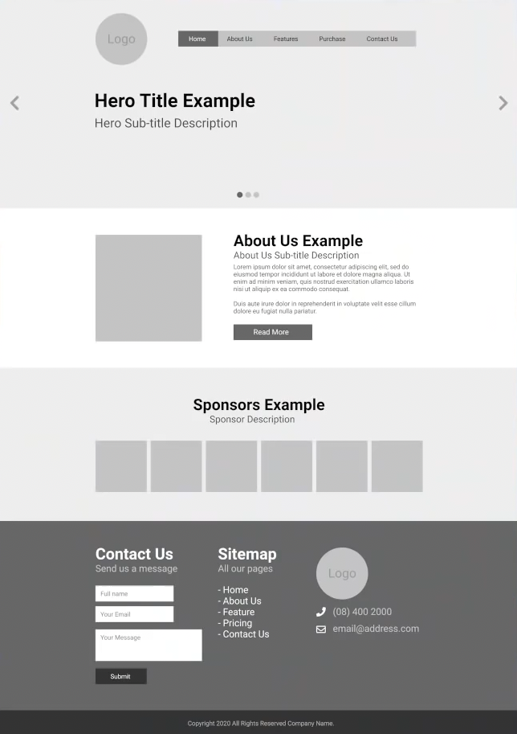

❖ next let's talk about the design size once we start `Figma` 

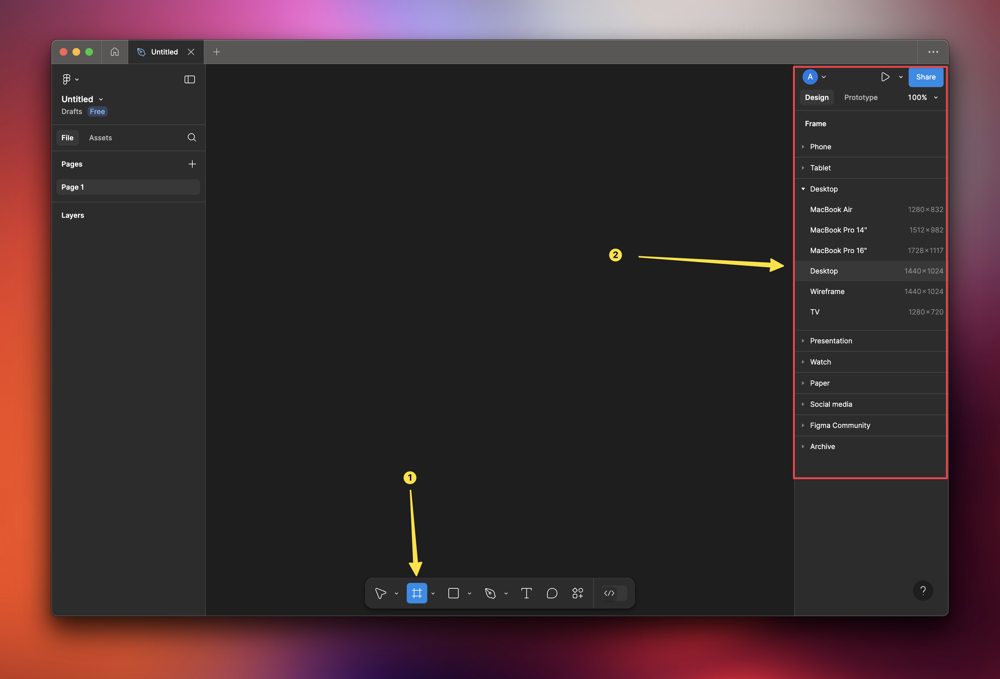

❖ you can also adjust the size after you create the document from the layout section. 

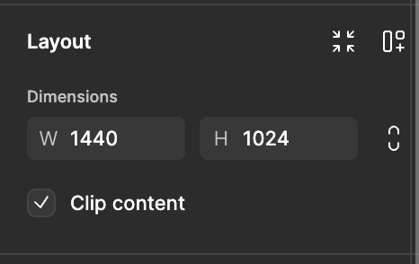

❖ you can also rename the layout by double clicking the name 👇

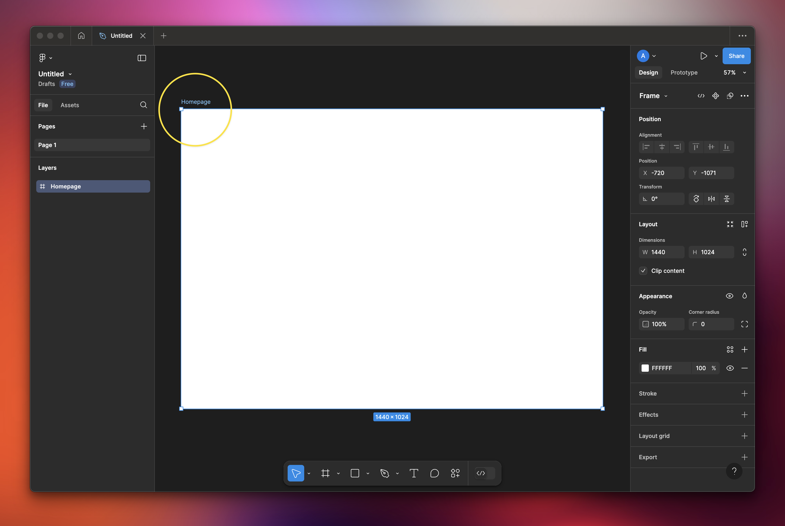

❖ you can use the keyboard shortcut `z` for zoom, `h` for the hand tool, `v` for the move tool, etc. 

→ holding spacebar will temporarily trigger the hand tool 

→ ⌘ + Scroll makes you zoom in or out. 

❖ you can drag & drop files to `Figma` from your computer. 

❖ next step is to create a layout grid and customize it as you see fit. 

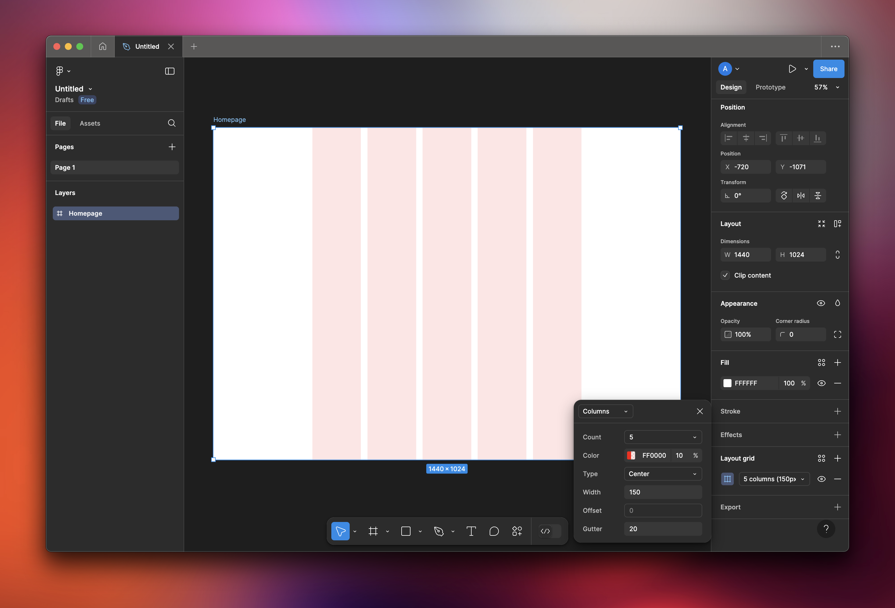

❖ those columns in the grid are there to help you design better, align shapes to the grid, etc..

❖ a good values for the columns will be 12 count and 140 for the margin but you're free to customize it as you see fit.

❖ you can show/hide the grid using the eye

### Auto Layout in Figma

select two objects and right click and choose `add auto layout` or simply click `⇧ + A`

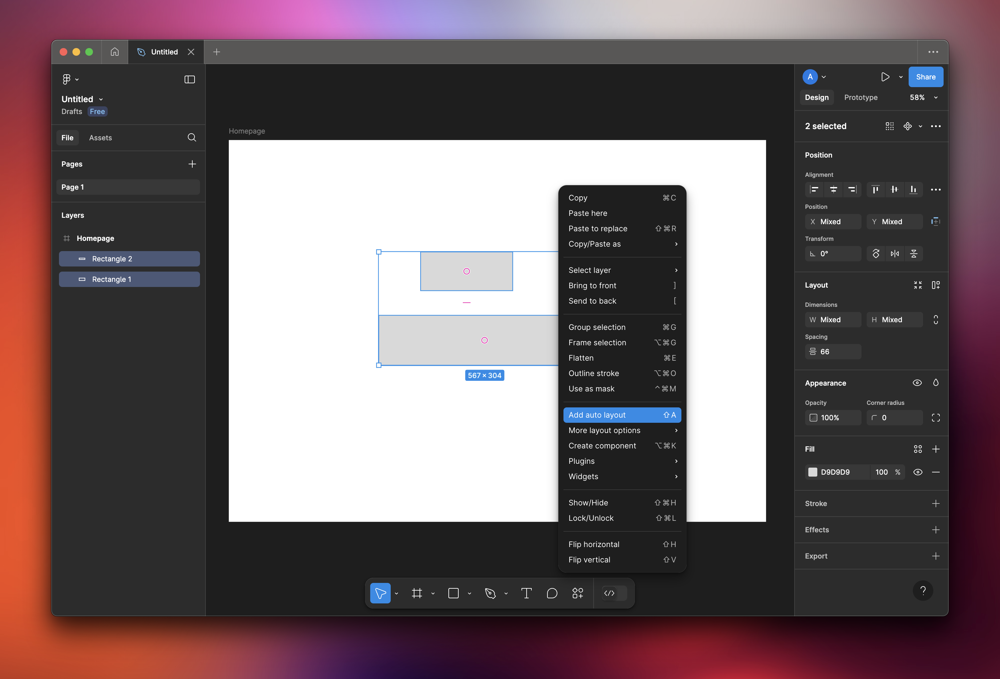

→ then you can control the alignments from the auto layout menu

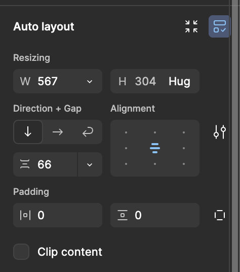

### Text in Figma

it's a little bit like indesign when it comes to text boxes, but you have to use the scale tool or `k` from the keyboard to scale the text.

### Creating Components in Figma

• **Component Creation:** Select a group of elements or a single object, right-click, and choose “Create Component.” This turns the selection into a reusable master element.

• **Reusing Components:** Drag and drop instances of the component from the assets panel or copy-paste them into your design. These instances are linked to the master, meaning updates to the master automatically apply to all instances.

This process ensures consistency and efficiency in design.

Example: let's take a look at that Navigation Bar

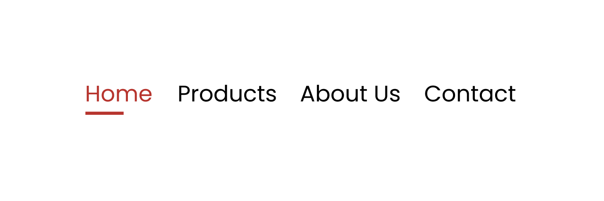

→ now let's assume we want to change the color of all the items in the navigation bar excluding the active menu (home in this example), what would you normally do is to select all of them and change the font, color, etc.. 

→ the component way (the easier way), we create a component (like a template) one time for not active menu bar item and if we need to change something we will change that master components and all instances of that component will follow the same styling. 

❖ components are stored in a different space or canvas other than our main canvas. 

❖ you can import components from the assets tab under local assets. 

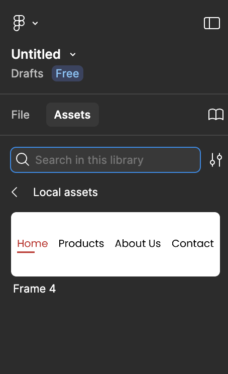

→ you can create a component using the shortcut `⌥ + ⌘ + K` 

→ then you can create variants (copies with different styling)  from the following button after you create and select the component: 

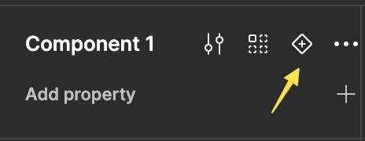

→ once you create the variant move it to the new canvas `Components` , i've created the active (default) and not active (variant). 

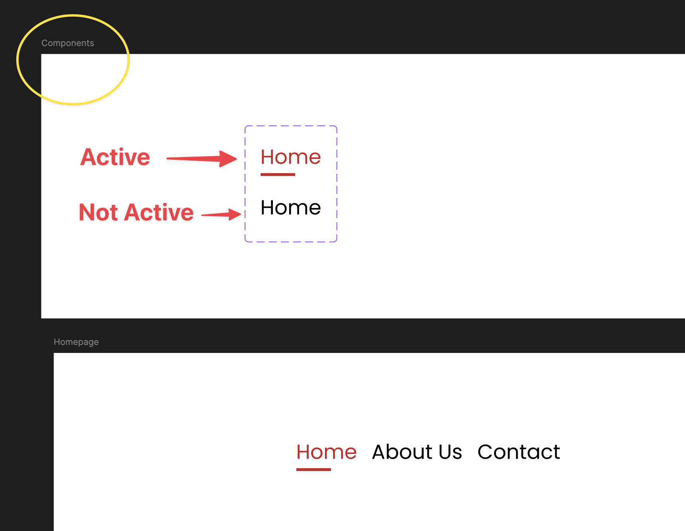

→ now we can drag and drop and change variants easier from the assets tab, and also control the spacing between them: 

→ pressing `Esc` commits the text you're typing. 

→ after creating the text we've to select the option `scale to fit` from the `layout` menu so that it fix the text box otherwise you'll have a strange spacing in when you do `auto layout` 

### Animation and Prototype

let's say we have the following button: 

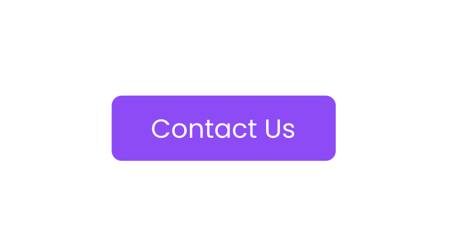

and we want a slight effect to happen when we hover the mouse over the button

→ first create a component and a variant with dropped opacity to 80% 

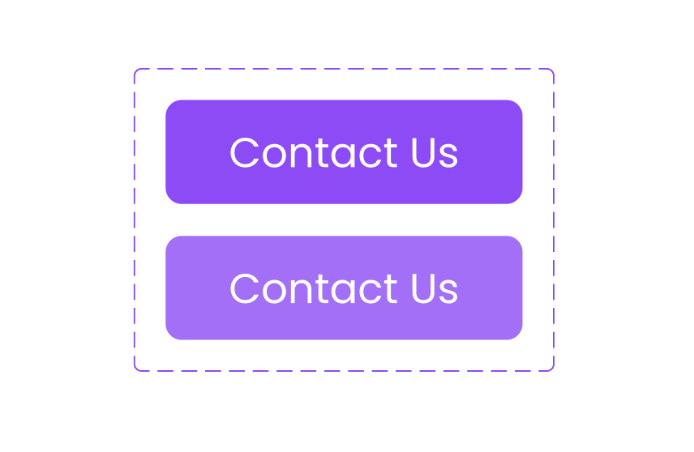

→ next we do the following from the prototype tab: 

❖ we can't create sophisticated animation for something like the following scenario: when i switch between navigation bar items (about, contact, etc...) the active tab becomes of certain color and the rest becomes black. 

→ to create such animations we need a more advanced tool like framer. 

## UI Libraries in Figma

❖ you can search for online components using the assets tab

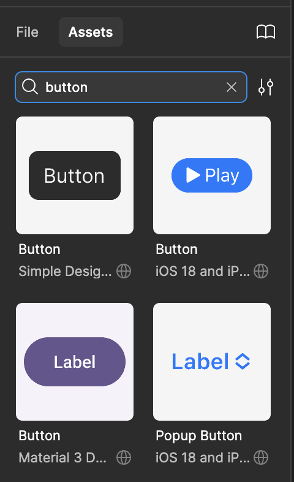

❖ what makes figma unique is it has a wide range of ui libraries online (like UI8, Dribbble, or Creative Market). Just download the **.fig** file (Figma file) and open it in Figma and you're good to go. 

→ example of a downloaded library from UI8

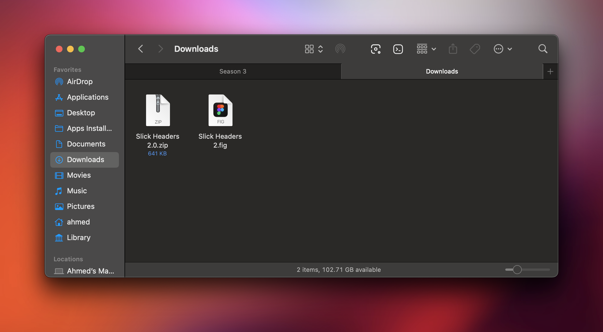

→ you can also use mockups in those libraries and upload your screenshot from your computer. 

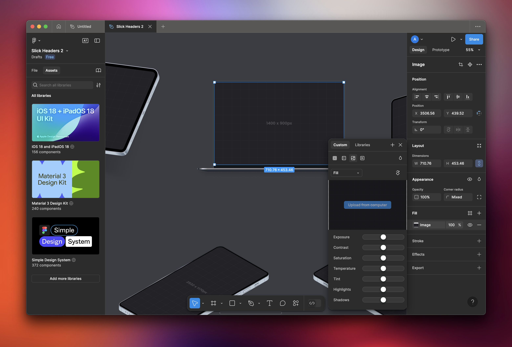

→ these files are premium on `UI8` website but you can download them for free from a telegram channel called `@ui8market`. Just search the file on the original website and then search it again in the telegram channel to download it's files. 

→ check also the following links: 

https://www.figma.com/community/ui-kits?resource_type=mixed&editor_type=all&price=all&sort_by=all_time&creators=all

https://www.uistore.design/types/figma/

## Developer Mode in Figma

❖ one of the best figma feature is it's **Design-to-development handoff:** Developers can easily inspect designs, export assets, and grab code snippets directly from Figma.

❖ Developer mode can be found here: 

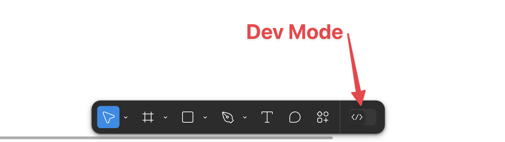

→ but the bad news is it's for the plus plan (Paid) 

→ what you can do for free is to select an element, right click on it and select `copy as` and choose `css`. this will give you css code for that element you choose. 

→ in the plus plan figma can create something like tailwind code but we can take that normal css code and ask chatGPT to right the corresponding tailwind code that does the same thing and build your project step by step. 

## Plugins in Figma

you can search for plugins that does various of tasks 

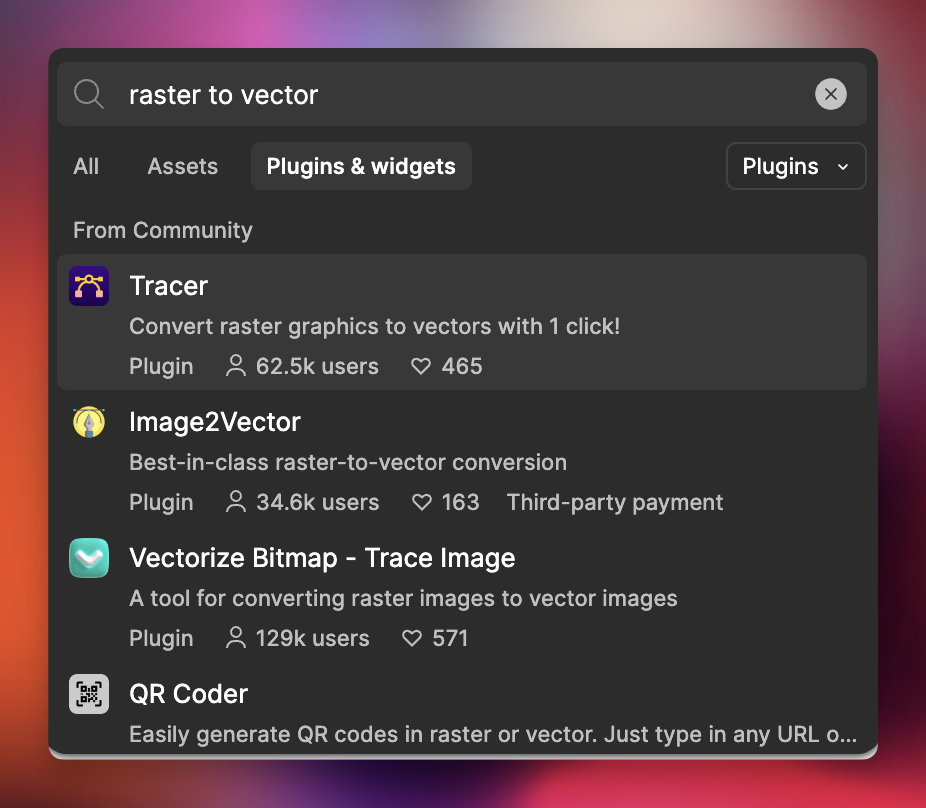

## Useful Tips

❖ ⇧ + R `→`  show - hide ruler (useful for alignments)

❖ brackets `[]` `→`  control layer hierarchy

❖ if you click on the color in the fill tab you can save specific colors as your palette. 

❖ sometimes when you place something on top of a component it just takes it's place but if you clicked the control key ⌃ it will place it on top of it normally. 

