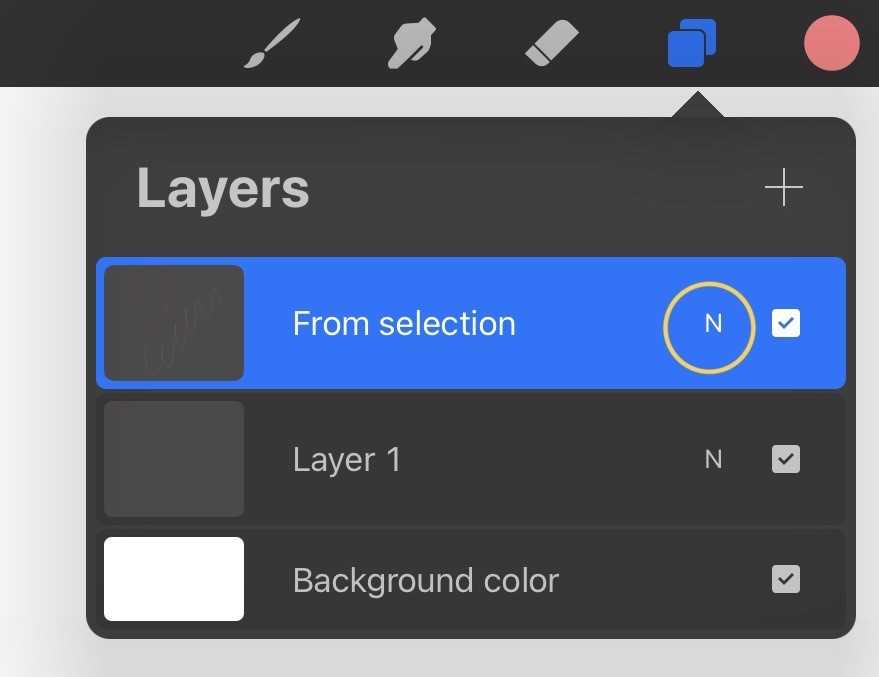
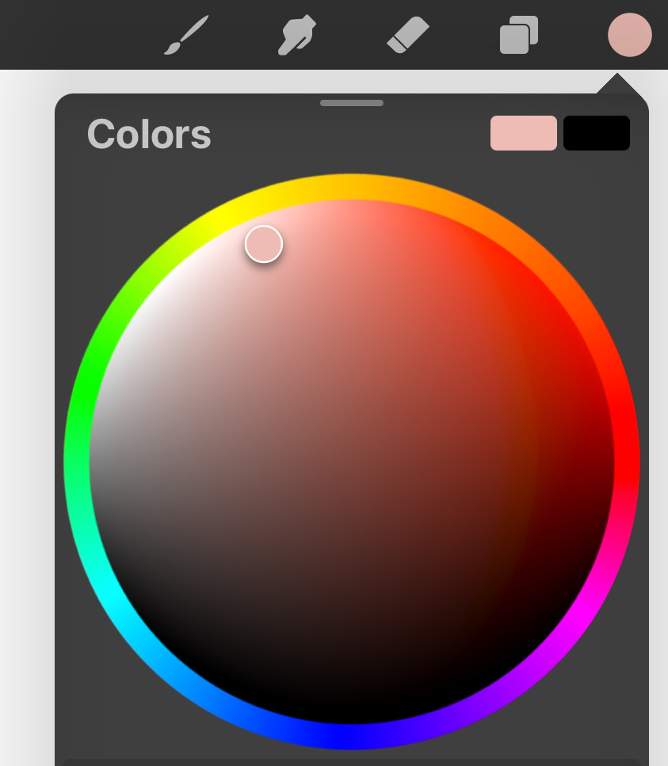

* Tap with two fingers to undo and three fingers to redo. 
* Tap with two fingers and hold to get start over and tap with three fingers and hold to redo everything. 
* To hide or reveal the interface tap with four fingers. 
* Swipe down with three fingers to show the quick menu (where you can cut, copy, paste, etc..). 
* Tap and hold with your finger to use the color picker. 
* To turn off drawing with your finger and use only the pen for drawing and fingers for gestures click on the gear icon, prefs tab , gesture controls, general, disable touch actions. 
* to control layer opacity open layer menu, tap with two fingers on the layer and swipe anywhere on the screen, you can also do that by opening the layer panel and clicking on the N like so: 

this will show layer opacity as well as blending modes. 
* to swap between colors tap and hold the color circle in the top right corner. 
* to quickly select the contents of a  layer open the layer menu, tap and hold with two fingers, then you can choose another color for example and draw inside the boundaries of your selected layer. you can use that in shading or highlighting. 
	you can do this also by using the (alpha lock) method, by swiping  the layer with two fingers to the right. 
	and to remove the (alpha lock) swipe again with two fingers to the right. 
* you can also pinch & zoom the color picker to get more precise colors like this: 

* to select more than one layer, swipe the layer to the right and click on group. 
* to clear the layer from it's content swipe left and right with three fingers.  
* you can tap and hold the selection tool to move the canvas while the selection tool is active. 
* you con tap and hold on the eyedropper tool on The left and select any color with your Apple Pencil on The canvas.

