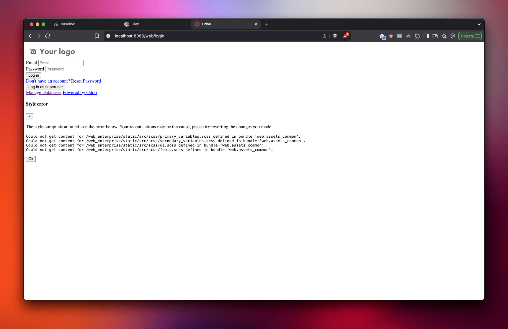

sometimes you can get an error like this: 

If you see this there's a big chance that you're missing the odoo enterprise addons, you need to get them from the client files and point their directory in the config file then re-launch the server.