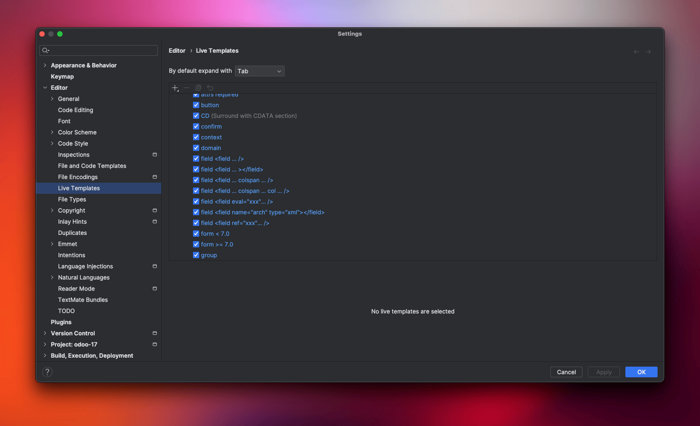

→ Install the plugin from this link: 
https://plugins.jetbrains.com/plugin/13083-odoo-autocompletion-support/features
or simply search `Odoo Autocompletion Support` in Pycharm Marketplace. 

→ Go to this location on the Mac: 

```
/Users/ahmed/Library/Application Support/JetBrains/PyCharm2023.3/
```

→ Clone the following repo to the Same Location above 👆: 
https://github.com/JulienDrecq/PycharmTemplateOdoo/tree/master

After cloning extract the files and folders to the main PyCharm Folder, here's an output of tree Command to showcase the files

❯ tree -L 1
.
├── README.md
├── bundled_plugins.txt
├── codestyles
├── disabled_plugins.txt
├── early-access-registry.txt
├── event-log-metadata
├── extensions
├── `fileTemplates`
├── global-model-cache
├── inspection
├── jdbc-drivers
├── keymaps
├── light-edit
├── options
├── plugin_PCWMP.license
├── plugins
├── pycharm.key
├── pycharm.vmoptions
├── scratches
├── ssl
├── tasks
├── `templates`
├── updatedBrokenPlugins.db
└── workspace

→ Now restart PyCharm and Go to the Live Templates in Settings under Python and also XML. 


→ Try Typing `field` for example in your xml and you will see the Suggestions 

→ Try also Typing `fields` in Python file and see the suggestions: 


