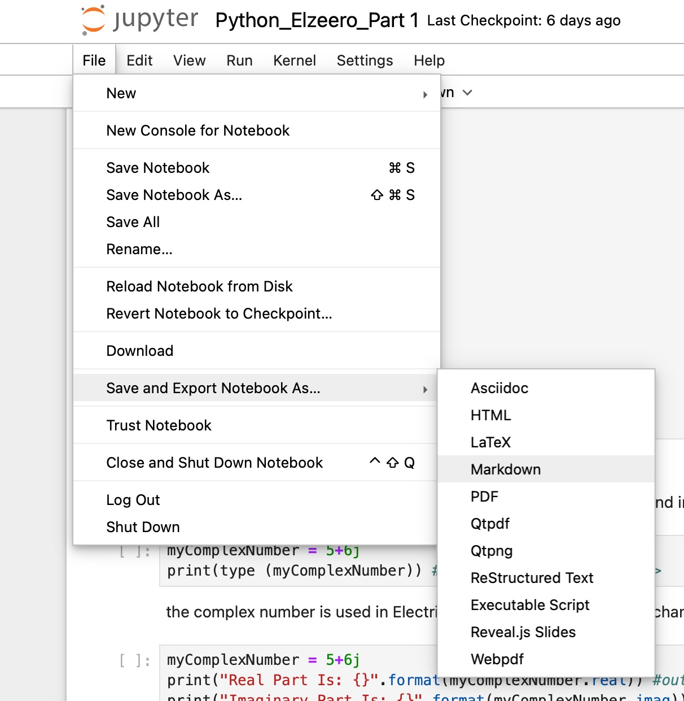

### :: `How to Convert Jupyter Notebooks to PDF the Right Way` ::

* if you have multiple python installed via `homebrew` uninstall every one of them and uninstall brew completely, don't worry we will install it back after we finish. 
* we will use the integrated python in mac os which was in my case python 3.9.6; you can check which version by running: 

```plaintext
python -V
```

* since we're using the integrated version of python we will get rid of the following error when installing packages thgrough pip: 
`externally managed environment`
* Now let's install pandoc

```
pip install pandoc
```

* and let's install `jupyter`

```
pip install jupyter
```

* now cd into the location of your `jupyter` notebooks and type: 

```
jupyter notebook
```

This will start the Jupyter Notebook server, and a new browser window or tab will open with the Jupyter Notebook interface.
* now run this command: 

```
sudo tlmgr install lmodern
```

* and this command

```
sudo tlmgr update --self
```

* Now open the notebook in your browser, you can download them as html, markdown just fine. 


* now for the pdf we will use the `webpdf` option but before that we need to install chromium, so will install it using `playwright` command 

```
pip install playwright
```


```
playwright install chromium
```

* now refresh the page and choose `webpdf` option again.