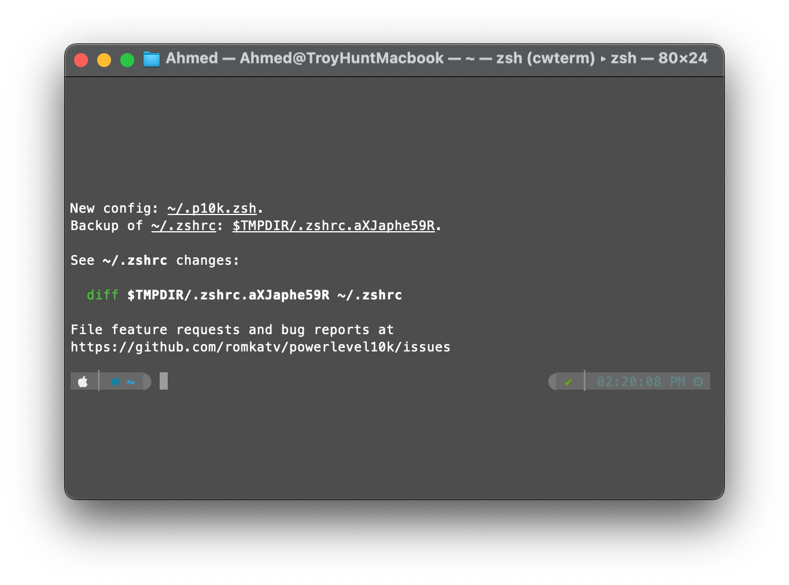

### :: **Basic Terms** ::
• shell = command line interpreter
• terminal = text input/output environment
• CMD = is the original shell for the Microsoft DOS operating system
• PowerShell = After CMD
### :: Navigation ::
to know where you are type

```bash
pwd
```

To Go Back 1 Level Up type: 

```bash
cd ..
```

To Go Back (Like The Back Button in Finder and in The Browser) type: 

```sh
cd -
```

→ This goes back to the last directory you were in not 1 level up. 

to make directory (i.e folder) type: 

```bash
mkdir "your folder name"
```

to quickly make multiple folders let's say 5

```bash
mkdir css js fonts imgs assets
```

if you want to make let's say folders named Day 1 , Day 2 .. Day 4 you can type: 
```bash
mkdir Day\ {1..4}
```
❖ the `\` backslash is there to escape the space

to make directory in the parent folder type: 
```bash
mkdir ../"your folder name"
```

→ Advanced Example with MKDIR

```sh
mkdir -p {dev,test,prod}/{backend,frontend}
```

This will make a structure like this: 
├── dev
│   ├── backend
│   └── frontend
├── prod
│   ├── backend
│   └── frontend
└── test
   ├── backend
   └── frontend

to view the content of the directory you are at type: 
```bash
ls
```

to view all the content of a directory including the hidden files use
```bash
ls -all
```

or 
```bash
ls -a
```

to navigate use cd command just like windows: 
```bash
cd "your folder name"
```

to create .txt file type: 
```bash
touch "your text file name".txt
```

to open files  (like the txt file we just create it) using terminal type: 
```bash
open "your text file name".txt
```

**Create Multiple Directories from a txt File**

→ let's say you want to copy a lot of directories so you can paste them elsewhere, first use: 

```bash
ls | pbcopy
```

→ Next to paste them in the new directory as txt file run this: 

```bash
pbpaste > dirs.txt
```

→ Now to create the folders in the text file run the following command: 

```bash
cat dirs.txt | xargs -I {} mkdir -p "{}"
```

**Move, Copy, Paste, Rename, Delete a file**
copy 
```bash
cp -r 
```
the -r refers to recursively (the directory with inside folders)

**How to Use rsync as replacement for cp and get a Percentage?**

```bash
rsync -ah --info=progress2 /directory /destination
```

→ you can also use alias like this in the zshrc file:

```bash
alias cpcp="rsync -ah --info=progress2"
```

→ now you can use the command like this: 

```bash
cpcp /directory /destination
```

move
```bash
mv
```

to move all files into a parent folder 
```bash
mv * ../
```

to move all files from folder1  to folder2 for example (folder2 doesn't exist yet)
```bash
mkdir -p folder2 && mv folder1/* folder2/
```

rename
```bash
mv
```

delete files 
```bash
rm
```

to delete a directory type: 
```bash
rm -r "yoru directory name"
```

to force delete a directory with it's content type: 

```sh
sudo rm -Rf <your_directory>
```

to copy file use this command: 
```bash
cp "your text file name".txt "new file name".txt
```

ps: you can use tab after typing cp to get the file name automatically just like windows. 
to rename type: 
```bash
mv "your old text file name".txt "your new text file name".txt
```

to copy a full directory with it's content type: 
```bash
cp -R "your directory name"/ "your new directory"
```

to force delete a directory type: 
```bash
rm -RF "your directory name"/
```

to force eject an external hard drive type: 
```shell
sudo diskutil unmountDisk force /Volumes/Samsung\ T5
```

to remount the external hard drive you have to know the name of the disk first through: 
```shell
sudo diskutil list
```

then run the mount command: 
```shell
sudo diskutil mountDisk /dev/disk4
```

To clear the terminal window type: 
```bash
Clear
```

To Go to the Start of the Line
```bash
⌃+A
```

To Go to the End of the Line
```bash
⌃+E
```

To Move Between Words
```bash
⌥ + ← →
```

**Drag & Drop **
When you’re using “cd” command to navigate you can drag & drop your folders through finder directly to terminal window, it will automatically put the path to the folder for you. 

### :: add alias ::
add alias to md to make directories same as mkdir in mac os terminal 
if you're on zsh type: 
```bash
open -e ~/.zshrc
```
or 
```bash
nano ~/.zshrc
```
or 
```bash
code ~/.zshrc
```
this will open the .zshrc file

adding the alias: scroll to the end of the file and add: 
```bash
alias md='mkdir'
```

This line tells Zsh that whenever you type md, it should treat it as mkdir.
After editing the file in nano, you save it by pressing Ctrl + O, then Enter, and exit nano with Ctrl + X.

apply the chages to take effect by typing in your terminal: 
```bash
source ~/.zshrc
```

This command re-runs your .zshrc file, applying any changes you made.
To test if your alias works, try using md in the terminal to create a directory. For example:

```bash
md testDirectory
```

in windows you can type ipconfig to get your ip and other data, how can we do that on mac terminal? 

## How to know which shell you're using and how to change the default shell?

→ to know which shell you're using open the terminal and paste this command: 

```
echo $SHELL
```

→ to change the default shell use the following command: 

```
chsh -s /bin/bash
```

and restart the terminal. 

## The `-y` Flag in Commands

→ when you see a command like this: 

```
brew install --cask brave-browser -y
```

→ The `-y` flag is used to answer `Yes` automatically to any questions will be asked by the shell.

## The Find Command
### How to search all directories for a specific file or folder? 

→ The find command in Mac OS Searches and manipulates files and directories

→ example to search for directories with the name `ollama` 

```sh
sudo find / -type d -iname "ollama" 2>/dev/null
```


	❖ The `/` in the command refers to the root directory
	❖ The `i` in the flag `-iname` ignores case sensitivity.


→ you can add more than condition like this: 

```sh
sudo find / \( -type f -iname "bahy" -o -type d -iname "bahy" \) 2>/dev/null
```

	❖ This will search both files and directories

→ to search for `ollama` and `.ollama` directories (normal and hidden directories) type: 

```sh
sudo find / -type d \( -name "ollama" -o -name ".ollama" \) 2>/dev/null
```

	❖ The `-o` operator is used to specify an alternative condition

→ example case where we use `find` and `grep` to search for grep in files: 

```sh
find . -type f -name '*.txt' -exec grep -iH "example" {} \;
```

	❖ The `.` represent the current directory
	❖ The `i` in the grep ignores case sensitivity.
	❖ The -H option tells grep to print the filename and the line containing the string we're looking for. 

→ Advanced example with `find` and `grep` and `regular Expressions` : let's say we want to search for a string `Hello World` but this string may exist in the files like this: `"Hello" World` with the word `Hello` quoted. thus; the normal find and grep commands won't work to catch this so what can we do about this? the answer is `regular Expressions` we will use it to widen the search parameters

```sh
find . -type f -name '*.txt' -exec grep -iH -E "hello.*world" {} \;
```

	❖ The `-E` flag tells `grep` that we will use a regular Expression
	❖ The `.*` expression means find hello followed by any number of characters including white spaces until you find the world string

## The Diff Command

In macOS, `diff` is a command that compares two files or sets of files to show their differences. It generates an output showing what lines are different between the two input files.

→ simple example to see difference between files: 

```sh
diff file1.txt file2.txt
```

→ simple example to search for difference between two directories 

```sh
diff -r Testing Testing2
```

we can get an output like this: 

```
Only in Testing2: file1 copy.md
Only in Testing2: file2 copy.md
```

→ advanced example using `find` , `cat` , and `python` to find duplicates: 

	❖ First use the find command to search for whatever you like (files or directories or both) 

```sh
find Testing Testing2 -type d | cat > output.txt
```

	❖ In this example i'm searching for only directories in both folders then i pipe the output to txt file with the cat command. 
	❖ next we will use the following python script with the txt as an argument to find the duplicate folders in both directories

```python
#!/usr/bin/env python

# script uses a txt file containing directories or files, store them in array and print out the duplicate records in the array (the duplicates in two directories)

# first use the find command to print directories or files in two folders to a txt file using cat command

# use the script like this: python3 scriptname.py '/Volumes/folder name/folder/file.txt'

  

import argparse

from collections import Counter

  

# Create argument parser

parser = argparse.ArgumentParser(description='Find duplicate lines in a text file')

parser.add_argument('file', type=argparse.FileType('r'), help='the input file')

args = parser.parse_args()

  

with args.file as f: # Use the provided file directly

lines = [line.strip().split("/")[-1] for line in f] # Strip newlines and split by "/"

  

counter = Counter(lines) # Count occurrences of each line

duplicates = [line for line, count in counter.items() if count > 1] # Filter out lines that appear once

  

print(duplicates)
```

### :: **How to Activate 'Code' Command in ZSH to Create and Open Files with VS Code ** ::

	1.	Open your zsh configuration file in a text editor. The file is usually located at ~/.zshrc.
	2.	Add the following line to the file: 
	
```bash
export PATH="$PATH:/Applications/Visual Studio Code.app/Contents/Resources/app/bin"
```

	1. Save the file and close the text editor.
	2. Run the command source ~/.zshrc to reload your zsh configuration.

After following these steps, the code command should work and allow you to open files in VS Code from the terminal while using the zsh shell.
### :: My ZSHRC File Aliases & Path Variables ::

```bash
aliasmd='mkdir'
aliaspip='pip3'
aliaspython='python3'
exportPATH=$PATH:/Users/Ahmed/Documents/Scripts
```
### :: How to Add Folder to Path Variable on Mac ::

To add a folder to the PATH variable on macOS, follow these steps:
	1.	Open Terminal, which you can find in the Utilities folder within the Applications folder, or by using Spotlight search.
	2.	In the Terminal window, type the following command and press Enter:
	
```bash
nano ~/.bash_profile
```

or 

```bash
code ~/.bash_profile
```

to open in vs code

	3.	This will open the .bash_profile file in the Nano text editor.
	4.	Within the Nano editor, add the following line at the end of the file:
	
```bash
export PATH="$PATH:/path/to/folder"
```

Replace /path/to/folder with the actual path of the folder you want to add.
	5.	Press Control + O to save the changes, then press Control + X to exit Nano.
	6.	Back in the Terminal, execute the following command to apply the changes:
	
```bash
source ~/.bash_profile
```

Now, the folder should be added to the PATH variable, and you should be able to use its executables or scripts from any Terminal window.
### :: IP Address and Location Information ::

```bash
curl ipinfo.io
```

This command will give you information such as your public IP address, the city and country you’re in, the name of your ISP, and more.

**Detailed IP Information:**
```bash
curl ip-api.com/jsonip-api.com/json
```

This provides detailed information about your IP, including latitude/longitude, timezone, and more.

**Just the Country:**
```bash
curl ipinfo.io/country
```

to copy the output of the terminal to the clipboard we will use **pbcopy** command 
```bash
some_command | pbcopy
```

For example, if you want to copy your public IP address to the clipboard, you can use:
```bash
curl ifconfig.me | pbcopy
```

there's this awesome website that has all terminal commands for windows, mac, linux and more 
https://ss64.com/

### :: how to list all folder sizes in the current directory ::

you can use this simple command to list all folders in the current directory: 

```bash
du -hd1 | sort -hr
```

if you want more advanced command that list all sub-directories and files you'll need to use ncdu (NCurses Disk Usage) by doing the following: 

```bash
brew install ncdu
```

Then you can run it in any directory:

```bash
ncdu
```
you can kill the command using ⌃ + C 

### :: Say Command ::

you can set the voice for spoken content in settings and open terminal and type: 

```bash
say "the words you want siri to say"
```

### :: Transfer / Upload Files Using Terminal ::

Since `transfer.sh` Is Down for Security Reasons; a Good Alternative Is `file.io` Which We Can Use with Curl to Upload and Get a Link. The Response Will Be Json so We Will Install `jq` And Pipe the Output to It so We Can Get a Readable Output

```bash
i="/your/file" ; curl --progress-bar --no-buffer -F "file=@$i" https://file.io | tee >(jq)
```

❖ We Can Also Create a ZSH Snippet for This as Follows: 

```bash
# Upload Files to File.io Using Curl and Tee
expand-upload() {
  local buffer="$BUFFER"
  if [[ $buffer =~ '~upload$' ]]; then
    BUFFER="i=  ; curl --progress-bar --no-buffer -F \"file=@\$i\" https://file.io | tee >(jq)"
    CURSOR=2  # Move the cursor to the position
  fi
}
```

❖ This Will Set the Cursor Right After the Equal Sign Allowing You to Type the First Letters of the File You Want to Download and Use the Tab Key to Get Zsh Completion (⚡)

→ Also check this: 
https://rstream.io/tools/file-sharing

### :: Ditto Command ::
Let's say you have 3 Folders Day 1, Day 2, Day 3 and you want to copy files from Day 1 & 2 to Day 3; to do that type: 

```bash
ditto 'Day 1' 'Day 3' | ditto 'Day 2' 'Day 3'
```
### :: Display Key Strokes ::

type: 
```bash
npx macos-key-cast
```

to kill the process press ⌃ +c

### :: Speed Test ::

open terminal and type: 
```bash
pip install speedtest-cli
```

after install you can type the command: 
```bash
speedtest-cli
```

you may need to add the python packages to your PATH: 
open ~/.zshrc using nano and add: 

```bash
export PATH="/Users/Ahmed/Library/Python/3.9/bin:$PATH"
```

Save and reload the terminal using 

```bash
source ~/.zshrc
```
### :: how to know the location / directory of every package you installed ::
just type `whereis` which is  a linux command: 
examples: 
```bash
➜  Desktop  whereis ffmpeg
ffmpeg: /opt/homebrew/bin/ffmpeg /opt/homebrew/share/man/man1/ffmpeg.1
➜  Desktop  whereis brew
brew: /opt/homebrew/bin/brew /opt/homebrew/share/man/man1/brew.1
➜  Desktop  whereis ffpb
ffpb: /opt/homebrew/bin/ffpb
➜  Desktop  whereis ef.sh
ef.sh: /Users/Ahmed/Documents/Scripts/ef.sh
➜  Desktop  whereis pip
pip: /opt/homebrew/bin/pip
```

### ::Executing Scripts From Specific Directory Without Copying::
if we have a folder that is already added to the path variables in your system and this folder contains a bunch of bash scripts; then we can make a little trick to run this script from anywhere without the need to copy the script file to location you want
we will add this simple code in the start of the script: 

```bash
location=$1
cd"$location"
```

so now all we have to do is to make the script executable just for one time in the script folder and when we run the script from anywhere in the drive we just give it the location which we want to execute the script from and the script will automatically jump into the directory you entered and execute the rest of the script

```bash
convert.sh 'user/document/folder/'
```

this is basically saying execute the convert.sh script in the directory `user/document/folder/`
### :: How To Upgrade Your Terminal Game :: 

First Install Oh My Zsh Through This Link: 

```bash
https://ohmyz.sh/
```

now we're gonna install the best theme which is `powerlevel10k` 
Github Link: https://github.com/romkatv/powerlevel10k#fonts

First Install The Fonts from the Following Link:
https://github.com/romkatv/powerlevel10k?tab=readme-ov-file#fonts

#### Configure your terminal to use this font:
Open _Terminal → Preferences → Profiles → Text_, click _Change_ under _Font_ and select `MesloLGS NF` family.

after that open terminal and paste this: 

```bash
git clone --depth=1 https://github.com/romkatv/powerlevel10k.git ${ZSH_CUSTOM:-$HOME/.oh-my-zsh/custom}/themes/powerlevel10k
```

The Default theme in `~/.zshrc` will look like this: 

```zsh
ZSH_THEME="robbyrussell"
```


Next Set `ZSH_THEME="powerlevel10k/powerlevel10k"` in `~/.zshrc` and Restart the Terminal.

after going with the install here's the last window



if you want to re-choose your config just type in the terminal

```bash
p10k configure
```

and source the `zshrc` file for changes to take effect. 

now it's time to install `zsh-syntax-highlighting` 

Github Repo: https://github.com/zsh-users/zsh-syntax-highlighting

look for oh my zsh install in the `install.md` file 

Open Terminal and Type

```sh
cd ~
git clone https://github.com/zsh-users/zsh-syntax-highlighting.git
echo "source ${(q-)PWD}/zsh-syntax-highlighting/zsh-syntax-highlighting.zsh" >> ${ZDOTDIR:-$HOME}/.zshrc
```

→ source the `.zshrc` file or restart your ZSH shell. 

Now open terminal and type: 
```bash
echo "Hello World"
```

### Alternative installation method using Oh-My-ZSH

→ Clone this repository in oh-my-zsh's plugins directory:

```sh
git clone https://github.com/zsh-users/zsh-syntax-highlighting.git ${ZSH_CUSTOM:-~/.oh-my-zsh/custom}/plugins/zsh-syntax-highlighting
```

→ Activate the plugin in `~/.zshrc`:

```sh
plugins=( [plugins...] zsh-syntax-highlighting)
```

→ Restart zsh (such as by opening a new instance of your terminal emulator).
### Autopair Plugin

A simple plugin that auto-closes, deletes and skips over matching delimiters in zsh intelligently.

#### How to Install?

Since We Re Using `oh-my-zsh` We Will Install It In The Following Path: 

```plaintext
/Users/ahmed/.oh-my-zsh/custom/plugins/
```

Using This Command: 

```zsh
git clone git@github.com:hlissner/zsh-autopair.git
```

If We Re Using SSH 

And The Following Command If We Re Using HTTP

```zsh
git clone https://github.com/hlissner/zsh-autopair.git
```

❖ Now We Need To Add It In Our `zshrc` File: 

```zsh
plugins=(
    # other plugins...
    zsh-autopair
)
```

❖ Restart Your Terminal And You're Good To Go. 

### :: **Cat Command** ::

you can create a new file using the cat command like this: 

```bash
cat > demo.txt
```

you can now add text to the demo.txt file from the terminal, when you're done press control + D  twice to Exit. 

to append text to the file demo.txt 
```bash
cat >> demo.txt
```

now you're in edit mode again
to show the content of demo.txt in the terminal

```bash
cat demo.txt
```

to move all content from demo.txt to a new test.txt file for example 
```bash
cat demo.txt > test.txt
```

to clear the content of a file using cat 
```bash
cat /dev/null > filename.txt
```
### :: `How to Add Snippets to your Terminal for Single and Double Quotes` ::

* Open your .zshrc configuration file using a text editor:
* Add the following lines at the end of the file:

```bash
quote_double() {
    LBUFFER+='""'
    CURSOR=$((CURSOR-1))
}
zle -N quote_double

quote_single() {
    LBUFFER+="''"
    CURSOR=$((CURSOR-1))
}
zle -N quote_single

bindkey '"' quote_double
bindkey "'" quote_single
```

These lines define two functions, quote Double and quote_single, which handle the insertion of double quotes and single quotes, respectively. The zle -N command makes the functions available as widgets for binding. The bindkey commands bind the functions to the double quote (") and single quote (') keys.
Save the changes and exit the text editor.

To apply the changes, either restart your terminal or run the following command:

```bash
source ~/.zshrc
```

### how to make bash the default shell?
use this command: 
```bash
chsh -s /bin/bash
```

### How to Pass the Output of a Command to Another Command ? 

Let's Say We Want to Pass the `Pwd` Output to the `rename.sh` Script so that It Will Rename All the Files in the Current Working Directory; to Do This We Can Use a Simple Command Like This: 

```bash
rename.sh "$(pwd)"
```

But There's Even an Easier Way, We Can Use the Dot `.` Instead Of `"$(pwd)"` Like This:

```
rename.sh .
```

We Can Use This for All Sort of Commands Like `code` Command or `pycharm` Command.

### How to Use Multiple Line Commands in Zsh? 

❖**First Method**: Put the Commands in a Text Editor First Then Copy Paste Them to the Terminal

```bash
pwd
echo "Hello"
```

❖ **Second Method**: one line command 
```bash
zsh -c 'echo "Hello"; pwd; echo "World"' 
```

**Explanation:**
* **`zsh -c`**: This tells ZSH to execute the following command as a single unit.
* **`echo "Hello"; pwd; echo "World"`**:  This is your multi-line command, separated by semicolons (`;`). Each line will be executed in sequence. 

but what about something like loops; something like this: 

```bash
for (( i=0; i<=5; i++ )); do
    echo $i
    sleep 1
done
```

❖ We Can Use One Line Commands Like This: 
```bash
for (( i=0; i<=5; i++ )); do echo $i; sleep 1; done
```

❖ we can also use curly braces: 
```bash
{
for (( i=0; i<=5; i++ ))
do
    echo $i
    sleep 1
done
}
```

❖ First Type the Open Brace and Hit Enter, Then Type Each Line and Hit Enter, and at Last Type the Closing Brace and Hit Enter and the Command Will Work. 
❖ You Can Replace the Curly Braces with Parentheses 
❖ We Can Also Use Backslash with Semicolins 

```bash
❯ for (( i=0; i<=5; i++ )); do
for> echo $i; \
for> sleep 1; \
for> done
```

❖ Hit Enter After `do` And You Will See The `for>` In the Next Line.
❖ At the End of the Echo and Sleep Commands Add Semicolin and Space and the Backslash Then Hit Enter

The Output:
```bash
0
1
2
3
4
5
```

### How to Create Snippets in ZSH?
Here's an Example that Expands `~hello` and `~~goodbye` To a Full Text with Custom Cursor Position:

```bash
# Define the expansion function for ~hello
expand-hello() {
  local buffer="$BUFFER"
  if [[ $buffer =~ '~hello$' ]]; then
    BUFFER="hello have a nice day"
    CURSOR=6  # Move the cursor to the position after 'hello '
  fi
}

# Define the expansion function for ~goodbye
expand-goodbye() {
  local buffer="$BUFFER"
  if [[ $buffer =~ '~goodbye$' ]]; then
    BUFFER="goodbye have a great day"
    CURSOR=8  # Move the cursor to the position after 'goodbye '
  fi
}

# Create a wrapper function that calls both functions
expand-snippets() {
  expand-hello
  expand-goodbye
}

# Bind the wrapper function to a key combination, e.g., Ctrl+H
zle -N expand-snippets
bindkey '^H' expand-snippets  # Change this to your preferred key combination
```
### Explanation: 

❖ The `cursor` Starts the Count From Zero
❖ The `Wrapper Function` Is Used because We Bind Both Functions with the Same Key Combination `⌃+H` , So It Calls Both Functions and Then the if Conditions Kicks in and Correspond to the Right Buffer (Word You Typed in the Terminal)
❖ We Can Change The  `⌃+H` Bind Key to another Key as Follows:

```bash
bindkey '`' expand-snippets  # we are using backtick (the telda key)
```

❖ It's Recommended to Stay Away From the Tab Key Cuz It's Used to Auto-Complete File Names
❖ We Can Check Percisely the Cursor Position Number We Want by Copying the Command to a New Vs-Code Docoument and Look in the Bottom Right Corner You Will See Something Like `Ln 1, Col 20` and as You Move the Cursor the `Col 20` Will Change, but Vs-Code Starts Counting From 1 so Whatever Number Vs-Code Have We Should Subtract 1 From It to Get the Right Cursor Number.
❖ The Function Name Can't Be the Same as a Command Otherwise the Command Will Not Work

### Extra Steps I Take

❖ I Created a New ZSH File in My Home Directory with the Touch Command

```bash
touch my-snippets.plugin.zsh
```

And Sourced that File in The `ZSHRC` File by Adding the Following Line:

```bash
source /Users/Ahmed/my-snippets.plugin.zsh
```

`VIP Note`: It's Importat to Put the Full Path to the New ZSH File, Otherwise It Might Create Issues with Somehting Like the Cd App, Cuz It Will Create a New Terminal at a Different Location and Won't See the Sourced File

❖ The New File Will Contain All the Snippets

### Generating Five Random Digits in ZSH

```bash
RANDOM=$(( $(date +%s) % 32768 ))
randomNumber=$(printf "%05d" $((RANDOM % 100000)))
echo "${randomNumber}"
```

This seeds the `**RANDOM**` variable with the current time in seconds, ensuring that you get a different sequence of random numbers each time you run the script.

### How to Manipulate Files Naming in ZSH?

Let's Assume You Made a File Using the Touch Command: 

```bash
touch someFile.txt
```

We Can Store that File in a Variable and Then Manipulate the Output Later, but First Let's Try a Little Test to Extract Each Part of the File: 

❖ Let's Start with the File Name only without the Extension

```bash
i=someFile.txt ; echo ${i%.*}
```

This Will Extract only the File Name `someFile` And Print It in the Termianl

**Explanation**
**`%` The Percent Mark Tells Zsh to Remove From `{i}` The Variable Whatever Comes After the Percent Mark.
`.*` The Dot Represents the Dot in the File Extension and the Asterisk Plays as a Wild Card to Match Any Extension Comes After the Dot.

❖ Next Lets Extract the Extension only From the File:

```bash
i=someFile.txt ; echo ${i##*.}
```

this will print only txt to the terminal but what did we do in the echo command: 
`##` This Is a Special Character in Shell Commands that Acts as a "String-Slicing" Tool. It Tells the Shell to Remove Everything From the Beginning of the String (I) Until the First Occurrence of a Period (.)
**The **`*`** as a wildcard:** In this context, the asterisk acts like a "wildcard" that matches any character (including zero characters) *before* the period (.)
❖ We Can Add the Dot Manually to Be Printed on the Screen so the Output Will Be `.txt` Instead of Just `txt` 

```bash
i=someFile.txt ; echo ."${i#*.}"
```

❖ With These Tools You Can Easily Manipulate Files Naming

### If There's a File in Use What Command Can I Use to Show the Process That's Using that Folder or File? 

You can use the `lsof` (List Open Files) command to find out which process is using a specific file or folder. Here's how you can do it:

`To find the process using a specific file:`

```bash
lsof /path/to/file
```

`To find the process using a specific folder:`

```bash
lsof +D /path/to/folder
```

This command will list all processes that are using the specified file or folder. The output will include the process ID (PID), user, and command name associated with the process.

❖ If You're Struggling with a Process that Keeps Running After You Kill It Like `Adobe IPC Broker` We Can Disable It Temporarily Using the Following Method: 

#### How to Disable Adobe IPC Broker Temporarily to Eject Your Hard Drive?

❖ Please Note that Process Is Important for Adobe Software to Work so We Can't Remove It Instead We Will Disable It Temporarily Just Enough to Eject Our Hard Drive. 

❖ The Process Location in My Case Is in This Location: 

```
/Library/Application Support/Adobe/Adobe Desktop Common/IPCBox/AdobeIPCBroker.app/Contents/MacOS/AdobeIPCBroker
```

❖ You Can Find It's Location Using The `lsof` Command Also (When You Use the Command to Find Which Process Is Using the Hard Drive). 

❖ Rename `AdobeIPCBroker` to `AdobeIPCBroker.old` And Then Kill the Process Using `raycast` or Activity Monitor Until It's No Longer Using the Hard Drive, Then Rename It Back By Removing The `.old` From It's Name.


`To filter the output for easier readability, you can use:`

```bash
lsof /path/to/file | grep -i "filename"
```
or
```bash
lsof +D /path/to/folder | grep -i "foldername"
```

This command can be useful for identifying processes that may be locking a file or directory, preventing you from performing operations like deleting or moving it.

### How to Count How Many File with a Specific Extension in a Main Directory Recursively (Including Sub-Directories)?

```bash
find "$(pwd)" -type f -name "*.mkv" | wc -l
```
❖ This Will Count How Many Mkv Files Are There in that Main Directory Recursively and Print the Number in the Terminal. 

❖ We Can Combine This Logic in a Zsh Function Like This: 

```bash
# Count How Many File with a Specific Extension in a Main Directory Recursively
expand-count() {
  local buffer="$BUFFER"
  if [[ $buffer =~ '~count$' ]]; then
    BUFFER="find \"\$(pwd)\" -type f -name \"*.\" | wc -l"
    CURSOR=31  # Move the cursor to the position
  fi
}
```


#### How to Run a Command with Time Delay (After that Time Run This Command)? 

To run a command with a delay in Zsh, you can use the `sleep` command to pause for a specified number of seconds before executing the next command. Here's how you can delay the execution of `echo "Hello World"` by 5 seconds:

```zsh
sleep 5 && echo "Hello World"
```

This command will wait for 5 seconds (`sleep 5`), then run the `echo "Hello World"` command.

The `sleep` command works with seconds, to delay a command for 30 minutes, you would multiply 30 minutes by 60 seconds per minute, which gives you 1800 seconds.

So, to run a command after 30 minutes, you would use:

```zsh
sleep 1800 && echo "Hello after 30 minutes"
```

This will delay the `echo` command for 1800 seconds (30 minutes).

#### Use Case for This Command

❖ You Can Use Command to Set Downloads After a Period of Time Before You Sleep 


#### How to Delete All Files with a Specific Extension in the Working Directory Recursively (Including Sub-Directories)?

Let's Say We Want to Delete All `mkv` Files From the Working Directory Recursively We Can Use This Command to Do So: 

```bash
find . -type f -name "*.mkv" -delete
```

We Can Also Add a ZSH Snippet Like This: 

```zsh
# Delete All Files with a Specific Extension in the Working Directory Recursively (Including Sub-Directories)

expand-del() {

local buffer="$BUFFER"

if [[ $buffer =~ '~del$' ]]; then

BUFFER="find . -type f -name \"*.\" -delete"

CURSOR=24 # Move the cursor to the position

fi

}
```

#### How to Print the Total Size of a Specific Extension in the Current Directory Recursively (Including Sub-Directories)?

Let's Say We Want to Count The Total Size of All `mkv` Files From the Working Directory Recursively We Can Use This Command to Do So: 

```bash
find . -type f -name "*.mkv" -exec du -ch {} + | grep total$
```

We Can Also Add a ZSH Snippet Like This: 

```zsh
# Print the Total Size of a Specific Extension in the Current Directory Recursively (Including Sub-Directories)

expand-total-size() {

local buffer="$BUFFER"

if [[ $buffer =~ '~totals$' ]]; then

BUFFER="find . -type f -name \"*.\" -exec du -ch {} + | grep total\$"

CURSOR=24 # Move the cursor to the position

fi

}
```

#### How To Exit Python Interpreter In The Terminal?
 
 you can use one of the following methods:

```zsh
exit()
```

```bash
quit()
```

### How to Force Eject a Removable Disk using Terminal on MacOs

Use the following command:

```
diskutil unmount force /Volumes/Samsung\ T5
```

→ you can also add `sudo` with the command. 

### How to Remove files using a txt file with rm command in MacOs Terminal

```sh
touch file_{1..3}.txt
ls > files_to_remove.txt
cat files_to_remove.txt
xargs rm < files_to_remove.txt
```

### How to open GUI File manager app like Finder from Terminal location (Current Work Directory)? 

To open the current directory in a GUI file manager from the terminal:

- **macOS:** Use:

```sh
open . 
```

- **Linux:** Use: 

```sh
xdg-open . 
```

These commands will launch the default file manager and display the current directory.