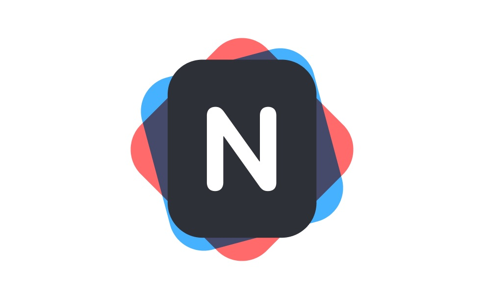

Thank you for checking out **Noto**! We crafted **Noto** to be clean and modern, yet powerful enough to replace your existing note app. Let us give you a walk through of what it can do.
---
### Ed****iting tools 🛠
**Text Format**
**Bold**, *italic*, __underline__, ~~strikethrough~~, ::highlight::

**List**
* Number list
1. Item 1
2. Item 2
* Bullet list
* Item 1
* Item 2
* Check list
- [ ] Item 1
- [x] Item 2

**Block Quote**
> **Truth tends to reveal its highest wisdom in the guise of simplicity.
> **- Friedrich Nietzsche

**Drawing / Handwriting (Pro)**


**Code (Pro)**
```swift
let noto = "Modern Writing App"
print(noto)
```

**Math Equation (Pro)**
$$f(x) = \int_{-\infty}^\infty    \hat f(\xi),e^{2 \pi i \xi x}    \,d\xi$$

**Table (Pro)**
| **Image** in table | **Video** in table | **Math** in table | **Code** in table | **Check****l****i****s****t** in table |
|  |  | $$\frac{d}{dx}\int_{a}^{b}f(t)dt=f(x)$$ | ```swift
print("hello world")
``` | - [ ] Item 1
- [ ] Item 2
- [x] Item 3 |


**File (Pro)**
[Calligraphy 2.pdf](Calligraphy 2.pdf)

**Links
**| **Map Link** | **YouTube Link** | **Website Link** |
| [https://maps.apple.com/?address=2890%20Taylor%20St,%20San%20Francisco,%20CA%20%2094133,%20United%20States&auid=8187980391740442942&ll=37.808340,-122.415727&lsp=9902&q=Fisherman's%20Wharf&_ext=CiYKBQgEEOIBCgQIBRADCgQIBhBzCgQIChAOCgQIEBABCgUILxDpARImKTE7enAN50JAMe6APgT+ml7AOa8QoMwz6EJAQZ73pLlDml7AUAQ%3D&t=m](https://maps.apple.com/?address=2890%20Taylor%20St,%20San%20Francisco,%20CA%20%2094133,%20United%20States&auid=8187980391740442942&ll=37.808340,-122.415727&lsp=9902&q=Fisherman's%20Wharf&_ext=CiYKBQgEEOIBCgQIBRADCgQIBhBzCgQIChAOCgQIEBABCgUILxDpARImKTE7enAN50JAMe6APgT+ml7AOa8QoMwz6EJAQZ73pLlDml7AUAQ%3D&t=m) | [https://youtu.be/cG8PXdTlDag](https://youtu.be/cG8PXdTlDag) | [https://www.theverge.com/good-deals/2019/10/31/20941651/black-friday-deals-store-start-time-dates-hours-walmart-amazon-google-best-buy](https://www.theverge.com/good-deals/2019/10/31/20941651/black-friday-deals-store-start-time-dates-hours-walmart-amazon-google-best-buy) |

### ---
### Organization Gestures**🤟
*** Drag to reorder list item or paragraph. (iOS)


* Drag to move folders & notes.
| Select multiple notes by swiping left on their thumbnails. | Create new folders by dragging one note onto another | Pin your notes by dragging them to the top of the screen |
|  |  |  |


---
### Feedback 💬****
If you have any questions or issues, please don’t hesitate to contact us at:
[https://twitter.com/noto_app](https://twitter.com/noto_app) 

You can also submit feature requests at:
[https://noto.kampsite.co/](https://noto.kampsite.co/)

Again, thank you so much for trying out **Noto**. We hope you enjoy it as much as we are!